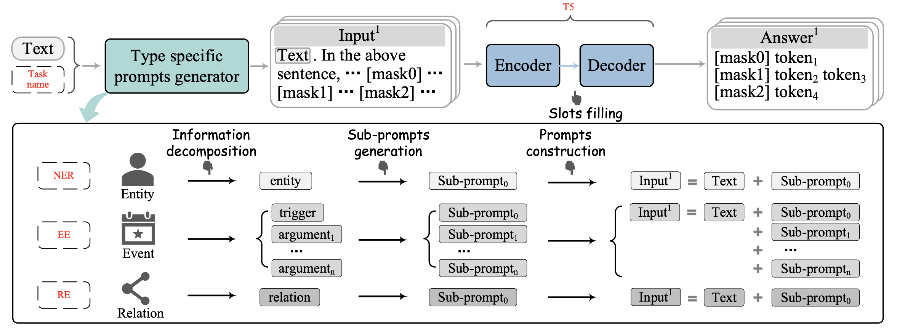
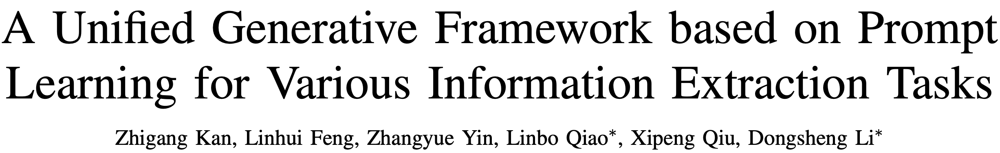
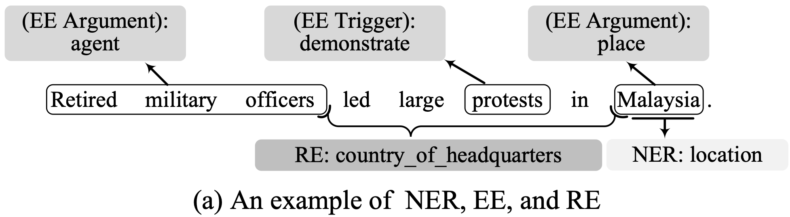
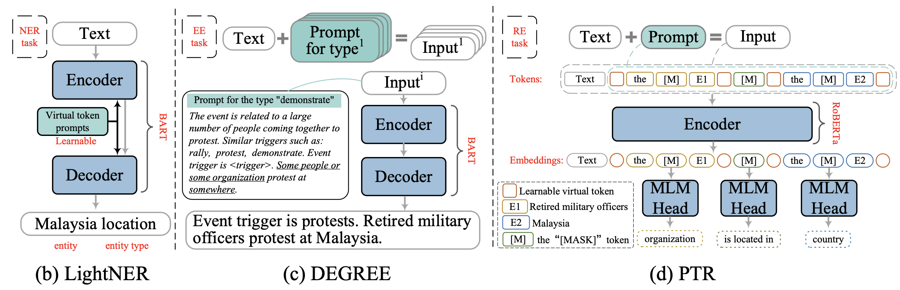
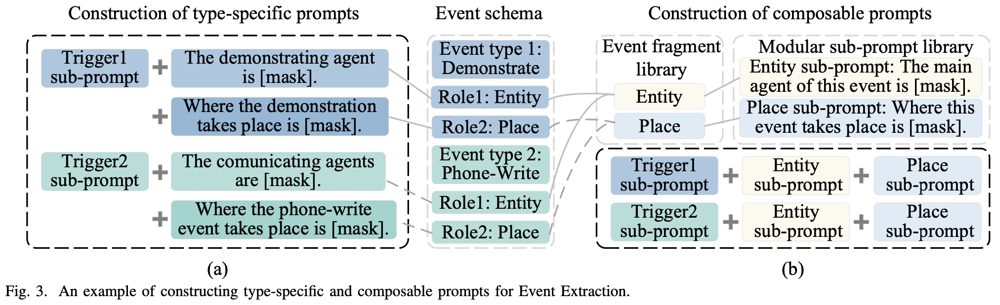
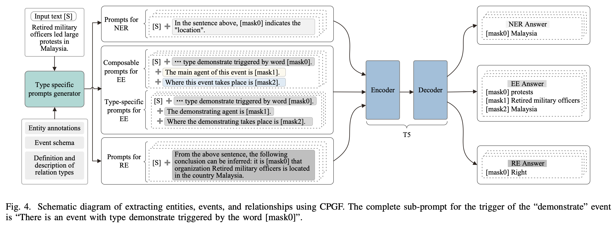

来自复旦邱组，提出了一种基于prompt的生成式框架，可以用于各种信息抽取任务。

<!--more-->

## Overview

- [[paper]](https://arxiv.org/pdf/2209.11570v1.pdf) [[papers-with-code]](https://paperswithcode.com/paper/a-unified-generative-framework-based-on) [[dblp]](https://dblp.uni-trier.de/search/publ/bibtex0?q=A%20Unified%20Generative%20Framework%20based%20on%20Prompt%20Learning%20for%20Various%20Information%20Extraction%20Tasks)

## Background

在信息抽取领域，传统方法大多基于微调范式。它们针对下游任务精心设计网络结构，但是至少有两个因素会导致预训练和微调之间不可忽略的gap。

- 采用额外的网络会导致预训练和微调的结构化差异
- 预训练任务和下游任务存在显著差异

prompt范式正是为了修复预训练与微调的不一致，在这种范式下，各种下游任务都转化为类似于预训练的任务。

- [LightNER](https://paperswithcode.com/paper/lightner-a-lightweight-generative-framework)针对NER任务提出了一种生成式框架，其引入了prompt指导的注意力层，在低资源NER任务上取得了很好的成绩，但不能应用到其他IE任务上（例如事件抽取）。

- [DEGREE](https://paperswithcode.com/paper/event-extraction-as-natural-language)为事件抽取提供了一种模版设计的方法，具体来说，它通过恢复特定类型提示中的受损文本来提取事件。然而，DEGREE通过将所有论据角色的代词集合到一个描述事件发生的短句中，构建了事件类型的特定类型提示。这导致了论据子提示和事件类型之间的密切关联。换句话说，这导致了不同事件类型的论据子提示之间存在相当大的差异。此外，DEGREE也不能应用于其他IE任务（例如关系抽取）。

- [PTR](https://paperswithcode.com/paper/ptr-prompt-tuning-with-rules-for-text)是一个通用的基于提示的文本分类框架。它通过结合子提示和可学习的虚拟标记来生成提示，并通过仅有编码器的PLM将[MASK]标记映射到候选答案来判断关系的类型。然而，PTR只能用预先设计的子符号和逻辑规则对特定的文本内容进行分类，但不能从文本中提取具有可变长度的信息，如实体和事件。

为了缓解这些问题，本文为所有的IE任务引入了一个新的统一的基于提示的生成框架（CPGF）。CPGF将各种IE任务转换为完形填空任务，并用T5来预测答案。本文的贡献如下：

- 本文提出了一个基于提示学习范式的新型统一生成框架，用于各种信息抽取任务。
- 本文介绍了一种为复杂任务（如EE）构建独立子提示的方法。此外，为了提高框架在数据稀缺的情况下提取事件的通用能力，为事件提取设计了一种由多个模块化子提示组成的可组合提示。
- 本文提出了一种基于提示的方法，通过判断语义矛盾来实现关系抽取，并为其设计了一个相应的模板。
- 一系列关于EE、NER和RE的实验结果表明，该框架在数据丰富和数据稀缺的情况下都很有效。

## Method

本文提出的框架包含四个部分：

- 信息分解表示将复杂的信息分割成多个片段。
- 子提示生成产生信息片段的子提示。
- 提示构建产生信息类型的特定类型或可组合提示（EE独有）。
- 在填槽阶段，采用T5来预测答案。

### Notation

- 原始文本$S$
- 目标信息$\mathcal{Y}=\{\mathcal{Y}^1,\cdots,\mathcal{Y}^t\}$
  - $\mathcal{Y}^j$表示类型$j$的待提取信息，$t$为类型总数
  - 对于EE，$\mathcal{Y}^j$可能包含多个元素，如事件类型和论元角色
- 提示$Pr=\{Pr^1,\cdots,Pr^t\}$

### Sub-Prompts Generation

依赖于类型的子提示适用于数据丰富的场景，而模块化的子提示是为数据稀缺的场景设计的。下图显示了这两种子提示之间的区别。该图的左边部分显示了依赖类型的子提示和信息类别之间的关系。在这种情况下，子提示是通过用掩码词替换每个信息类型的定义或片段描述中的关键词而独立产生的。

在使用模块化子提示的情况下，我们在产生子提示之前合并类似的信息片段。CPGF将具有相同语义但分布在不同类型信息中的元素视为同一信息片段。通过分析训练数据集中的信息元素的语义，手工建立了一个涵盖每种信息类型的所有组成的信息片段库。数据集中的每一类信息都由库中的一个或多个信息片段组成。

我们通过为信息片段库中的每个元素生成一个与类型无关的子提示，组成一个模块化的子提示库$P=\{p_1,p_2,\cdots,p_{\lvert F\rvert}\}$，其中$\lvert F\rvert$表示信息片段的总数。详细地说，它在一个描述片段和信息类型之间关系的通用句子中替换了关键词，以获得一个模块化的子提示。我们的框架通过从模块化子提示库中搜索其片段来获得目标信息的子提示。通过这种方式，CPGF可以有效地提取具有从未见过的类型的信息元素，如果这些元素出现在片段库中。

### Prompts Construction

第$j$种信息类型的提示是通过连接原始文本和子提示来构建的：
$$
\begin{align}
\mathcal{S}_{\text{prompt}}^j &= f_{\text{prompt}}(S) \\
							  &= S \mathop{\Vert} Pr^j
\end{align}
$$
其中$\mathop\Vert$表示拼接两段文本，$Pr^j$表示组合目标信息中所有相关元素的子提示：
$$
Pr^j = \mathop{\Vert}_{i=1}^n p_i^j
$$
对于NER和RE，$n$始终为1。对于EE，$S^j_{\text{promt}}$被称为特定类型的prompt，如果用来组成的提示语是依赖于类型的，因为这个提示语的每个部分都与信息类型有关。由模块化子提示组成的提示被命名为 "可组合提示"。

### Answer Generation

在获得样本的一系列提示后，将其送入PLM，通过MLM预测每个提示中MASK词的预测值。
$$
z_i^j = \text{MLM}(p_i^j)
$$
在这个过程中，使用特殊字符 $\vert$ 分隔子提示的多个答案。

## Experiment

