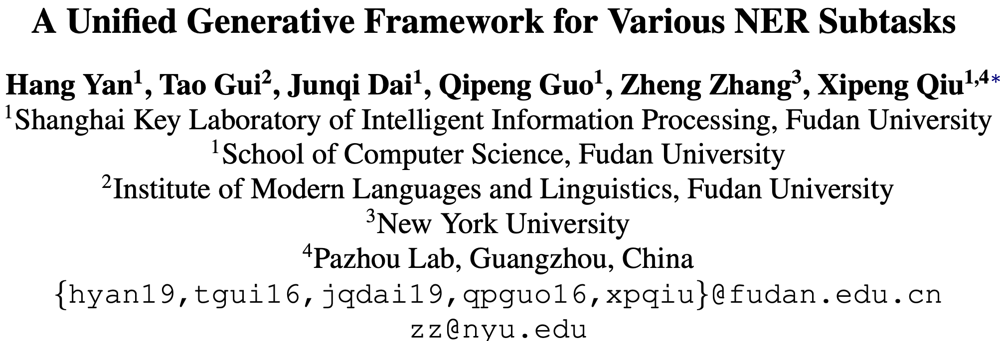

ACL 2021，来自复旦邱组，用生成式统一NER。

<!--more-->

## Overview

- [[paper]](https://aclanthology.org/2021.acl-long.451.pdf) [[papers-with-code]](https://paperswithcode.com/paper/a-unified-generative-framework-for-various) [[dblp]](https://dblp.uni-trier.de/search/publ/bibtex0?q=A%20Unified%20Generative%20Framework%20for%20Various%20NER%20Subtasks) [[code]](https://github.com/yhcc/BARTNER)

## Background

NER旨在识别句子中的实体片段，这些实体可能是嵌套的或者是不连续的，因此NER任务可以分为flat NER、nested NER和discontinuous NER。一般而言，这些子任务可以通过序列标注或者span-level的分类解决。

本文的贡献如下：

- 提出了一种生成式的统一框架，将NER问题形式化为实体span序列生成问题。
- 框架融合了预训练模型BART，并提出三种实体表示的序列化方法。
- 提出的框架避免了对标注schema和枚举span的复杂设计，在8个英文数据集上取得了SOTA，包括2个flat NER、3个nested NER和3个discontinuous NER。

## Method

### Notation

- 输入句子$X=[x_1,x_2,\cdots,x_n]$
- 目标序列$Y=[s_{11},e_{11},\cdots,s_{1j},e_{1j},t_1,\cdots,s_{i1},e_{i1},s_{ik},e_{ik},t_i]$
  - 其中$s$和$e$表示一个span的起止下标，$t_i$表示标记下标。
- 实体类别$G=[g_1,\cdots,g_l]$
  - $l$表示类别总数
  - $t_i\in(n,n+l]$，移位是为了不与指针下标混淆。

### Seq2Seq for Unified Decoding

模型主要包括Encoder和Decoder两部分。

对于Encoder而言，将文本编码为隐层表示：
$$
\mathbf{H}^{e} = \text{Encoder}(X)
$$
对于Decoder而言，负责计算每一步的下标分布$P_t = P(y_t|X,Y_{\lt t})$。因为$Y_{\lt t}$包含指针下标和标记下标，所以先按如下规则转换为token：
$$
\hat{y}_t = \begin{cases}
	X_{yt}&\text{if}\ y_t\le n \\
	G_{yt-n}&\text{if}\ y_t > n
\end{cases}
$$
转换之后，就可以计算最终表示：
$$
h_t^d = \text{Decoder}(\mathbf{H}^e;Y_{\lt t})
$$
可以通过下式获得下标的概率分布$P_t$：
$$
\begin{align}
  \mathbf{E}^e & = \mathrm{TokenEmbed}(X)\\
  \mathbf{\hat{H}}^e & = \mathrm{MLP}(\mathbf{H}^e) \\
  \mathbf{\bar{H}}^e & = \alpha*\mathbf{\hat{H}}^e + (1-\alpha)*\mathbf{E}^e \\
  \mathbf{G}^d & = \mathrm{TokenEmbed}(G) \\
  P_t & = \mathrm{Softmax}([\mathbf{\bar{H}^e}\otimes \mathbf{h}_t^d;\mathbf{G}^d\otimes \mathbf{h}_t^d] )
\end{align}
$$
其中$\text{TokenEmbed}$是Encoder和Decoder共享的embedding，$\alpha$为超参数。训练时采用teacher forcing，推理时自回归生成目标序列。解码时采用如下算法，将下标序列转换为实体span。

BART采用的BPE算法可能会把一个token切分为多个BPE字符，为了更充分利用BART，本文提出了三种基于指针的实体表示，用于定位原始语句中的实体，如下图所示：

- Span：使用实体的起始和截止BPE下标。
- BPE：使用实体的所有BPE下标。
- Word：只使用每个实体的第一个BPE下标。

如果句子中没有实体，那么输出就是空序列（只包含起始字符\<s\>和终止字符\</s\>）。

## Experiment

选用了八个数据集：

- Flat NER: CoNLL-2003, OntoNotes
- Nested NER: ACE 2004, ACE 2005, Genia
- Discontinuous NER: CADEC, ShARe13, ShARe14

对实体表示的消融实验：

Word实体表示比其他两种更好。
