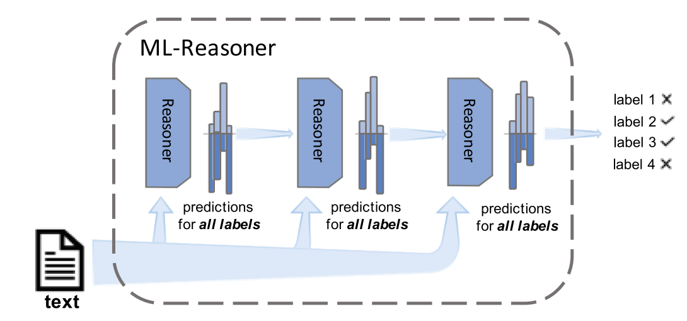
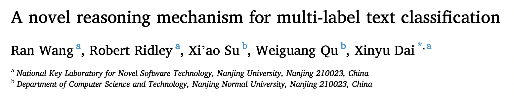
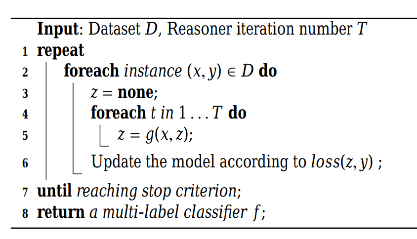
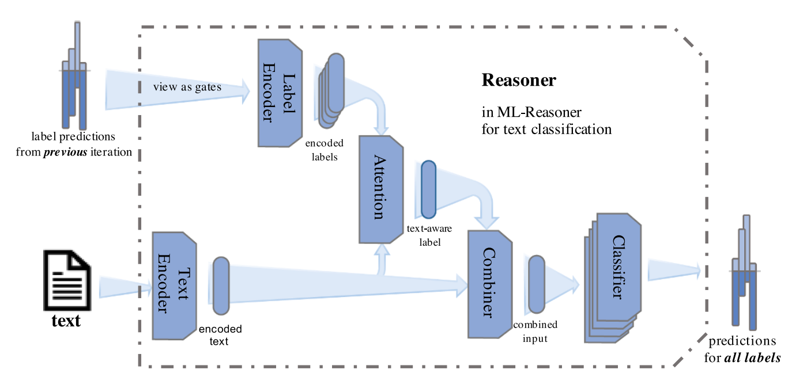
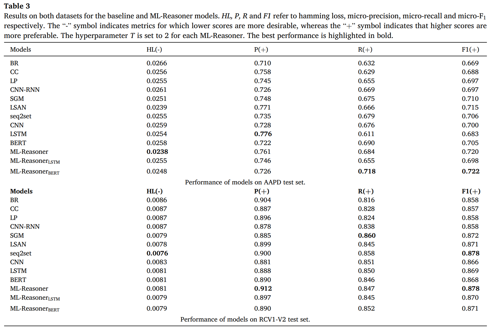
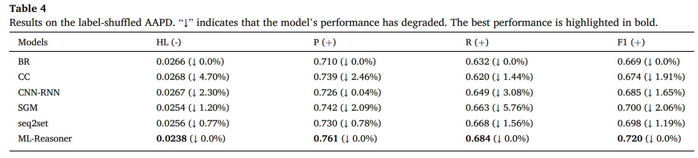
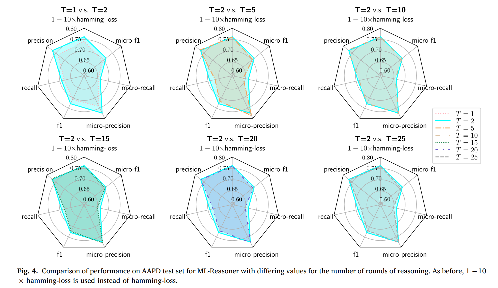

Information Processing and Management 2021（CCF-B）

<!--more-->

## Overview

- paper: <https://www.sciencedirect.com/science/article/pii/S0306457320309341>
- code: 

## Background

多标签分类中，考虑标签内部的相关性非常有必要。自SGM等工作开始，许多人采用Seq2Seq的方法处理MLC问题。但是这种方法依赖于标签的顺序，为此本文提出了Multi-Label Reasoner（ML-Reasoner）的方法，为每个标签单独二分类以满足标签本质上的无序性。

为了利用标签相关性，作者设计了一种新颖的迭代式推理机制，将先前预测的标签概率作为推理时的额外特征。

## Method

数据集$D=\{(x_i,y_i)\}_{i=1}^N$，样本$x_i = \{w_1,\cdots,w_p,\cdots,w_n\}$。推理的迭代算法如下所示。

通过将前一轮所有标签的预测结果$z_{t-1} = (z_{t-1,1}\cdots,z_{t-1,k})$作为下一轮的额外输入（看作权重），在迭代轮次中传递了标签信息，使得ML-Reasoner可以捕获标签相关性。相比之下CC或SGM等方法，只利用了部分的标签信息。

Reasoner模块有点像Transformer的Decoder部分，分别对text和label进行embedding，并计算attention后分类。

层间传递时，将上一轮的概率看作权重，对label embedding加权。
$$
\begin{align}
\vec{l}_j &= \text{LabelEmbedding}(l_j)\in\mathbb{R}^{D_4} \\
\vec{l}_{j_{\text{encoded}}} &= z_{t-1,j}\vec{l}_j\in\mathbb{R}^{D_4}
\end{align}
$$
作者这里使用的是TextCNN提取文本特征$\vec{x}\in\mathbb{R^{D_2}}$，并接一个全连接层得到$\vec{x}_{\text{encoded}}\in\mathbb{R^{D_3}}$。对文本和标签特征计算注意力权重：
$$
\begin{align}
s_j &= W_2\left[\vec{x}_{\text{encoded}};\vec{l}_{j_{\text{encoded}}}\right] + b_2 \\
\alpha_j &= \frac{\exp(s_j)}{\sum_{i=1}^k\exp(s_i)} \\
\vec{l}_{\text{attention}} &= \sum_{j=1}^k\alpha_j\vec{l}_{j_{\text{encoded}}} \in \mathbb{R}^{D_4}
\end{align}
$$
从而得到组合特征
$$
\vec{x}_{\text{combined}} = [\vec{x}_{\text{encoded}};\vec{l}_{\text{attention}}] \in\mathbb{R}^{D_3+D_4}
$$
然后使用全连接+sigmoid分类即可，采用BCE Loss。

## Experiment

选择AAPD和RCV1-V2数据集。

使用了AllenNLP库实现，BERT选用bert-base-uncased，学习率5e-5。基线ML-Reasoner采用GLove 300维初始化，label embedding为300维随机初始化，采用Adamax优化器，学习率2e-3。

实验结果上，相比BERT有2%以上的提升。

作者也验证了标签顺序对于模型性能没有影响。

作者探讨了迭代轮次的影响，$T=2$时最佳。

