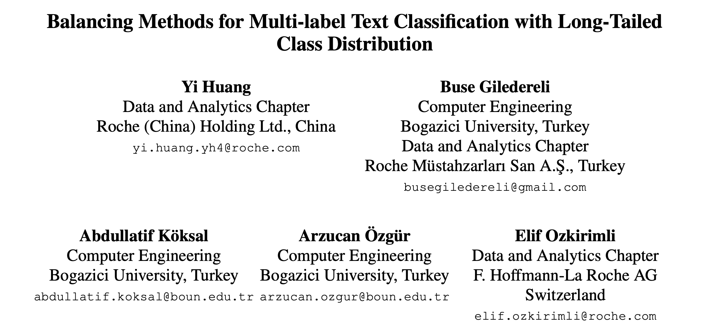
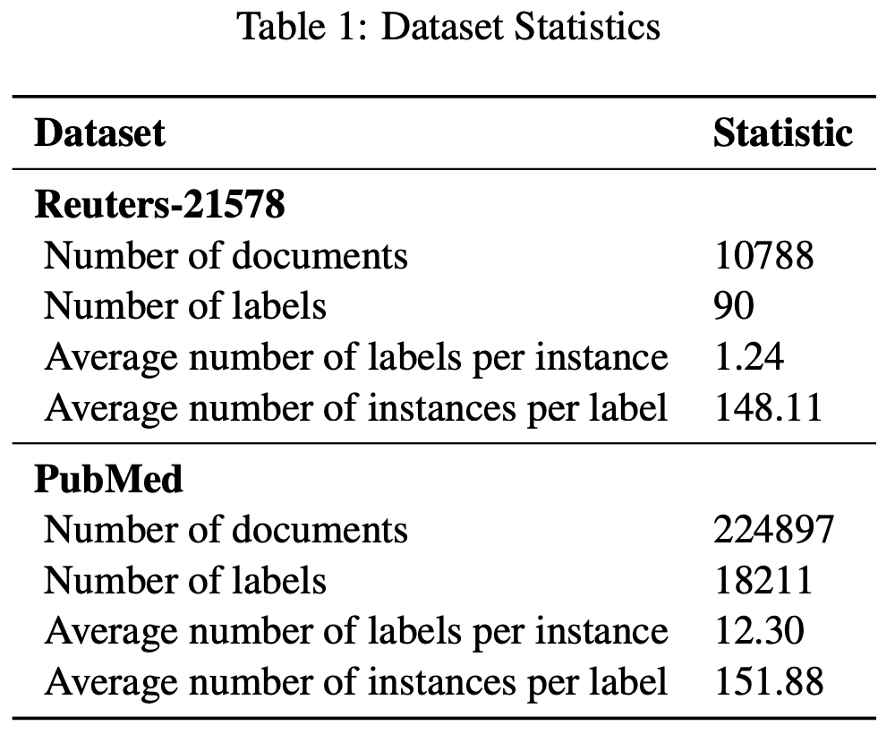
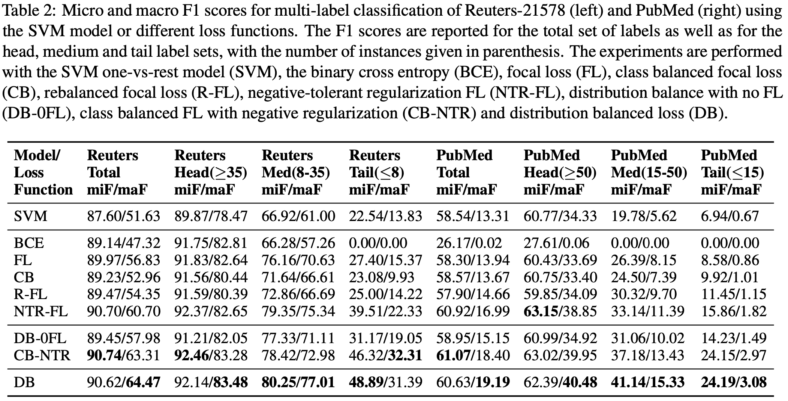
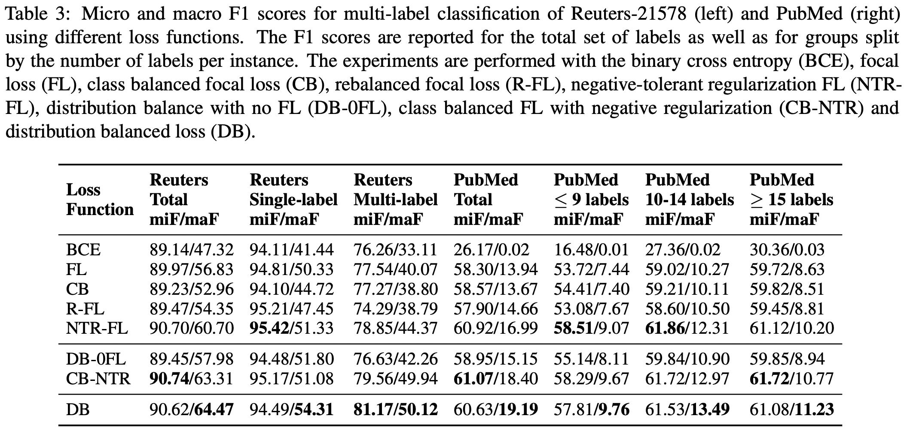

EMNLP 2021，损失函数大杂烩。

<!--more-->

## Overview

- paper: <https://aclanthology.org/2021.emnlp-main.643.pdf>
- code: <https://github.com/Roche/BalancedLossNLP>

## Background

多标签分类通常面对长尾分布的问题，只有一小部分标签频繁出现，大部分标签的样本都很少。

本文介绍了多标签分类中的一些平衡损失函数，在Reuters-21578和PubMed上进行了实验。

## Method

### Binary Cross Entropy (BCE)

BCE是最基础的损失函数，其中$p_i^k = \sigma(z_i^k)$。
$$
L_{BCE} = \begin{cases}
-\log(p_i^k) & \text{if}\ y_i^k = 1 \\
-\log(1-p_i^k) & \text{otherwise}
\end{cases}
$$

### Focal Loss (FL)

Focal Loss由恺明大神提出，在更难分类的样本上增加了损失权重。
$$
L_{FL} = \begin{cases}
-(1-p_i^k)^\gamma\log(p_i^k) & \text{if}\ y_i^k = 1 \\
-(p_i^k)^\gamma\log(1-p_i^k) & \text{otherwise}
\end{cases}
$$

### Class-Balanced focal loss (CB)

类别平衡的损失函数对Focal Loss进一步加权，以捕获数据的边际递减效应，减少了头部样本的冗余信息。

对于每个标签，出现频率为$n_i$，则有平衡项
$$
r_{CB} = \frac{1-\beta}{1-\beta^{n_i}}
$$
其中$\beta\in[0,1)$，控制了有效样本的增长速度。
$$
L_{FL} = \begin{cases}
-r_{CB}(1-p_i^k)^\gamma\log(p_i^k) & \text{if}\ y_i^k = 1 \\
-r_{CB}(p_i^k)^\gamma\log(1-p_i^k) & \text{otherwise}
\end{cases}
$$

### Distribution-Balanced loss (DB)

通过整合再平衡权重以及negative tolerant regularization（NTR），分布平衡函数减少了标签共现的冗余信息，并且对“容易分类的”样本分配较低的权重

首先，为了重新平衡权重，在单标签的情况下，一个样本可以通过重采样概率$P_i^C=\frac1C\frac1{n_i}$
来加权，但是在多标签的情况下，如果采用同样的策略$P^I = \frac1C\sum_{y_i^k}\frac1{n_i}$，样本会被过采样。

因此，需要引入权重归一化$r_{DB} = P_i^C/P^I$，可以采用平滑函数$\hat{r}_{DB} = \alpha+\sigma(\beta\times(r_{DB}-\mu))$，将$r_{DB}$映射到区间$[\alpha,\alpha+1]$，从而重平衡的Focal Loss定义如下。
$$
L_{R-FL} = \begin{cases}
-\hat{r}_{DB}(1-p_i^k)^\gamma\log(p_i^k) & \text{if}\ y_i^k = 1 \\
-\hat{r}_{DB}(p_i^k)^\gamma\log(1-p_i^k) & \text{otherwise}
\end{cases}
$$
NTR机制将正负样本区别对待，引入了一个缩放因子$\lambda$和一个内在的类别偏差，以降低尾部类别的门限，避免过度抑制。
$$
L_{NTR-FL} = \begin{cases}
-(1-q_i^k)^\gamma\log(q_i^k) & \text{if}\ y_i^k = 1 \\
-\frac1\lambda(q_i^k)^\gamma\log(1-q_i^k) & \text{otherwise}
\end{cases}
$$
其中对于正例$q_i^k=\sigma(z_i^k-v_i)$，对于负例$q_i^k=\sigma(\lambda(z_i^k-v_i))$。$v_i$可以在训练开始时最小化损失函数估计，缩放因子为$\kappa$，类别先验为$p_i=n_i/N$。
$$
\hat{b}_i = -\log(\frac1{p_i}-1),v_i=-\kappa\times\hat{b}_i
$$
从而最终的损失函数为
$$
L_{DB} = \begin{cases}
-\hat{r}_{DB}(1-q_i^k)^\gamma\log(q_i^k) & \text{if}\ y_i^k = 1 \\
-\hat{r}_{DB}\frac1\lambda(q_i^k)^\gamma\log(1-q_i^k) & \text{otherwise}
\end{cases}
$$

## Experiment

选取Reuters-21578和PubMed数据集，采用SVM（？？？）作为baseline。

直接使用了transformers中的BertForSequenceClassification，Reuters-21578选用了bert-base-cased，PubMed使用了biobert-base-cased。最大长度512，batch size为32。

