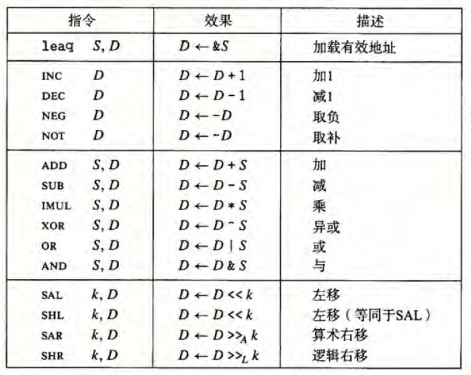

---

title: 'CSAPP Chap3: 程序的机器级表示'
date: 2021-04-21 18:37:52
tags:
- CSAPP
category:
- CSAPP
---

CSAPP第三章

<!--more-->

## 程序编码

```bash
linux> gcc -Og -o p p1.c p2.c
```

> -Og告诉编译器使用会生成符合原始C代码整体结构的机器代码的优化等级

实际上gcc调用了一整套程序，将源代码转化成可执行代码。

- **预处理器**扩展源代码，插入所有#include指定的文件，展开所有#define声明的宏。
- **编译器**（Compiler）产生两个源文件的汇编代码，分别为p1.s和p2.s。
- **汇编器**（Assembler）将汇编代码转化为二进制**目标代码**文件p1.o和p2.o。
- **链接器**（Linker）将目标代码文件和实现库函数的代码合并，生成可执行文件p。

在命令行使用“-S”选项，可以看到编译器产生的汇编代码。

```bash
linux> gcc -Og -S mstore.c
```

使用“-c”选项，GCC会编译并汇编该代码。

```bash
linux> gcc -Og -c mstore.c
```

可以使用反汇编器查看机器代码文件

```bash
linux> objdump -d mstore.c
```

## 数据格式

Intel用字表示16位数据类型

| C声明  | Intel数据类型 | 汇编代码后缀 | 大小（字节） |
| ------ | ------------- | ------------ | ------------ |
| char   | 字节          | b            | 1            |
| short  | 字            | w            | 2            |
| int    | 双字          | l            | 4            |
| long   | 四字          | q            | 8            |
| char*  | 四字          | q            | 8            |
| float  | 单精度        | s            | 4            |
| double | 双精度        | l            | 8            |

## 访问信息

x86-64的CPU包含一组16个存储64位值的**通用目的寄存器**，这些寄存器用来存储整数数据和指针。

最特别的是栈指针%rsp，用来指明运行时栈的结束位置。

| %rax    | %eax | %ax  | %al  |
| ------- | ---- | ---- | ---- |
| 64(bit) | 32   | 16   | 8    |
| 8(byte) | 4    | 2    | 1    |


### 操作数指示符

大多数指令有一个或多个**操作数**，指示出执行一个操作中要使用的源数据值，以及放置结果的目的位置。操作数分为三种类型：

- **立即数**：用来表示常数值，如\$-577或$0x1F。
- **寄存器**：表示某个寄存器的内容，用$$r_a$$表示寄存器a，$$R[r_a]$$表示它的值。
- **内存引用**：它会根据计算出来的地址（通常称为**有效地址**）访问某个内存位置，用$$M_b[Addr]$$表示内存中从地址Addr开始的b个字节值的引用。

| 类型   | 格式               | 操作数值                        | 名称                |
| ------ | ------------------ | ------------------------------- | ------------------- |
| 立即数 | $$$Imm$$           | $$Imm$$                         | 立即数寻址          |
| 寄存器 | $$r_a$$            | $$R[r_a]$$                      | 寄存器寻址          |
| 存储器 | $$Imm$$            | $$M[Imm]$$                      | 绝对寻址            |
| 存储器 | $$(r_a)$$          | $$M[R[r_a]]$$                   | 间接寻址            |
| 存储器 | $$Imm(r_b)$$       | $$M[Imm+R[r_a]]$$               | （基址+偏移量）寻址 |
| 存储器 | $$r_b, r_i$$       | $$M[R[r_b]+R[r_a]]$$            | 变址寻址            |
| 存储器 | $$Imm(r_b, r_i)$$  | $$M[Imm+R[r_b]+R[r_a]]$$        | 变址寻址            |
| 存储器 | $$(,r_i,s)$$       | $$M[R[r_i]\cdot s]$$            | 比例变址寻址        |
| 存储器 | $$Imm(,r_i,s)$$    | $$M[Imm+R[r_i]\cdot s]$$        | 比例变址寻址        |
| 存储器 | $$(r_b,r_i,s)$$    | $$M[R[r_b]+R[r_i]\cdot s]$$     | 比例变址寻址        |
| 存储器 | $$Imm(r_b,r_i,s)$$ | $$M[Imm+R[r_b]+R[r_i]\cdot s]$$ | 比例变址寻址        |

> 比例因子$$s\in\{1,2,4,8\}$$

### 数据传送指令

最简单形式的数据传送指令MOV类，这些指令把数据从源位置复制到目的位置，不做任何变化。

| 指令         | 效果              | 描述           |
| ------------ | ----------------- | -------------- |
| MOV S, D     | $$D\leftarrow S$$ | 传送           |
| movb         |                   | 传送字节       |
| movw         |                   | 传送字         |
| movl         |                   | 传送双字       |
| movq         |                   | 传送四字       |
| movabsq I, R | $$R\leftarrow I$$ | 传送绝对的四字 |

> 传送指令的两个操作数不能都指向内存位置。

MOV指令只会更新目的操作数制定的那些寄存器字节或内存位置。唯一的例外是movl指令以寄存器作为目的时，它会把该寄存器的高位4字节设置为0。

常规的movq指令只能以表示为32位补码数字的立即数作为源操作数。movabsq指令能以任意64位立即数值作为源操作数，并且只能以寄存器作为目的。


MOVZ和MOVS可以将较小的源值复制到较大的目的。

- MOVZ类中的指令把目的中剩余的字节填充为0。
- MOVS类中的指令通过符号拓展来填充。


pushq指令的功能是把数据压到栈上，而popq指令时弹出数据。这些指令只有一个操作数——压入的数据源和弹出的数据目的。


```assembly
pushq %rsp
// 等价于
subq $8, %rsp
movq %rbp, (%rsp)
```

```assembly
popq %rax
// 等价于
movq (%rsp), %rax
addq $8, %rsp
```

## 算术和逻辑操作



**加载有效地址**指令leaq实际上是movq指令的变形。它的指令形式是从内存读数据到寄存器，但实际上它根本没有引用内存，该指令将有效地址写入目的操作数。


一元操作只有一个操作数，这个操作数可以是一个寄存器，也可以是一个内存位置。

二元操作的第二个操作数既是源又是目的。第一个操作数可以是立即数 、寄存器或是内存位置，第二个操作数可以是寄存器或是内存位置。当第二个操作数为内存地址时，处理器必须从内存读出值，执行操作，再把结果写回内存。

移位操作，先给出移位量，第二项给出要移位的数。移位量可以是一个立即数，或者放在**单字节**寄存器%cl中。（只允许以这个特定的寄存器作为操作数）

### 特殊的算术操作


对于imulq/mulq：

- 双操作数，从两个64位操作数产生一个64位乘积。
- 单操作数，计算两个64位值的全128位乘积，要求一个参数在寄存器%rax中，另一个作为操作数给出。乘积存放在%rdx（高64位）和%rax（低64位）中。

有符号数除法指令**idivq**将寄存器%rdx（高64位）和%rax（低64位）中的128位数作为被除数，除数作为指令的操作数给出。指令将商存在寄存器%rax中，将余数存在寄存器%rdx中。

指令cqto读出%rax的符号位，并将它复制到%rdx的所有位。

无符号除法使用divq指令。通常寄存器%rdx会事先设置为0。

## 控制

CPU维护着一组单个位的**条件码**寄存器，他们描述了最近的算术或逻辑操作的属性。

- CF：进位标志。最近的操作使最高位产生了进位。可用来检查无符号操作数的溢出。
- ZF：零标志。最近的操作得出的结果为0。
- SF：符号标志。最近的操作得到的结果为负数。
- OF：溢出标志。最近的操作数导致一个补码溢出——正溢出或负溢出。
- leaq指令不不改变任何条件码。
- 对于逻辑操作，进位和溢出标志会设置成0。
- 对于移位操作，进位标志将设置为最后一个被移出的位，溢出标志设置为0。
- INC和DEC指令会设置溢出和零标志，但是不会改变进位标志。


> CMP和TEST指令只设置条件码而不改变任何其他寄存器。

### 访问条件码

SET指令根据条件码的某种组合，将一个字节设置为0或者1。

一条SET指令的目的操作数是低位单字节寄存器元素之一，或是一个字节的内存位置，指令会将这个字节设置为0或1。为了得到一个32位或64位结果，我们必须对高位清零（例如利用MOVZ指令）。


### 跳转指令

**跳转**指令会导致执行切换到程序中的一个全新的位置，这些跳转的目的地通常用一个**标号**指明。


jump是无条件跳转。它可以是**直接跳转**，即跳转目标是作为指令的一部分编码的（标号）；也可以是**间接跳转**，即跳转目标是从寄存器或内存位置中读出的（“*”后跟一个操作数提示符）。

条件跳转指令根据条件码的某种组合，或跳转，或继续执行代码序列中下一条指令。条件跳转只能是直接跳转。

跳转指令有几种不同的编码，最常用的都是**PC相对的**，会将目标指令的地址与**紧跟在跳转指令后面那条指令的地址**之间的差作为编码。

第二种编码是给出“绝对”地址，用4个字节直接指定目标。

###  用条件控制来实现条件分支

C语言中的if-else语句的通用形式模版如下：

```c
if (test-expr)
  then-statement
else
  else-statement
```

对于这种通用形式，汇编实现通常会使用下面这种形式：

```c
  t = test-expr;
  if (!t)
    goto false;
  then-statement
  goto done;
false:
  else-statement
done:
```

### 用条件传送实现条件分支

现代处理器使用流水线执行指令，遇到条件需要跳转时，只有知道跳转结果才能确定指令顺序，才能使用流水线。现在处理器采用**分支预测**的方法来预测跳转的结果，即处理器会预测当前跳转的结果。

用**条件传送**来实现条件分支，不会先判断跳转，而是先将两个分支的结果进行计算，将结果分别保存在两个寄存器中，然后再通过**条件传送指令`CMOV`**将正确结果传送到输出的寄存器中。


条件传送同样也存在局限性

1. 如果条件判断是里面执行语句的可行性判断时，使用条件传送实现条件分支就会出现错误。比如对于指针`xp`，有个条件分支为`xp?*xp:0`，如果使用条件传送来实现，就会先运行`*xp`，如果该指针不存在，就会报错。
2. 如果执行语句需要大量计算时，由于条件传送会先全部计算后再进行选择，则会浪费一些时间。

### 循环

do-while

```c
do {
    body-statement
} while(test-expr);
```

```assembly
loop:
	body-statement
	t = test-expr;
	if (t)
		goto loop;
```

while有两种翻译方法

```c
while(test-expr)
    body-statement
```

第一种方法称为跳转到中间（jump to middle）。

```assembly
	goto test;
loop:
	body-statement
test:
	t = test-expr;
	if (t)
		goto loop;
```

当使用较高优化等级时，比如`-O1`时，GCC会使用guarded-do策略。

```c
t = test-expr;
if (!t)
    goto done;
loop:
	body-statement
	t = test-expr;
	if (t)
        goto loop;
done:
```

for循环可以转化为while循环，GCC会为其产生的代码是while循环的两种方法之一，这取决于根据优化等级。

```c
for (init-expr; test-expr; update-expr)
    body-statement
    
// 等价于
init-expr;
while (test-expr) {
	body-statement
    update-expr;
}
```

### Switch

switch语句可以根据一个整数索引数值进行多重分支，通过使用**跳转表（Jump Table）**使得实现更加高效。跳转表是一个数组，表项i是一个代码段的地址。


数组jt包含7个表项，每个都是一个代码块的地址。GCC用&&创建一个指向代码位置的指针。


> 通过第2行可以知道`switch`的最小值，第3行可以知道`switch`的最大值，第4行可以知道`default`的标号。

跳转表的内容由编译器自动生成填写，其声明如下所示.

