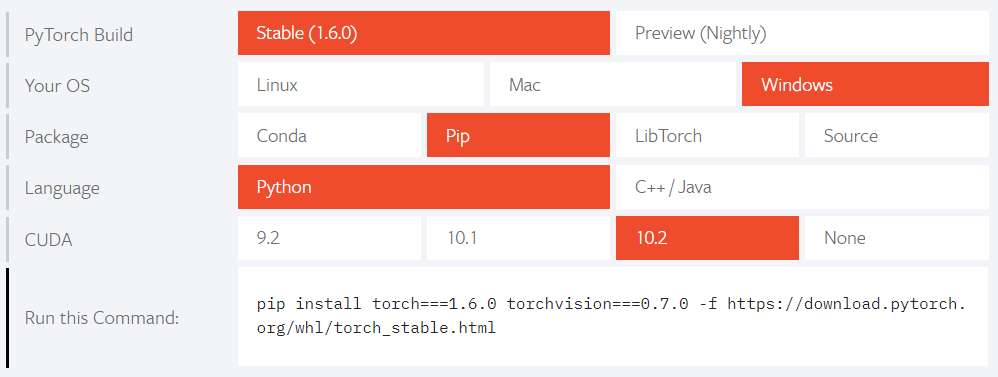
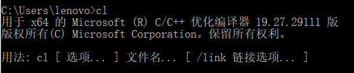

在windows 10系统上安装detectron2。

<!--more-->

## 环境依赖

给出自己的环境，低版本未测试。

- Python 3.7.2
- Pytorch 1.6
- pycocotools 2.0
- CUDA 10.2
- VS 2019 Community

### 安装 CUDA

进入[官网](https://developer.nvidia.com/cuda-downloads)，按部就班安装，[参考教程](https://blog.csdn.net/qq_37296487/article/details/83028394)。

cmd输入如下命令，测试CUDA是否安装成功。

```bash
nvcc -V
```

### 安装 Pytorch

python和git这些基本的就不提了，介绍一下pytorch的安装。

进入[pytorch官网](https://pytorch.org/)，选择相对应的版本，使用pip直接安装。



测试Pytorch是否安装成功。

```python
import torch, torchvision
print(torch.__version__, torch.cuda.is_available())
```

### 安装 VS 2019

进入[vs官网](https://visualstudio.microsoft.com/zh-hans/downloads/)，选择community版本进行下载。

下载完成后，先不着急运行安装程序，按[博客](https://www.loongten.com/2019/06/18/vs2019/)将安装目录迁移到非系统盘（C盘实在是装不下了）。

完成后，运行安装程序，选择C++组件即可，其他组件看个人需求选择。

### 安装 pycocotools

[原版](https://github.com/cocodataset/cocoapi)的pycocotools不支持windows，需要使用[修改版](https://github.com/philferriere/cocoapi)。

可通过如下命令安装

```bash
git clone https://github.com/philferriere/cocoapi.git
cd PythonAPI
python setup.py build_ext --inplace
python setup.py build_ext install
```

或者直接

```bash
pip install git+https://github.com/philferriere/cocoapi.git#subdirectory=PythonAPI
```

出现Successfully installed pycocotools-2.0即为安装成功。

### 安装 detectron2

```bash
git clone https://github.com/facebookresearch/detectron2.git
```

修改文件 setup.py，注释掉

```python
"pycocotools>=2.0.1",
```

开始安装

```bash
python setup.py build develop
```

安装过程无报错即可。

#### 目标检测

```bash
python demo/demo.py --config-file configs/COCO-Detection/faster_rcnn_R_50_FPN_3x.yaml --input ../TestExample/test.jpg --output ../TestExample/output.jpg --opts MODEL.WEIGHTS ../TestExample/model_final_b275ba.pkl
```

#### 实例分割

```bash
python demo/demo.py --config-file configs/COCO-Detection/faster_rcnn_R_50_FPN_3x.yaml --input ../TestExample/test.jpg --output ../TestExample/output.jpg --opts MODEL.WEIGHTS ../TestExample/model_final_f10217.pkl
```

## 可能出现的问题

[github issue](https://github.com/conansherry/detectron2/issues/2)

安装时提示缺少什么包，直接pip install即可，出问题可以查stackoverflow。

### cl.exe出错

[解决方法](https://blog.csdn.net/qq_35067322/article/details/105835311)

添加环境变量

```bash
C:\Program Files (x86)\Microsoft Visual Studio\2019\Community\VC\Tools\MSVC\14.27.29110\bin\Hostx64\x64
```

如下即可



### cocoeval出错

修改文件 detectron2\detectron2\layers\csrc\cocoeval\cocoeval.cpp

添加

```C++
#include <time.h>
```

修改

```C++
localtime_r(&rawtime, &local_time);
```

为

```C++
localtime_s(&local_time, &rawtime);
```

### nvcc.exe出错

修改文件 detectron2/detectron2/layers/csrc/nms_rotated/nms_rotated_cuda.cu

在11行

```C++
#ifdef WITH_HIP
```

之前添加

```C++
#define WITH_HIP
```