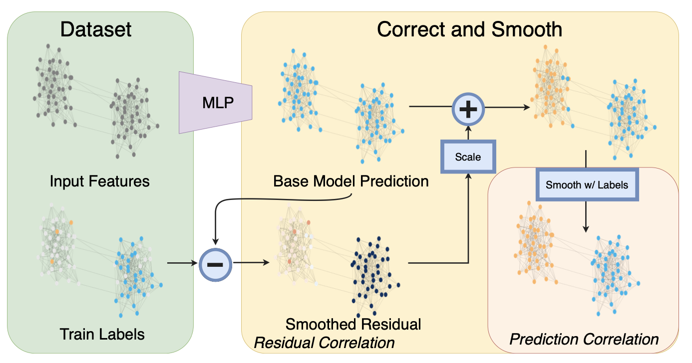
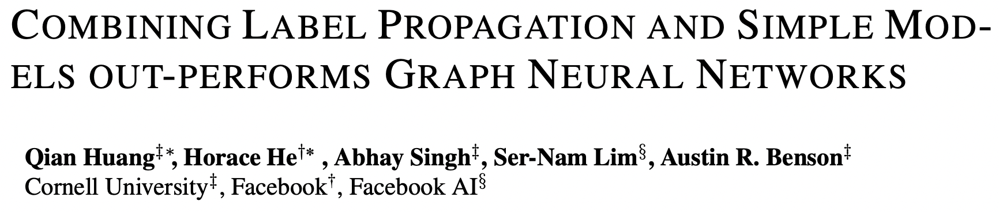
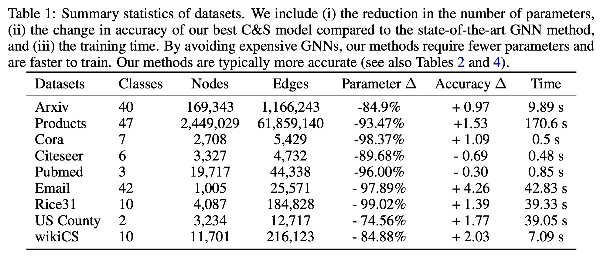
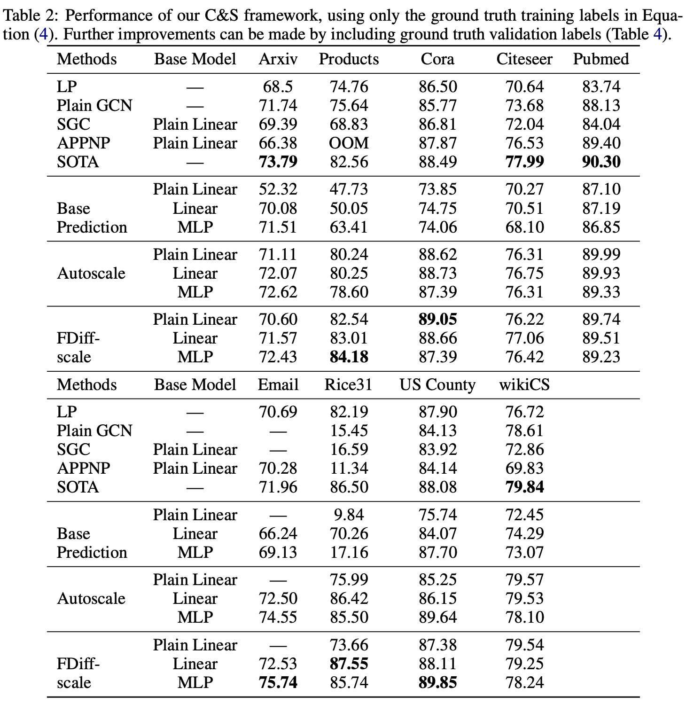

ICLR，采用后处理的方法而非GNN在OGB上取得SOTA。

<!--more-->

## Overview

- paper: https://arxiv.org/pdf/2010.13993.pdf
- code: <https://github.com/CUAI/CorrectAndSmooth>

## Background

随着图神经网络变得越来越复杂， 理解模型的性能为什么提升越来越困难，将其应用在大规模数据集上也很困难。

本文提出了一个简单的pipeline，包括三个部分

1. 忽略图结构，用节点特征进行基本预测。
2. 纠正步骤，将训练数据的不确定性传播到整个图中，以纠正基本预测。
3. 对预测结果进行平滑处理。

步骤2和3仅仅采用了经典方法做后处理。

## Method

图$G=(V,E)$有$n=|V|$个节点，节点特征$X\in\mathbb{R}^{n\times p}$。$A$为邻接矩阵，$D$为对角度矩阵，$S=D^{-1/2}AD^{-1/2}$。对于预测问题，节点集合分为有标注的$L$和无标注的$U$，标签$Y\in\mathbb{R}^{n\times c}$，需要给未标注的节点$j\in U$打标签。

首先直接用MLP对节点特征预测，不依赖任何的图结构，得到基本预测$Z$。

然后考虑融入标签特征纠正错误，提升预测的准确率。首先定义错误矩阵$E\in\mathbb{R}^{n\times c}$，在验证集和测试集上均为0。
$$
E_{L_t} = Z_{L_t} - Y_{L_t},\quad E_{L_v}=0,\quad E_{U}=0.
$$
采用标签传播（label spreading）技巧对错误进行平滑，优化目标为
$$
\hat{E} = \arg \min_{W\in\mathbb{R}^{n\times c}} \trace(W^T(I-S)W)+\mu\lVert W-E\rVert^2_F
$$
第一项平滑了错误，第二项保障了所求的解接近初始错误。可以通过迭代求解$E^{(t+1)} = (1-\alpha)E+\alpha SE^{(t)}$，其中$\alpha=1/(1+\mu)$，$E^{(0)} = E$。从而平滑后的错误为
$$
Z^{(r)} = Z + \hat{E}
$$
这种传播在回归问题的高斯假设下被证明正确，但对于分类问题而言，平滑后的错误可能尺度$\hat{E}$不对。可以推出
$$
\lVert E^{(t+1)}\rVert \le (1-\alpha)\lVert E\rVert + \alpha\lVert S\rVert_2\lVert E^{(t)}\rVert_2 = (1-\alpha)\lVert E\rVert_2 + \alpha\lVert E^{(t)}\rVert_2
$$
当$E^{(0)} = E$，从而$\lVert E^{(t)}\rVert_2\le\lVert E\rVert_2$。因此传播不能完全纠正图中节点的错误，本文提出了两种缩放机制Autoscale和Scaled Fixed Diffusion来处理这个问题。

在得到得分向量$Z^{(r)}$后，进一步对预测结果进行平滑。这是因为邻接的节点容易有相同的标签，所以采用标签传播再一次平滑处理。
$$
G_{L_t} = Y_{L_t},\quad G_{L_v,U} = Z_{L_v, U}^{(r)}
$$
将训练节点设置为真实标签，验证与无标注节点采用纠正预测（验证集也可以用真实标签）。采用$G^{(t+1)} = (1-\alpha)G+\alpha SG^{(t)}$迭代，给出最终的预测结果$\hat{Y}$。

## Experiment

