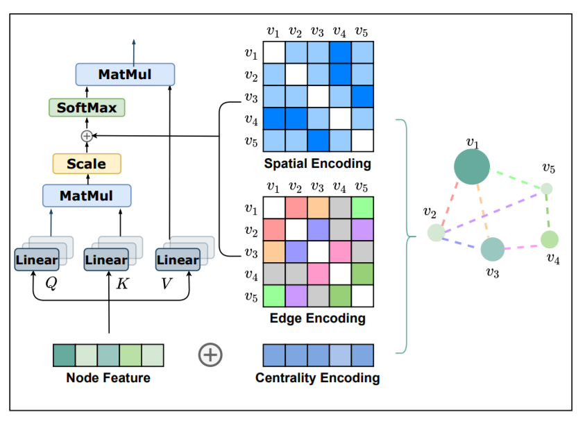
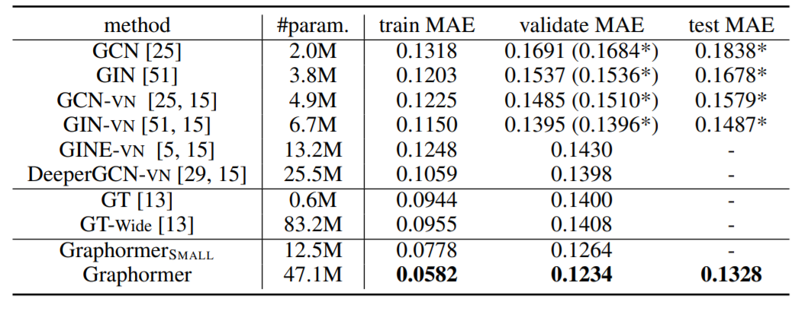
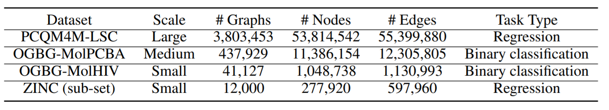
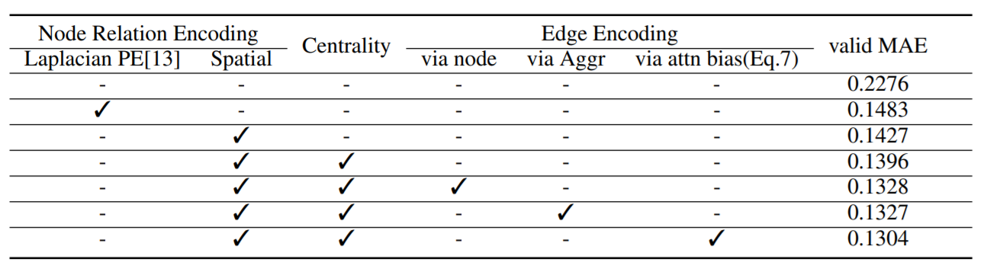

Graphormer：KDD Cup2021 OGB-LSC赛道的冠军方案

<!--more-->

## Overview

- KDD Cup2021: https://ogb.stanford.edu/kddcup2021
- Technical report: https://arxiv.org/pdf/2106.08279.pdf
- Arxiv: https://arxiv.org/pdf/2106.05234v3.pdf
- Code: https://github.com/microsoft/Graphormer/tree/ogb-lsc

来自大连理工和MSRA的一篇文章，值得一提的是Guolin Ke(<https://github.com/guolinke>)是TUPE的一作，也是尝试修改Transformer的工作。

## Background

Transformer在NLP和CV都取得了成功，但在图表示学习任务上的表现还不尽如人意，不能匹敌GNN等图神经网络。本文提出了Graphormer，在原生Transformer的基础上改进，在许多图预测任务上取得了SOTA结果，包括OGB-LSC等。

原生Transformer适合序列建模，为了在图数据中发挥作用，需要在模型中融入图结构信息。本文的贡献如下：

- 提出了**Centrality Encoding**，以捕获图中节点的重要性。
- 提出了新颖的**Spatial Encoding**，捕获节点之间的结构关系。
- 在数学上证明了Graphormer有强大的表示能力，且GNN等变体可以看作Graphormer的特例。

## Preliminary

### GNN

对于图$G=(V,E)$来说，GNN旨在学习节点$v_i$的表示向量$x_i$，采用聚合一阶或高阶邻居的表示迭代更新参数。

假设$h_i^{(l)}$为节点$v_i$在第$l$层的隐层表示，GNN的迭代过程主要有两步AGGREGATE和COMBINE：
$$
\begin{align}
a_i^{(l)} &= \mathrm{AGGREGATE}^{(l)}(\{h_j^{(l-1)}:j\in\cal{N}(v_i)\}) \\
h_i^{(l)} &= \mathrm{COMBINE}^{(l)}(\{h_j^{(l-1)}, a_i^{(l)})
\end{align}
$$
AGGREGATE聚合了邻居的信息，常用方法有MEAN、MAX、SUM等；COMBINE将聚合的信息融入节点表示。

此外，对于图表示任务，还需要设计READOUT函数，以用最后一层的节点特征$h_i^{(L)}$表示全图特征$h_G$。
$$
h_G = \mathrm{READOUT}(\{h_i^{(L)}|v_i\in G\})
$$

### Transformer

老生常谈，主要分为前馈网络和自注意力两个部分，自注意力采用缩放点积和多头注意力。

## Graphormer

### Centrality Encoding

centrality意为中心地位，文章认为GNN中的聚合方式没有考虑节点在图中的重要性，比如名人在社交网络中具有更重要的影响因子。

在Graphormer中，根据入度和出度为每个节点赋予两个嵌入向量，在原来的节点特征上相加。
$$
h_i^{(0)} = x_i + z_{\mathrm{deg}^-}^- + z_{\mathrm{deg}^+}^+
$$

### Spatial Encoding

Transformer可以捕获全局信息，但副作用是需要显示指定位置编码，比如序列数据中的绝对位置或相对位置编码。在图中，节点没有这种时序关系，为此设计了空间编码以捕获图结构信息。

具体来说，映射$\phi(v_i,v_j):V\times V\rightarrow \mathbb{R}$可以描述节点间的关系。如果节点相连，采用最短路径SPD，否则为给定值如-1。本文采用可学习的标量，并作为自注意力模块中的偏置项。
$$
A_{ij} = \frac{(h_iW_Q)(h_jW_K)^T}{\sqrt{d}}+b_{\phi(v_i,v_j)}
$$
其中，$A_{ij}$为注意力的权重矩阵。

### Edge Encoding in the Attention

除此之外，本文还考虑了边的结构信息。一种方式是直接将边特征与节点特征相加，另一种方式则是在聚合的时候考虑边的特征。但这些方法只向相关节点传播信息，不能有效利用全局信息。

对于有序节点对$(v_i, v_j)$，寻找最短路径$SP_{ij}=(e_1,e_2,\dots,e_N)$，对于均值计算点积作为编码：
$$
c_{ij} = \frac1N\sum_{n=1}^{N}x_{e_n}(w_n^E)^T
$$
将编码结合在自注意力中
$$
A_{ij} = \frac{(h_iW_Q)(h_jW_K)^T}{\sqrt{d}}+b_{\phi(v_i,v_j)} + c_{ij}
$$

## Implementation

## Special Node

BERT中设计了[CLS]用于代表序列的全局信息，本文也设计了类似的节点[VNode]，将最后一层的节点特征作为全局表示$h_G$。不同于[CLS]放在句首，[VNode]与所有节点相连，但要区分空间编码$b_{\phi([VNode],v_i)}$和$b_{\phi(v_i, [VNode])}$。

## Experiment

首先在OGB-LSC上，进行了实验结果的比较，数据集为量子化学回归PCQM4M-LSC，总共包含3.8M的图。

参数方面，提供了两个版本，分别采用12层768维和6层512维。

本文还在MoIPCBA、MoIHIV和ZINC上做了实验，都取得了较好的结果，数据集详情如下。

本文也做了消融实验，验证各个模块的有效性。

