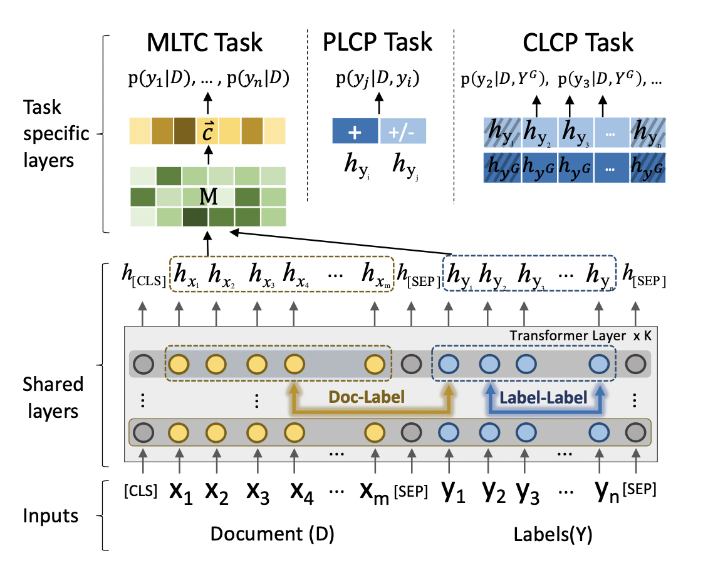
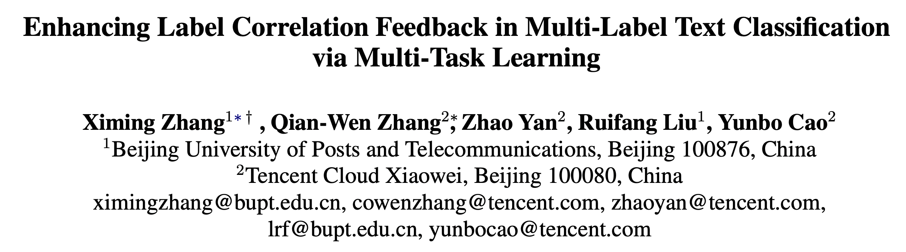
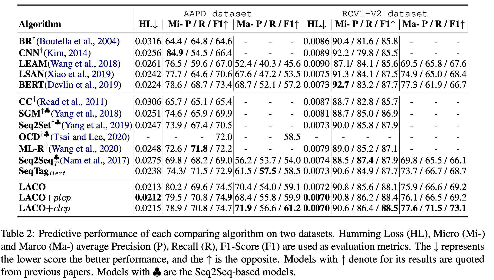
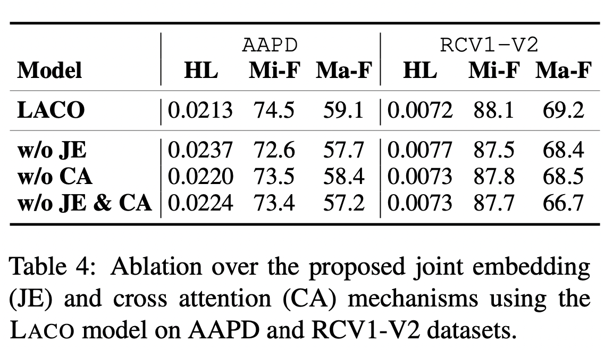
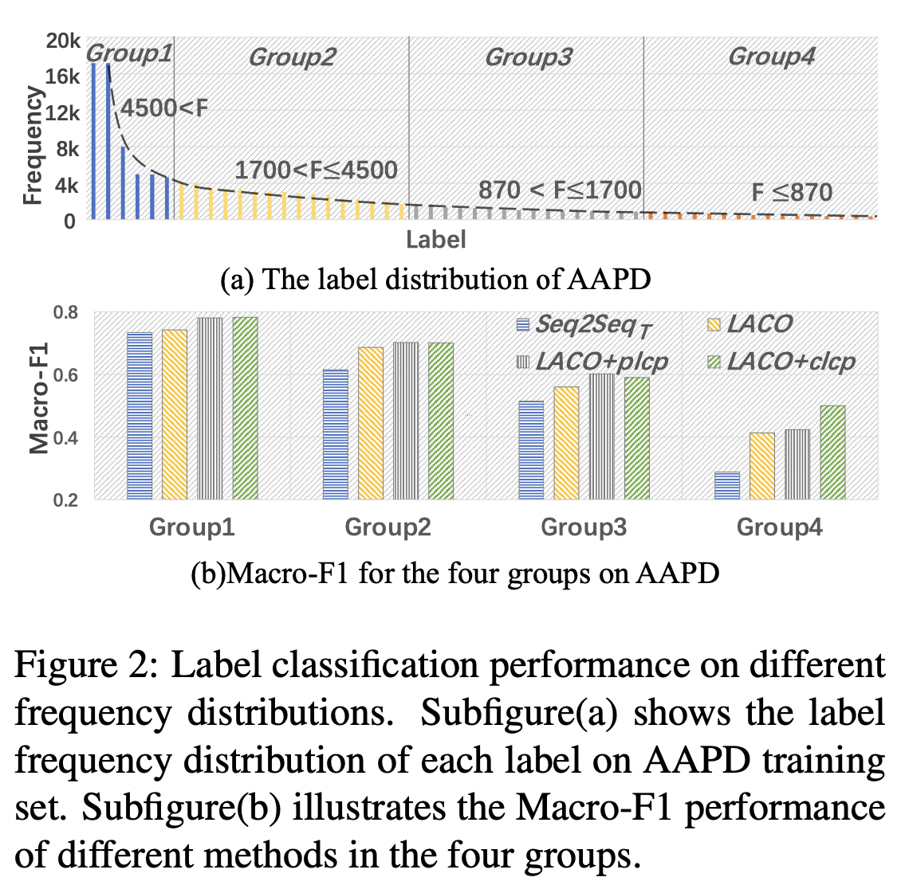
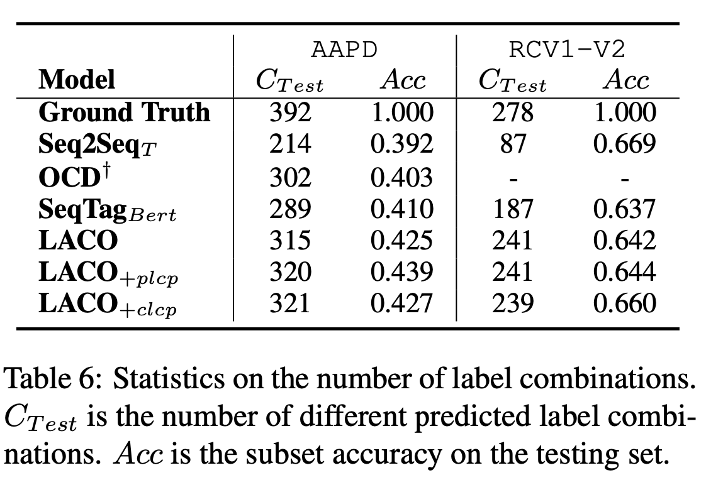
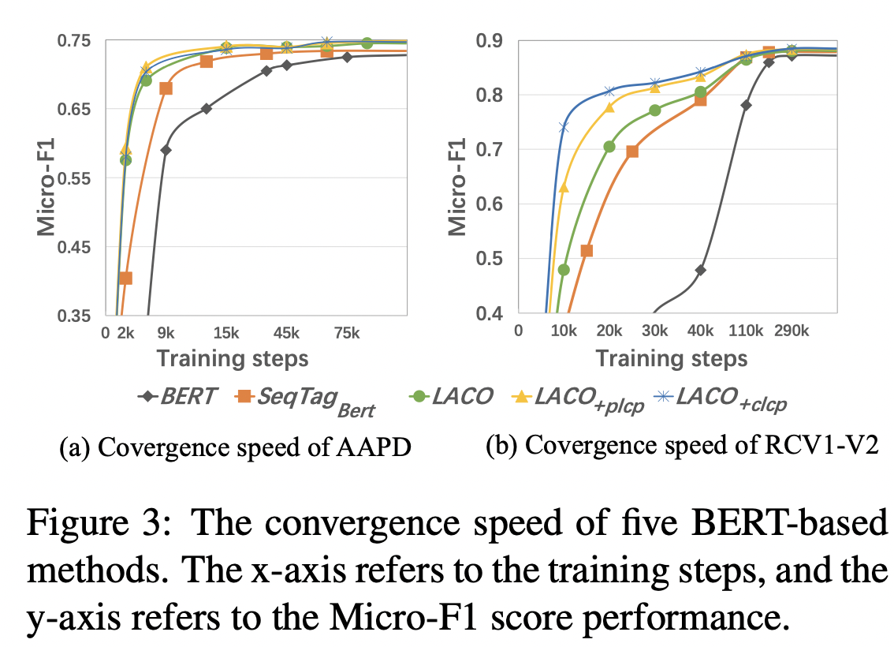

ACL Findings 2021，使用多任务学习加强标签相关性的反馈，设计了标签对共现预测（Pairwise Label Co-occurrence Prediction, PLCP）和条件标签共现预测（Conditional Label Co-occurrence Prediction, CLCP）两个任务。



<!--more-->

## Overview



- paper: <https://arxiv.org/pdf/2106.03103.pdf>
- code (tensorflow): <https://github.com/EiraZhang/LACO>

## Background

在多标签文本文类任务中，利用标签相关性的模型可以更好地泛化，有利于建模低频标签。基于Seq2Seq的方法可以有效捕获标签相关性，但也有几点不足：

- 依赖预先定义的标签顺序，模型对此十分敏感。
- 容易在训练集上过拟合，难以泛化至没有见过的标签组合。
- 存在错误传播的问题。

本文采用多任务学习的框架，基于Transformer引入joint embedding机制。通过self-attention和cross-attention，将文本信息和标签信息深度交互。并设计两个标签共现的预测任务，用于捕获标签之间的相关性。

- 标签对共现预测PLCP：通过两两组合，判断标签是否相关，捕获二阶相关性。
- 条件标签共现预测CLCP：给定部分相关标签集合，预测其他位置标签的相关性，可以捕获高阶相关性。

## Method

### Document-Label Joint Embedding (JE)

将文本序列和标签序列通过[SEP]拼接作为输入序列，表示为$\{[CLS],x_1,\cdots,x_m,[SEP],y_1,\cdots,y_n,[SEP]\}$，进入BERT后得到隐层表示$\{h_{[CLS]},h_{x_1},\cdots,h_{x_m},h_{[SEP]},h_{y_1},\cdots,h_{y_n},h_{[SEP]}\}$。

联合embedding的方式既兼顾了文本与标签的相关性，也考虑到了标签内部的相关性（但这种方法在标签数目过多时显然不适用）。

作者还显式地引入了cross-attention计算，称为Document-Label Cross Attention：
$$
M = H_DH_Y^T
$$
其中$H_D = [h_{x_1},\cdots,h_{x_m}]$为文本序列的embedding，$H_Y=[h_{y_1},\cdots,h_{y_n}]$为标签序列的embedding，$M\in\mathbb{R}^{m\times n}$。对于长为$2r+1$的文本，$M_{i-r;i+r}$衡量了标签-短语对的相关性。

为了提升稀疏正则化的有效性（？？？），作者还使用了CNN，结合max-pooling得到最终的文本表示$\vec{c}$。
$$
\vec{c} = \Omega(M_{i-r;i+r})·H_D
$$
对文本表示接全连接层得到预测结果，采用BCE损失函数即可。

### PLCP Task

作者将标签集分为$Y^+$和$Y^-$两类，$Y^+$表示相关的标签（共同出现过），$Y^-$表示不相关的标签。

标签对一部分从$Y^+$中挑选，标记为IsCo-occur，另一部分从$Y^+$和$Y^-$中挑选，标记为NotCo-occur，比例设为$\gamma$。将两个标签的embedding拼接$[y_i, y_j]$作为输入，采用交叉熵计算损失。
$$
\mathcal{L}_{plcp} = -[q_{ij}\ln p_{ij} + (1-q_{ij})\ln(1-p_{ij})]
$$

构造标签集

```python
label_list = example.label.split(" ")
label_ids = _predicate_label_to_id(label_list, label_map)
right_labels = []
wrong_labels = []
for label_id in range(0,len(label_ids)):
    if label_ids[label_id]==1:
        right_labels.append(label_id)
        else:
            wrong_labels.append(label_id)

right_pair = list(itertools.combinations(right_labels, 2))

contrast_dict = {}

for pair in right_pair:
    contrast_dict[pair]=[0,1]
    for i in range(0,int(len(right_pair)*2)):
        r = random.sample(right_labels,1)[0]
        w =random.sample(wrong_labels,1)[0]
        contrast_dict[(r,w)]=[1,0]
```

构造feature并采样

```python
feature_list=[]
for pair in contrast_dict.keys():
    feature = InputFeatures(
      input_ids=input_ids,
      input_mask=input_mask,
      segment_ids=segment_ids,
      token_label_ids=token_label_ids,
      label_ids=label_ids,
      fit_labelspace_positions=fit_labelspace_positions,
      fit_docspace_positions=fit_docspace_positions,
      pair = list(pair),
      pair_target=list(contrast_dict[pair]),
      #    pair = list([0,1]),
      #    pair_target= list([0,1]),
      is_real_example=True)
    feature_list.append(feature)
a = random.sample(feature_list, 1)
```

### CLCP Task

从$Y^+$中随机采样$s$个标签，形成$Y^G$，然后判断剩余的标签是否与其相关。为此引入了一个额外的位置向量$E_Y = [e_{y_1},\cdots,e_{y_n}]$，$e_{y_i}=0$就表示标签被采样了，也即$y_i\in Y^G$，反之则$y_i\in Y-Y^G$。

将所有被采样的标签表示做平均得到$h_{y^G}$，将其拼接到所有未被采样的标签表示，作为输入特征。同样采用交叉熵作为损失函数。
$$
\mathcal{L}_{clcp} = -\sum_{i=1}^{n-s}[q_{i}\ln p_{i} + (1-q_{i})\ln(1-p_{i})]
$$
其中$q_i\in\{0,1\}$表示标签$y_i$是否与$Y^G$中的标签共同出现。

```python
right_mask_labels = random.sample(right_labels,1)

for num_label in range(0,54) :
    if num_label not in right_mask_labels:
        fit_labelspace_mask_positions.append(num_label)
    else:
        fit_labelspace_given_positions.append(num_label)

for mask_position in fit_labelspace_mask_positions:
    if mask_position in right_labels:
        mask_lm_ids.append(1)
    else:
        mask_lm_ids.append(0)
```

## Experiment

在AAPD和RCV1-V2上进行了实验，实验设置为bert-base-uncased，batch size为32，最大长度320，学习率为5e-5，$\gamma$为0.5。



### Ablation



LACO在低频标签上能够取得更好的性能（提高召回，但准确率可能下降？）。



LACO预测出了更多样的标签组合。



LACO相比于BERT类模型，得益于多任务之间的特征交互，可以获得更快的收敛速度。


