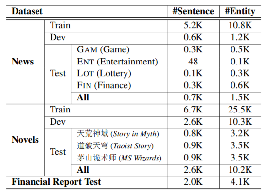

张岳老师的文章，关注如何更充分利用实体信息以增强预训练语言模型在中文NER上的表现（EMNLP 2020）。

<!--more-->

## Overview

- arxiv: https://www.aclweb.org/anthology/2020.emnlp-main.518.pdf
- code: 暂无

## Background

在中文NER中引入词典已经被证明是一个有效的方法，但是将实体信息融入BERT这类预训练模型的研究还很少。

论文首先基于互信息的计算，用新词发现策略来识别文档中的entity；然后设计了char-entity自注意力机制来捕捉中文字与实体之间的关系，将字符隐层状态和实体向量组合。

## Methodology

### New-Word Discovery

采用了[Bouma（2009）](https://svn.spraakdata.gu.se/repos/gerlof/pub/www/Docs/npmi-pfd.pdf)提出的方法，用互信息计算，不予赘述。

### Char-Entity-Transformer

经典的Transformer计算Q、K、V三个矩阵
$$
\{Q^l,K^l,V^l\} = \{h^{l-1}W_q^l,h^{l-1}W_k^l,h^{l-1}W_v^l\} \\
Atten(Q^l,K^l,V^l) = {\rm softmax}(\frac{Q^l {K^l}^T}{\sqrt{d_k}})
$$
本文也是先对给定的字符序列${\mathcal C} = \{c_1,\dots,c_T\}$，给定词典$\mathcal E_{ent}$，匹配得到对应的实体序列$\mathcal E = \{e_1,\dots,e_T\}$。

给定$(l-1)$层的隐层状态$\{h_1^{l-1},\dots,h_T^{l-1}\}$，QKV的计算如下
$$
\begin{align}
q_t^l &= h_t^{l-1}W_{h,q}^l; \\
k_t^l &= \begin{cases}{
			{h_t^{l-1}}^T W_{h,k}^l}\quad &{\rm if}\space e_t = 0,\\
			\frac12({h_t^{l-1}}^T W_{h,k}^l + E_{ent}^T[e_t]W_{e,k}^l)\quad &else;
		 \end{cases} \\
v_t^l &= \begin{cases}
			{h_t^{l-1}}^T W_{h,v}^l\quad &{\rm if}\space e_t = 0,\\
			\frac12({h_t^{l-1}}^T W_{h,v}^l + E_{ent}^T[e_t]W_{e,v}^l)\quad &else;
		 \end{cases}
\end{align}
$$
其中$E_{ent}$表示实体embedding，$W$表示可学习的参数。

如果字符没有匹配到实体，那么计算退化为原始的self-attention。

### NER任务

针对NER任务，模型使用softmax解码，采用BIO标注方式。

## Experiment

论文的实验使用了一个公开数据集CLUENER-2020，和两个自己标注的数据集。

本文还和ERNIE（百度）、Lattice进行了比较，采用的词典和ERNIE一样。

