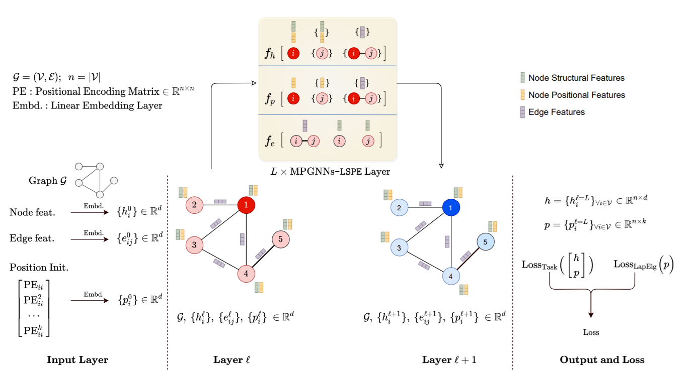
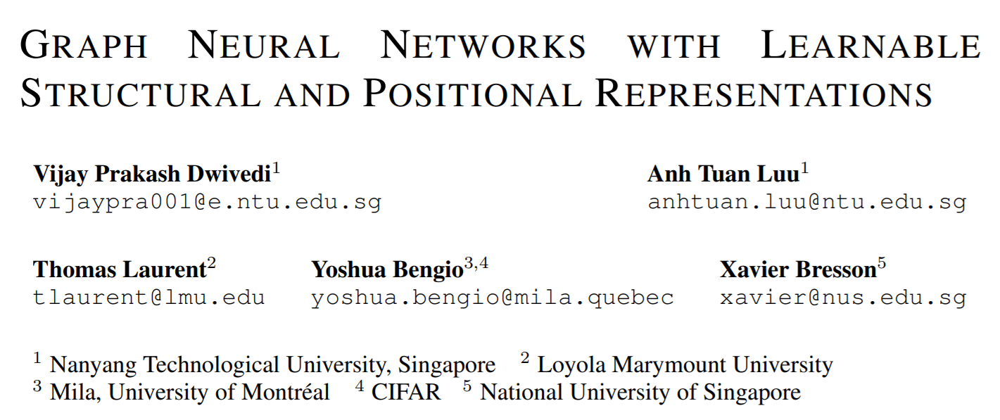
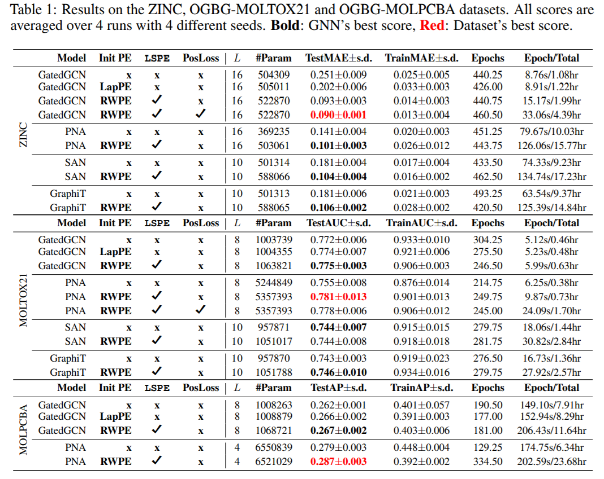
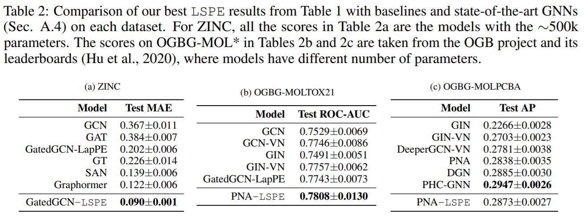
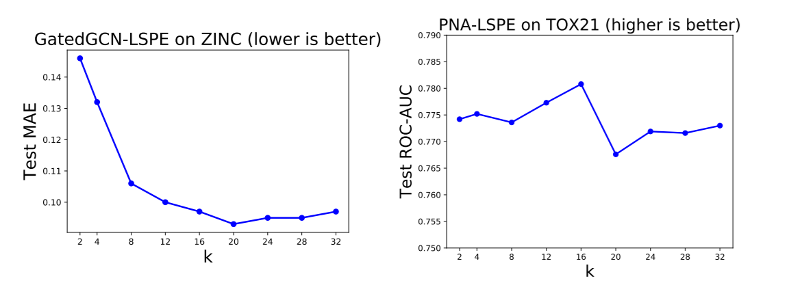

来自Bengio组，在GNN上引入位置编码，提出了一种新的框架LSPE，在分子数据集上的性能提升了2.87%至64.14%。

<!--more-->

## Overview

- arxiv: https://arxiv.org/pdf/2110.07875v1.pdf

- code: https://github.com/vijaydwivedi75/gnn-lspe

## Background

GNN大多是基于消息传递机制，通过聚合邻居的信息构建节点表示，但这也带来了一定的局限性。每个节点的表示只依赖于一小块local结构，而没有考虑到节点的位置信息。比如图中两个节点有着相同的1-hop邻居，但2-hop或高阶邻居都不甚相同，此时GNN不能区分两个节点。面对这种局限性，可以有三种方法：

1. 堆叠多层网络，因为过平滑现象可能难以适用长距离的节点；

2. 采用高阶的GNN，增加了计算代价；

3. 考虑节点的位置编码。

本文希望设计一种可学习的位置编码与GNN结合，从而可以提升GNN的节点表示能力，同时保持线性的计算复杂度便于大规模应用。

## Method

### Notation

假设图为$$\mathcal{G} = (\mathcal(V), \mathcal{E})$$，其中$$n = \lvert \mathcal{V} \rvert$$表示节点数，$$E=\lvert \mathcal{E} \rvert$$表示边数。$$A\in\mathbb{R}^{n\times n}$$为邻接矩阵，$$A_{ij} = 1$$表示两个节点有边相连，否则$$A_{ij} = 0$$，$$D\in\mathbb{R}^{n\times n}$$表示节点的度矩阵。$$h_i$$和$$p_i$$分别表示节点$$i$$的表示和位置编码，$$e_{ij}$$表示节点$$i$$和节点$$j$$相连的边的特征。

GNN模型一般有三个主要部分：嵌入层、堆叠的卷积层以及最后基于任务的层，用上标$$l$$表示层数，标准的MP-GNN参数更新公式如下：
$$
\begin{align}
\text{MP-GNNs}: \quad
	h_i^{l+1} &= f_h(h_i^{l}, \{h_j^{l}\}_{j\in\mathcal{N}_i}, e_{ij}^l),
	\ h_i^{l+1}, h_i^{l}\in \mathbb{R}^d, \tag{1} \label{eq1}\\
	e_{ij}^{l+1} &= f_e(h_i^{l}, h_j^{l}, e_{ij}^l),
	\ e_{ij}^{l+1}, e_{ij}^{l}\in \mathbb{R}^d \tag{2}
\end{align}
$$
其中$$f_h$$和$$f_e$$表示有可学习参数的函数，$$\mathcal{N}_i$$表示节点$$i$$的邻居。Transformer也被认为是MP-GNNs的一种特例，考虑全连通图，将$$\eqref{eq1}$$中的边特征丢弃，简化形式即为Transformer。

### Positional Encoding

现有MP-GNN中融合位置信息往往是通过拼接的方式：
$$
\begin{align}
	h_i^{\mathcal{l}=0} &= 
	\mathrm{LL}_h{
	\begin{bmatrix}
		{h_i^{\mathrm{in}} \\ p_i^{in}}
	\end{bmatrix}}
	= D^0{
	\begin{bmatrix}
		{h_i^{\mathrm{in}} \\ p_i^{in}}
	\end{bmatrix}}
	+d^0\in\mathbb{R}^d,\tag{3} \\
	e_{ij}^{l=0} &= \mathrm{LL}(e_{ij}^{\mathrm{in}})
    = B^0e_{ij}^{\mathrm{in}}+b^0\in\mathbb{R}^d \tag{4}
\end{align}
$$
其中$$p_i^\mathrm{in}\in\mathbb{R}^k$$表示输入节点的位置编码，$$D^0\in\mathbb{R}^{d\times(d_v+k)}$$和$$d_0\in\mathbb{R}^d$$表示全连接层的参数。这种方法融合了位置表示和结构化表示，同时保持了线性的计算复杂度，但是不能动态改变位置表示以更好地适应当前任务。

针对上述问题，本文将位置信息与结构信息分离，两种表示可以分别学习，这种框架称为可学习的结构和位置编码（**L**earnable **S**tructural and **P**ositional **E**ncodings，**LSPE**）。
$$
\begin{align}
\text{MP-GNNs-LSPE}: \quad
	h_i^{l+1} &= f_h\left(
	\begin{bmatrix}
		h_i^{l} \\ p_i^l
	\end{bmatrix},
	\left\{
		\begin{bmatrix}
			h_i^{l}\\p_i^l
		\end{bmatrix}
	\right\}_{j\in\mathcal{N}_i}, e_{ij}^l\right),
	\ h_i^{l+1}, h_i^{l}\in \mathbb{R}^d, \tag{5} \label{eq2} \\
	e_{ij}^{l+1} &= f_e(h_i^{l}, h_j^{l}, e_{ij}^l),
	\ e_{ij}^{l+1}, e_{ij}^{l}\in \mathbb{R}^d \tag{6} \\
	p_i^{l+1} &= f_p(p_i^l, \{p_j^{l}\}_{j\in\mathcal{N}_i}, e_{ij}^l),\ p_i^{l+1},p_i^l\in\mathbb{R}^d, \tag{7}
\end{align}
$$

### Definition of Initial PE

初始位置编码的选择很重要，本文比较了两种编码：Laplacian PE（LapPE）和Random Walk PE（RWPE）。LapPE为每个节点提供了唯一表示，并且是距离敏感的，但是受限于符号不明确，在训练过程中需要随机翻转符号。

本文提出了RWPE编码，定义如下：
$$
p_i^{\mathrm{RWPE}} = [\mathrm{RW}_{ii}, \mathrm{RW}_{ii}^2, \cdots,\mathrm{RW}_{ii}^k]\in\mathbb{R}^k\tag{8}
$$
其中$$\mathrm{RW}=AD^{-1}$$，本文没有使用完整的随机游走矩阵$${R_{ij}}$$，而是只考虑了节点自身的随机游走矩阵，降低了计算复杂度。RWPE编码没有LapPE的符号不明确问题，不需要随机额外的invariance，同时也提供了唯一的节点表示，在节点有一个独特的k-hop拓扑邻居时。

### Positional Loss

因为本文分离了位置信息，因此可以考虑设计位置编码loss以强迫其学习图的拓扑结构，本文采用的是Laplacian eigenvector loss。
$$
\begin{align}
    \text{Loss} &= \text{Loss}_{\text{Task}}\left(
        \begin{bmatrix}
            h^{l=L} \\ p^{l=L}
        \end{bmatrix}
    \right)
         + \alpha\ \text{Loss}_{\text{LapEig}}(p^{l=L}) \tag{9} \\
     \text{Loss}_{\text{LapEig}}(p) &= \frac{1}{k}\text{trace}(p^T\Delta p) + \frac{\lambda}{k} \lVert p^Tp-\mathrm{I}_k \rVert^2_F \tag{10}
\end{align}
$$
其中$$h^{l=L}\in\mathbb{R}^{n\times d}$$，$$p^{l=L}\in\mathbb{R}^{n\times k}$$，$$\lVert \cdot \rVert_F$$表示Frobenius范数，定义为矩阵各项元素平方和的平方根。此外注意到，本文限制位置向量的均值为0范数为1，以更好地近似Laplacian eigenvector loss。

## Experiment

在三个数据集ZINC、OGBG-MOLTOX21和OGBG-MOLPCBA上进行了实验，在不使用PE时图网络很难取得好的表现。

本文也比较了稀疏GNN和Transformer GNN类的方法，稀疏GNN在LSPE的加持下取得了更好的结果，尽管Transformer GNN理论上可以更好地克服长距依赖的局限性。

此外，本文对k的选择也做了实验，结果上来看适当大一点比较好。

