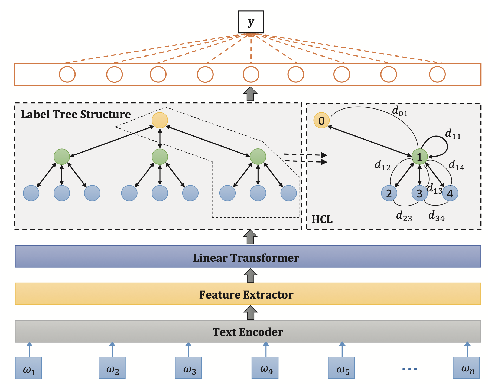
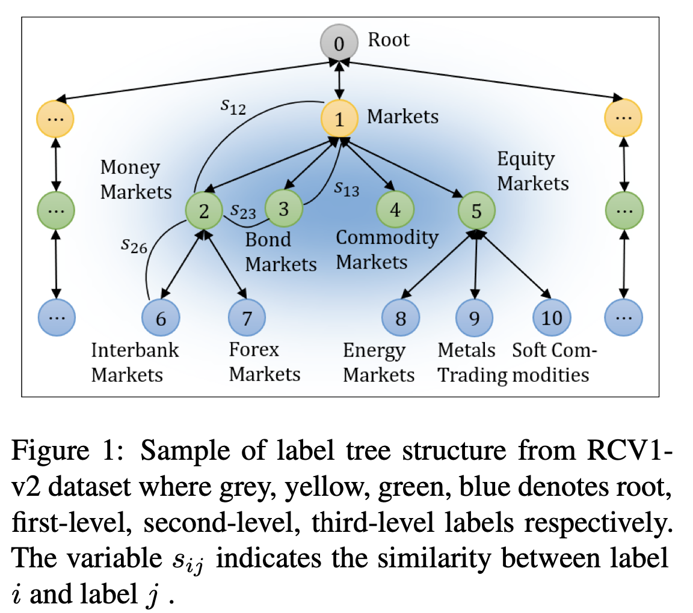
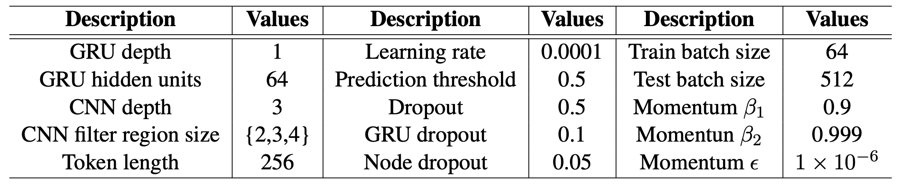
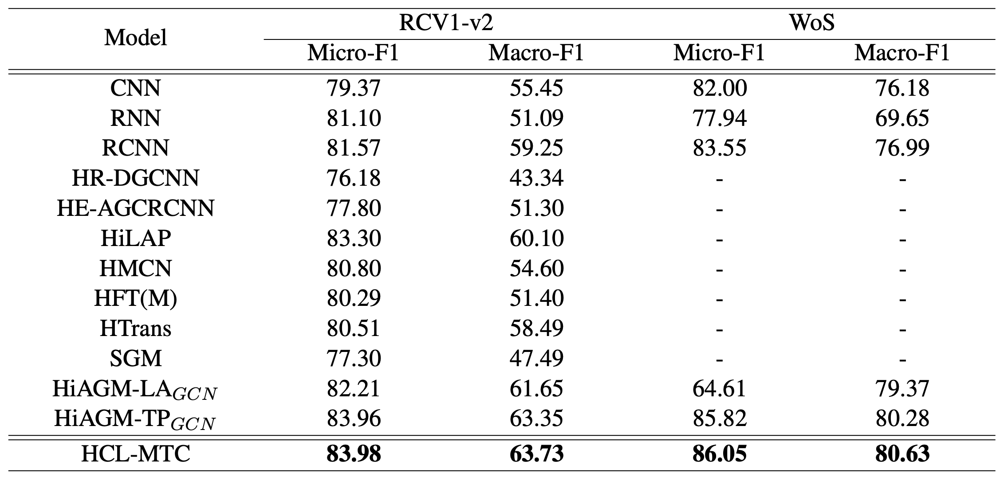
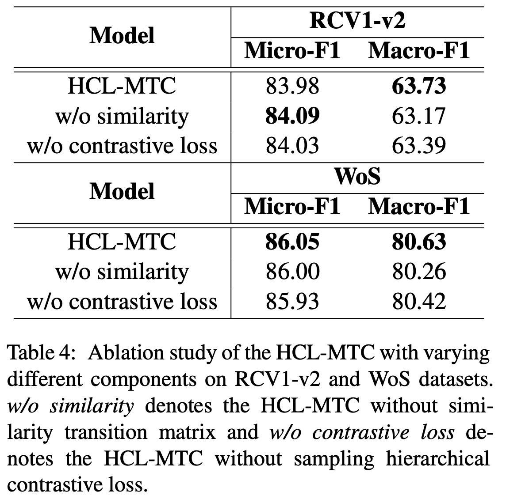

ACL ARR 2022，提出层次对比学习，学习标签间的区别信息。

<!--more-->

## Overview

- paper: <https://openreview.net/pdf?id=R1BifFIieBP>
- code:
- dataset: RCV1-V2 Wos

## Background

MLTC任务可以分为两种方法：直接从文本信息预测以及从文本标签的混合信息中预测。前者忽略了标签间的信息，后者可以学习标签的层次信息。

作者认为现有方法没有充分利用标签信息，只考虑了相关信息（correlative information），忽略标签的区别信息（distinctive information）。

例如上图中的$s_{23}$就是区别信息（同层节点之间），$s_{26}$表示相关信息（父子节点之间）。

## Method

本文选用了Bi-GRU作为文本编码器，采用CNN提取N-Gram特征。对于文本$T=\{x_1,x_2,\cdots,x_n\}$，卷积核输出特征$O=\{P^1,P^2,\cdots,P^K\}$。

之后接一个线性Transformer（全连接层）
$$
V=Reshape(MO)
$$
其中$M\in\mathbb{R}^{d_w\times d_c}$，$O\in\mathbb{R}^{d_c}$为文本特征，$V\in\mathbb{R}^{m\times d_n}$。

本文采用了HiAGM中的Hierarchy-GCN框架，节点可以聚合父子节点的信息。对于$\mathcal{G}=(\mathcal{V},\mathcal{E})$，$v_k\in\mathbb{R}^{d_n}$表示节点k的特征，$N(k)=\{n_k,child(k),parent(k)\}$表示节点的邻居。节点k的隐层状态通过下式计算：
$$
\begin{align}
a_{j,k} &= \left|\frac{v_j\cdot v_k}{\lVert v_j\rVert\cdot \lVert v_k\rVert}\right|, \\
\mu_{j,k} &= a_{j,k}v_j + b_l^k, \\
g_{j,k} &= \sigma(W_g^{d(j,k)}v_j+b_g^k), \\
h_k &= ReLU(\sum_{j\in N(k)}g_{j,k}\cdot \mu_{j,k})
\end{align}
$$
其中$W_g^{d(j,k)}\in\mathbb{R}^n$表示节点j到节点k的门控权重。

作者定义了采样层次对比损失（Sampling Hierarchical Contrastive Loss），用$s(v_{p_i}, v_{p_j})$表示父节点之间的相似度，用$s(v_{p_i}, v_{c_k})$表示父子节点的相似度。

在标签树中，父子标签对能够双向传递信息，但父节点之间不能传递信息。从而优化目标是最大化区别信息$s(v_{p_i}, v_{p_j})$，最小化相关信息$s(v_{p_i}, v_{c_k})$，损失函数定义如下
$$
\begin{align}
&s(v_{p_i}, v_{p_j}) = \left|\frac{v_{p_i}\cdot v_{p_j}}{\lVert v_{p_i}\rVert\cdot \lVert v_{p_j}\rVert}\right| \\
&s(v_{p_i}, v_{c_k}) = \left|\frac{v_{p_i}\cdot v_{c_k}}{\lVert v_{p_i}\rVert\cdot \lVert v_{c_k}\rVert}\right| \\
&L_d = \sum_{p_i\in\mathcal{V}}\sum_{p_j\in\mathcal{V}}\sum_{c_k\in child(i)}\exp(s(v_{p_i}, v_{p_j}) - s(v_{p_i}, v_{c_k}))
\end{align}
$$
因为枚举所有节点对时间代价大，为此需要采样，每一层只随机选取两个父节点和一个子节点参与计算。

最终的损失函数是BCE、递归正则化损失和采样层次距离损失的加权。

> Recursive Regularization for Large-scale Classification with Hierarchical and Graphical Dependencies, KDD 2013 [[paper]](http://nyc.lti.cs.cmu.edu/yiming/Publications/gopal-kdd13.pdf)

$$
\begin{align}
L_c &= -\sum_{i=1}^m[y_i\log(y_i')+(1-y_i)\log(1-y_i')] \\
L_r &= \sum_{i\in\mathcal{V}}\sum_{j\in child(i)}\frac12\lVert w_i-w_j\rVert^2 \\
L &= L_c + \lambda_1L_r + \lambda_2L_d
\end{align}
$$

## Experiment

选择RCV1-V2和WoS数据集。

