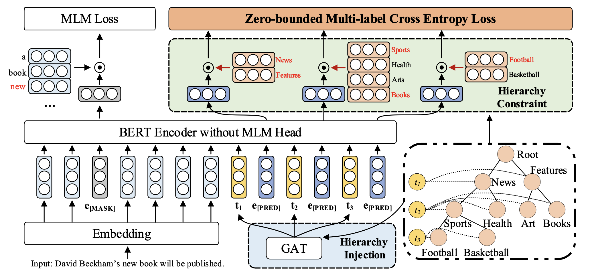
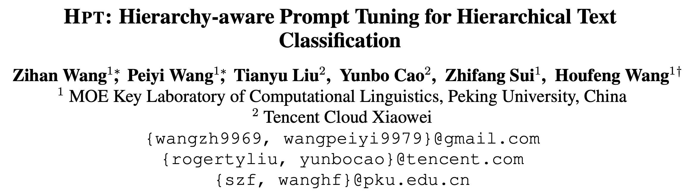
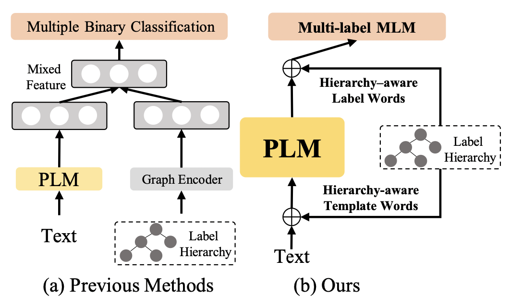
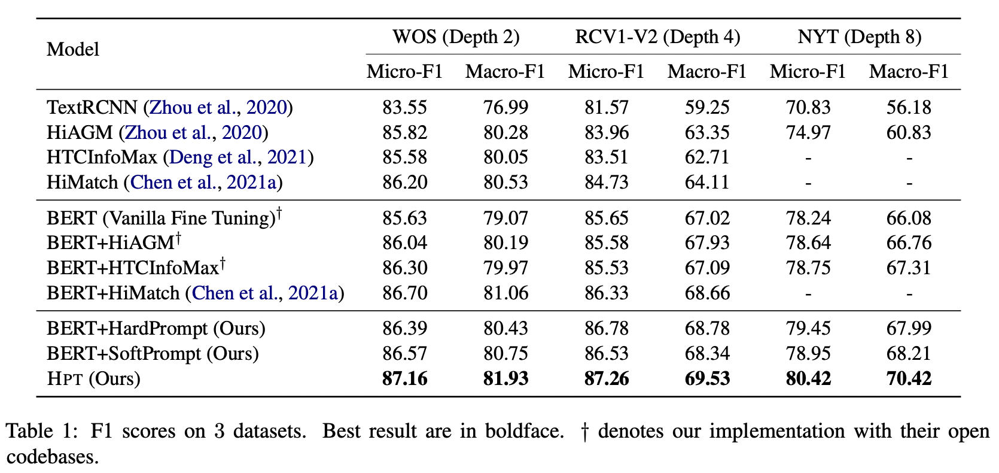
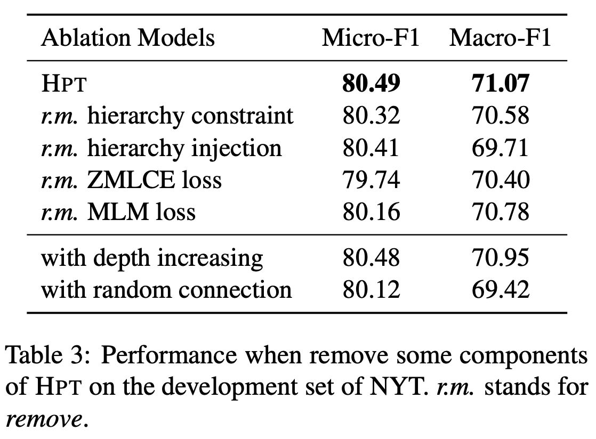
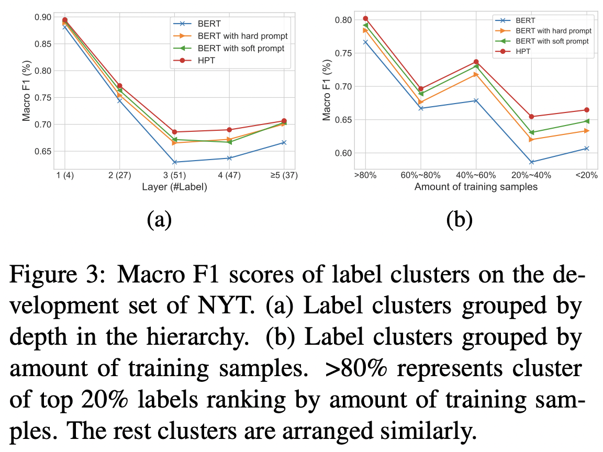
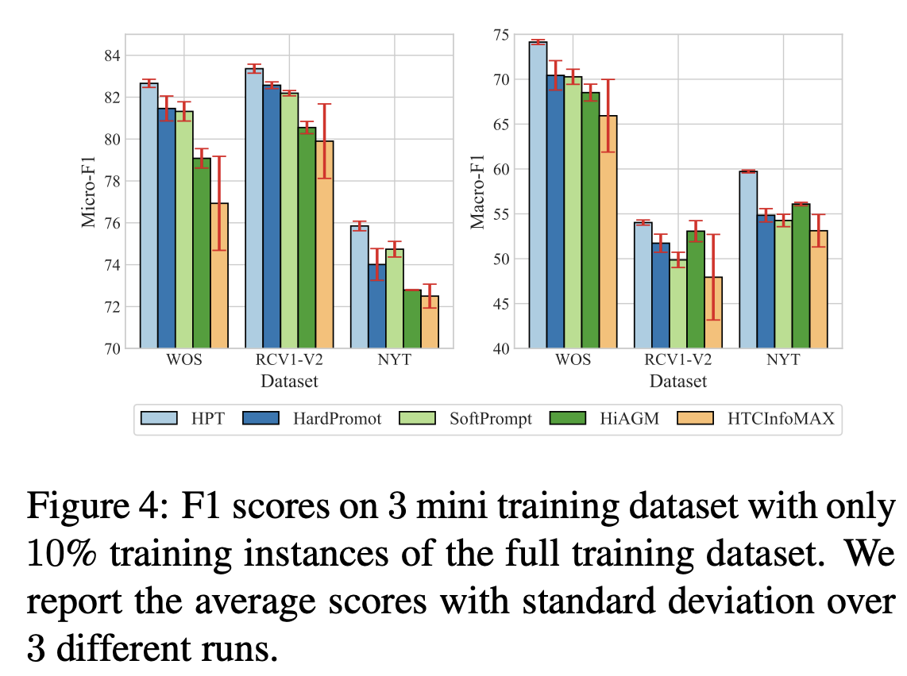

用 Prompt 方法做层次文本分类，并融合了层次信息。

## Overview

- paper: <https://arxiv.org/pdf/2204.13413v1.pdf>
- dataset: WOS RCV1-V2 NYT

## Motivation

对于微调（finetune）范式，在预训练的MLM任务与下游分类任务之间存在 gap ，为此提出了 prompt tuning 的概念，即构造模版让预训练模型做完形填空任务。例如构造模版 $\text{x is [MASK]}$，其中$\text{[MASK]}$可以代表分类中的标签，利用 MLM 预测 $\text{[MASK]}$ 的值，从而可以充分利用PLM的潜力。

在层次分类这种任务上，prompt 也同样适用，例如[Label Mask for Multi-Label Text Classification](https://arxiv.org/pdf/2106.10076.pdf)。不过现有方法仍然存在两个问题：

- **Hierarchy and flat gap**：局限于flat prompt，忽略了标签的层次信息。
- **Multi-label and multi-class gap**：MLM任务是多分类任务，而非多标签任务。

因此作者提出了 **H**ierarchy-aware **P**rompt **T**uning 方法，并将 HTC 转变为多标签的 MLM 任务。

## Method

### Perliminaries

标签层次定义为 $\mathcal{H}=(\mathcal{Y},E)$，给定文本 $\mathbf{x}$，预测的标签集合 $Y$ 对应于 $\mathcal{H}$ 中的一条或多条路径。

对于传统的微调范式而言，需要在语句首尾拼接 $[CLS]$ 和 $[SEP]$，即输入形式为 $ \text{[CLS] } \mathbf{x}\text{ [SEP]}$。送入模型后，对输出的 $h_{[CLS]}$ 接分类器预测标签即可。

而对于Prompt Tuning，主要有两种：

- Hard Prompt：人为构造的模版，如 $\text{[CLS] } \mathbf{x}\text{ [SEP] the text is about [MASK] [SEP]}$，模型需要预测被掩码的位置，相当于对词表中的每个词计算分数。此外还需要定义 verbalizer，即标签的映射关系。
- Soft Prompt：不需要手工构造模版，采用可学习的向量作为模版，如 $\text{[CLS] } \mathbf{x} \text{ [SEP] [V1] [V2] [V3] [MASK] [SEP]}$，模型预测 $\text{[MASK]}$ 的同时学习模版。

上述两种方式可以实现 HTC 的任务，将其转化为多个二分类任务，但存在作者提出的两个问题。

### Hierarchy-aware Prompt

给定 $L$ 层的层级结构，构造 $L$ 个虚拟模版 $\text{[V1] ... [VL]}$ ，输入为 $\text{[CLS] } \mathbf{x}\text{ [SEP] [V1] [PRED] ... [VL] [PRED] [SEP]}$，其中 $\text{[PRED]}$ 相当于 $\text{[MASK]}$。

具体而言，使用 BERT 作为文本编码器，那么输入表示为：
$$
\mathbf{T} = [\mathbf{x}_1,\cdots,\mathbf{x}_N,\mathbf{t}_1,\mathbf{e}_P,\cdots,\mathbf{t}_L,\mathbf{e}_P]
$$
其中 $\mathbf{X} = [\mathbf{x}_1,\cdots,\mathbf{x}_N]$ 表示词向量， $\mathbf{e}_P$ 就是 $\text{[PRED]}$ 的嵌入，采用 $\text{[MASK]}$ 作为初始化，$\{\mathbf{t}_i\}$ 表示 layer-wise 的模版嵌入，采用随机初始化。采用 BERT 编码后的输出为：
$$
\mathbf{H} = [\mathbf{h}_1,\cdots,\mathbf{h}_N,h_{\mathbf{t}_1},\mathbf{h}^1_P,\cdots,h_{\mathbf{t}_L},\mathbf{h}^2_P]
$$
之后对于 verblizer，为每个标签 $y_i$ 采用可学习的虚拟单词 $v_i$，选择对应 token embedding 的均值初始化 $\mathbf{v}_i$，形式化为：
$$
\text{Verb}_m(y_i) = \begin{cases}v_i,&y_i\in\mathcal{N_m}\\
\varnothing,&\text{Others}\end{cases}
$$

其中 $\mathcal{N}_m$ 表示第 $m$ 层的标签集合。

### Hierarchy Injection

考虑到上述方法只引入了标签的深度信息，作者希望在模版表示中引入层次知识。为此采用 $K$ 层堆叠的 GAT 建模层次关系，给定在第 $k$ 层的节点 $u$，信息聚合操作定义为：
$$
\mathbf{g}_u^{(k+1)} = \text{ReLU}\left(\sum_{v\in\mathcal{N}(u)\cup\{u\}}\frac{1}{c_u}\mathbf{W}^{(k)}\mathbf{g}_v^{(k)}\right)
$$
其中 $N(u)$ 表示 $u$ 的邻居，$c_u$ 是一个归一化常数。

为了获取每层的知识，创建 $L$ 个虚拟节点 $t_1,\cdots,t_L$，将 $t_i$ 与第 $i$ 层所有的节点相连（有点像 $\text{[CLS]}$ ）。对于节点初始化，采用虚拟单词 $\mathbf{v}_i$ 作为节点 $y_i\in\mathcal{Y}$ 的特征，模版嵌入 $\mathbf{t}_i$ 作为 $t_i$ 的节点特征。

在构建的新图上施加 GAT，虚拟节点 $t_i$ 的输出表示为 $g_{t_i}$，其聚合了第 $i$ 层的知识，利用残差连接获得第 $i$ 个模版嵌入：
$$
\mathbf{t}_i^\prime = \mathbf{t}_i + \mathbf{g}_{t_i}^K
$$
用 $\mathbf{t}_i^\prime$ 替代原有的 $\mathbf{t}_i$ 送入 BERT 即可。 

### Zero-bounded Multi-label Cross Entropy Loss

采用了多标签交叉熵，参考苏神的博客 [将“softmax+交叉熵”推广到多标签分类问题](https://kexue.fm/archives/7359)。

具体而言，作者对每一层都计算了交叉熵：
$$
\mathcal{L}_{ZMLCE}^m = \log(1+\sum_{y_i\in\mathcal{N}_m^n}e^{s_{y_i}}) + \log(1+\sum_{y_i\in\mathcal{N}_m^p}e^{-s_{y_i}})
$$
其中 $s_{y_i} = \mathbf{v}^T_i\mathbf{h}_P^m + b_{im}$，$\mathcal{N}_m^p$ 和 $\mathcal{N}_m^n$ 分别表示第 $m$ 层的正负标签集合。此外作者加了 MLM Loss，掩码比例为 15%。
$$
\mathcal{L}_{all} = \mathcal{L}_{MLM} + \sum_{m=1}^L\mathcal{L}_{ZMLCE}^m
$$
在推理时，选择得分大于 0 的标签作为预测结果。

## Experiments

选用 WOS NYT 和 RCV1-V2，只用了一层的 GAT。

从结果来看，不论是 HardPrompt 还是 SoftPrompt 都比直接微调要好，提出的方法取得了 SOTA。

消融实验验证了作者提出各个模块的有效性。

作者比较了模型在数据不平衡的表现，包括每层的标签数不平衡和每个样本包含的标签数不平衡。

此外还探讨了低资源设置下的表现，采用10%的训练数据，这也符合 prompt 本身的应用场景。

