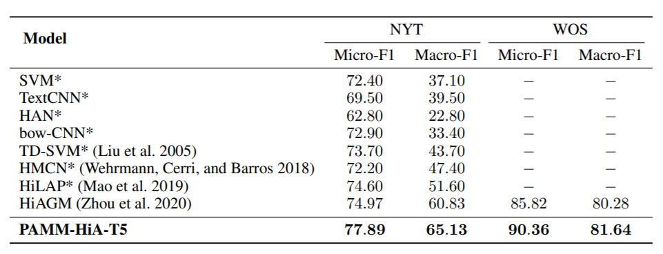

本文提出了一种层次感知的T5模型以及一种路径适应的掩码机制，称为PAMM-HiA-T5，不仅将上层标签的信息融入了下层标签，同时在标签预测时也引入了路径依赖信息。本文的模型在RCV1-V2、NYT和WOS上取得了SOTA。

<!--more-->

## Overview

- arxiv: https://arxiv.org/pdf/2109.08585.pdf
- code: 暂无

## Background

标签依赖性在层次化文本分类中很重要，作者认为主要可以分为层次依赖和路径依赖两种：

本文提出的模型不仅可以在生成模型中捕获父子标签的依赖关系，也可以识别特定路径中的层次依赖。在预测阶段，下一个标签取决于文本序列和当前路径上已经生成的标签。

### T5

T5模型是一种编码器-解码器架构，模型结构如下图所示：

在解码器部分，有一个额外的sublayer用于处理解码器的输出，被称为Casual Self-Attention Sublayer。
$$
\begin{align}
\mathrm{Block}_{Decoder}(Q_d,K_d,V_d,O_e)
&= \text{FFN}(\text{Multi-Head}(\text{Multi-Head}(Q_d, K_d, V_d), O_e, O_e)) \\
\text{Decoder}(Q_d, K_d, V_d, O_e)
&= \text{stack}(\text{Block}_{Decoder}(Q_d, K_d, V_d, O_e))
\end{align}
$$

## Method

### Hierarchy-Aware T5

首先将标签集转化为multi-level的标签序列
$$
\begin{align}
L_i &= \{l_1, l_2, l_3, l_5, l_5\} \\ 
\Rightarrow ML_i &= [l_1,\_,l_3,/,l_2,\_,l_4,/,l_5,EOS]
\end{align}
$$
其中“_”表示intra-level关系，“/”表示inter-level关系。

对于文本序列，直接送入T5编码器：
$$
O_{text} = \text{Encoder}(Q_{text},K_{text},V_{text})
$$
对于标签序列，送入T5的解码器：
$$
O_{hierarchy} = \text{Decoder}(Q_{label},K_{label},V_{label},O_{text})
$$
由此得到了level dependency信息
$$
A_{label} = \text{Multi-Head}(Q_{label},K_{label},V_{label})
$$
并通过cross-attention融合文本和标签信息
$$
A_{cross} = \text{Multi-Head}(A_{label}, O_{text}, O_{text})
$$
预测时是n个时间戳的结果（n表示文本长度）
$$
\text{Pred} = \text{softmax}(O_{hierarchy}W_3+b_3)\in\mathbb{R}^{n\times K}
$$

### Path-Adaptive Mask Mechanism

掩码矩阵是一个下三角矩阵，通常由0和1组成

掩码矩阵的定义如下
$$
m_{i,j}=\left\{
\begin{array}
    {rl}
    1  & {\{I_i\in L, I_j\in \text{ancestor}(I_i), 1\leq j<i\}} \\
    &  \cup{\{I_i\in S, j=i-1\}} \\
    &  \cup{\{I_i\in S, I_j\in \text{ancestor}(I_{i-1}), 1\leq j<i\}} \\
    0  & {else}
\end{array} \right.
$$
并定义了掩码损失
$$
\begin{aligned}
\text{Loss}_{\text{PAMM}}=\sum_{b=1}^{B}(\frac{\sum_{h=1}^{H}(\sum_{i=1}^{n}(1-\sum_{j\in C}s_{i,j}))}{H})
\end{aligned}
$$

$$
\begin{aligned}
    \text{Loss}=&\text{Loss}_{\text{HiA-T5}}+\rho \text{Loss}_{\text{PAMM}}
\end{aligned}
$$

## Experiment

数据集选取RCV1-V2、NTY和WOS

并统计了数据集内不同层次标签的数量：

选用T5-base作为backbone，有220M参数，12个注意力头。编码器输入的最大长度为300，解码器的最大输出长度为60。采用Adam优化器，batch size为10，学习率为3e-4，微调3个epoch。

RCV1-V2实验结果

NYT和WOS的实验结果

