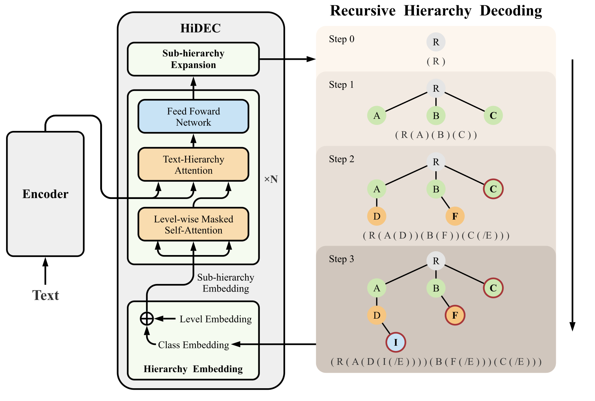
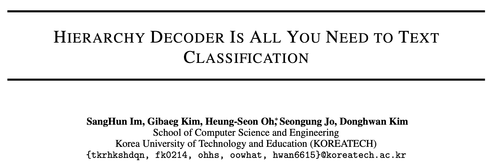
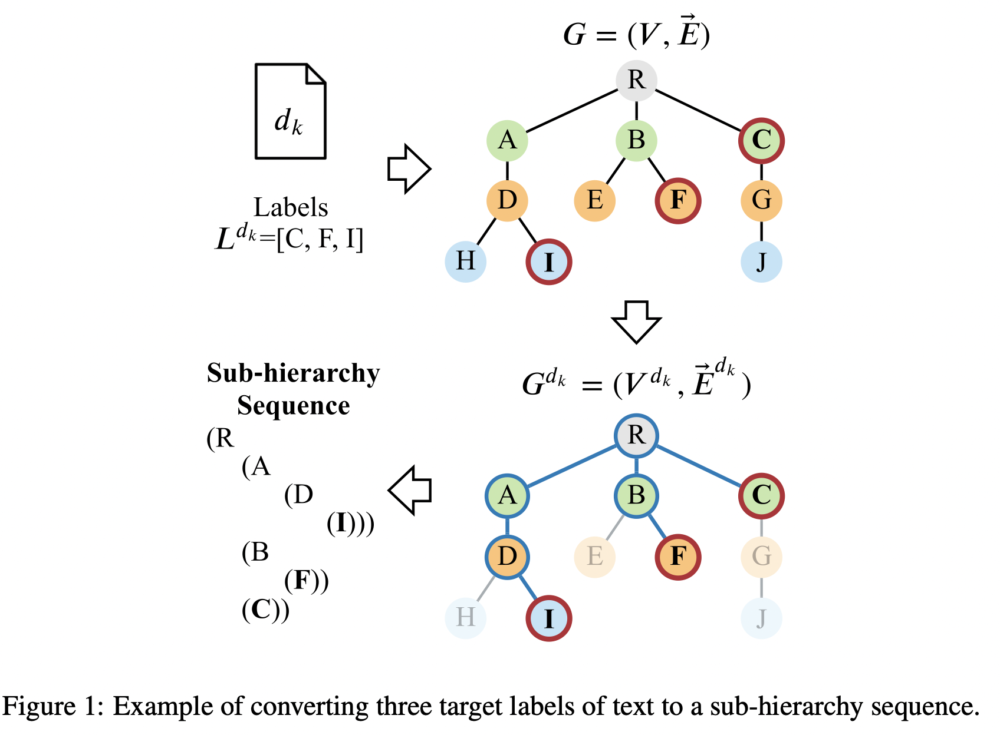
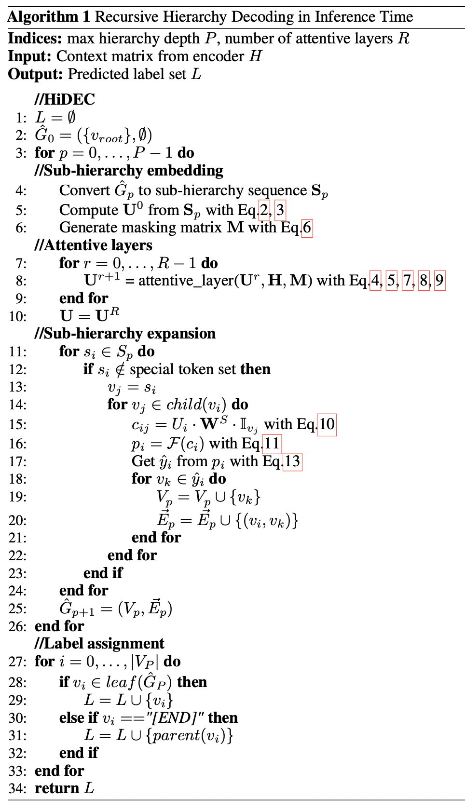
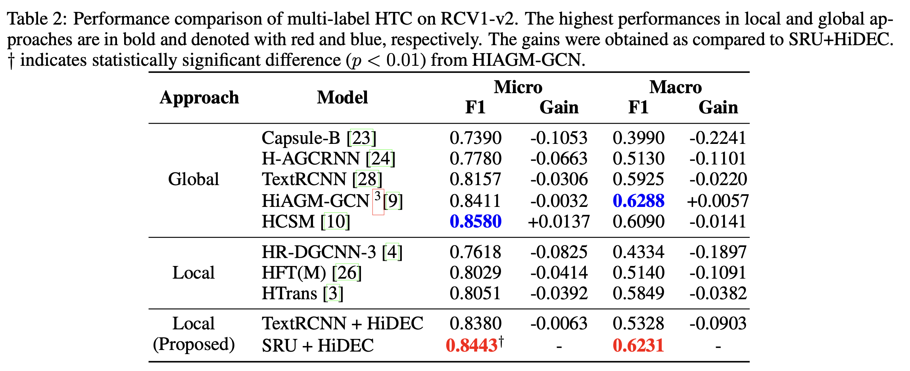
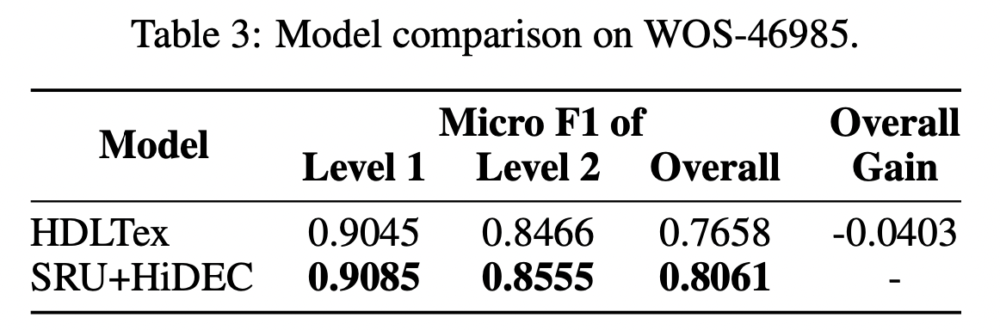
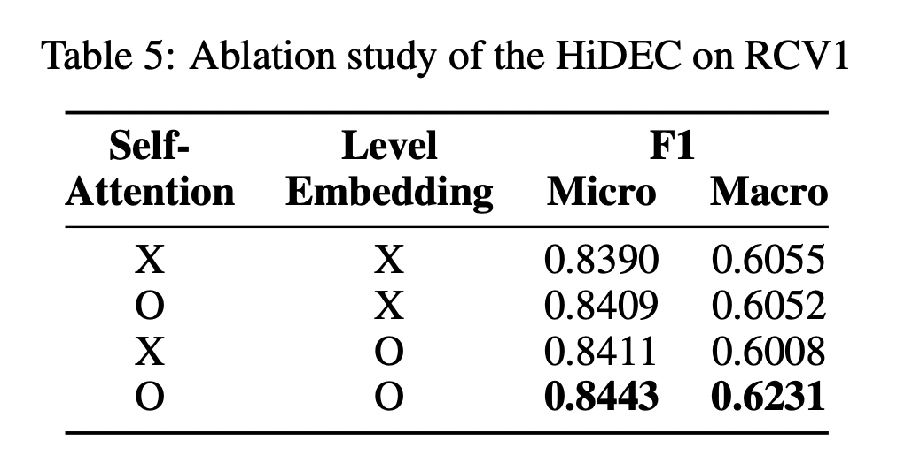

基于Encoder-Decoder架构，提出层次解码器，使用递归的层次解码处理依赖关系。

<!--more-->

## Overview

- paper: <https://arxiv.org/pdf/2111.11104v1.pdf>
- code: 

## Background

层次文本分类的方法可以分为local和global两类

- local方法是指将层次结构展平后分类，降低了计算的复杂度但是丢失了层次信息。
- global方法可以捕获层次信息，其往往采用元学习、强化学习或者图神经网络的方法，但是层次结构太大时计算不友好。

理想的层次分类模型应该兼顾二者，既有效（effective）也是容易扩展的（scalable）。本文提出了层次解码器，可以在训练和推理时感知层次依赖关系。

## Method

### Encoder

编码器部分选择单循环单元（Simple Reccurrent Unit, SRU），可以看作是简单快速并且更具解释性的RNN。SRU将矩阵-向量乘法修改为element-wise向量乘法，是一种可以并行的RNN。其计算过程示意如下：
$$
\begin{align}
\overrightarrow{\mathbf{H}^l}&=\overrightarrow{\text{SRU}^l}(\mathbf{H}^{l-1})\\
        \overleftarrow{\mathbf{H}^l}&=\overleftarrow{\text{SRU}^l}(\mathbf{H}^{l-1})\\

\mathbf{H}^l&=\mathbf{W}^l[\overrightarrow{\mathbf{H}^l};\overleftarrow{\mathbf{H}^l}]+b^l
\end{align}
$$

### Hierarchy Decoder

标签的层次关系可以表示为$G=(V,\vec{E})$，对于文档$d_k$，其对应的子图9就是$G^{d_k} = (V^{d_k},\vec{E}^{d_k})$。通过解析树生成对应的序列$S$，图中即为$\text{S= R ( A ( D ( I ( [END] ) ) ) ) ( B ( F ( [END] ) ) ) ( C ( [END] ) ) )]}$。用one-hot向量表示其中的字符，即$\vec{S} = [s_1,\cdots,s_M]$，其中$s_i=\mathbb{I}_{v_i}$。

于是层次嵌入$\mathbf{U}^0$的初始化可以表示为
$$
\mathbf{\bar{U}}^0=\mathbf{W}^S\bar{\mathbf{S}} \\
\mathbf{U}^0=\text{level\_embedding}(\mathbf{\bar{U}}^0)
$$
之后作者设计了level-wise掩码自注意力
$$
\begin{align}
\dot{\mathbf{U}}^r &= \text{Masked\_Attention}(\mathbf{Q,K,V}) \\
&= \text{softmax} \left( \frac{\mathbf{QK}^\top}{\sqrt{\text{e}}}+\mathbf{M} \right) \mathbf{V}
\end{align}
$$
其中$\mathbf{QKV}$都是对$\mathbf{U}$线性变换得到的，掩码矩阵定义了父子的基层关系，定义为
$$
\mathbf{M}_{ij}=\begin{cases}
-1e9 & \text{ if } v_i \notin ancestor(v_j) \\ 
0 & \text{ else }
\end{cases}
$$
自注意力计算后则是cross-attention，作者称为Text-Hierarchy Attention
$$
\begin{align}
	\mathbf{Q}&=\mathbf{W}_{Q}^{r} {\dot{\mathbf{U}}^{r-1}}^{\top} \\
	\mathbf{K}&=\mathbf{W}_{K}^{r} \mathbf{H}^{\top}\\
	\mathbf{V}&=\mathbf{W}_{V}^{r} \mathbf{H}^{\top} \\
	\ddot{\mathbf{U}}^r&=\text{Masked\_Attention}(\mathbf{Q,K,V}) \\
	&=\text{softmax} \left (\frac{\mathbf{QK}^\top}{\sqrt{e}} \right ) \mathbf{V}
\end{align}
$$
在解码时，计算子类和父类的相似度$c_{ij}$
$$
\begin{align}
c_{ij}&=U_i\cdot \mathbf{W}^S \cdot \mathbb{I}_{v_j} \quad \forall v_j \in child(v_i) \\
p_i&=\mathcal{F}(c_i)
\end{align}
$$
其中$\mathcal{F}$在单分类时为sigmoid，多标签时为softmax。

递归层次解码的算法表示如下

## Experiment

选取RCV1-V2和WOS数据集，学习率5e-5，隐层维度300，batch size为1024，硬件为NVIDIA A6000 * 8（富有）。

