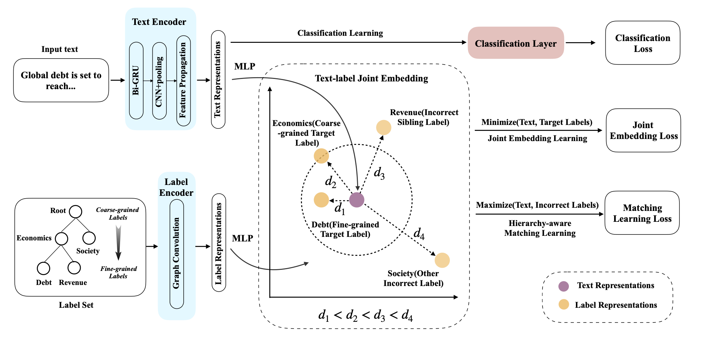
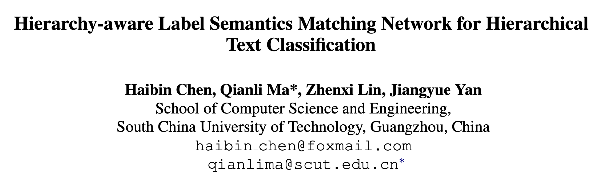
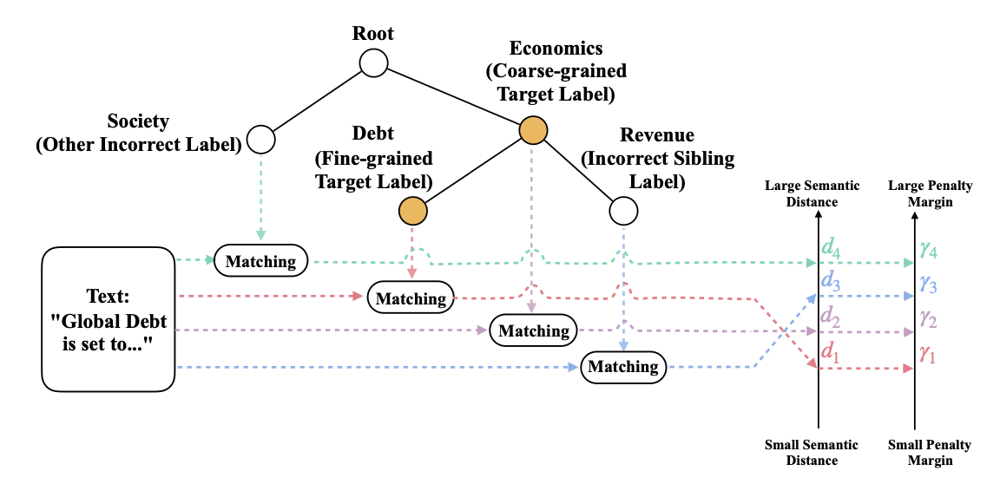
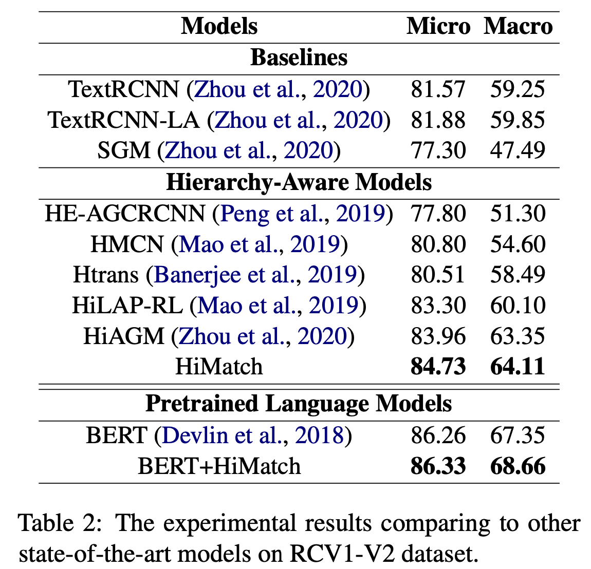
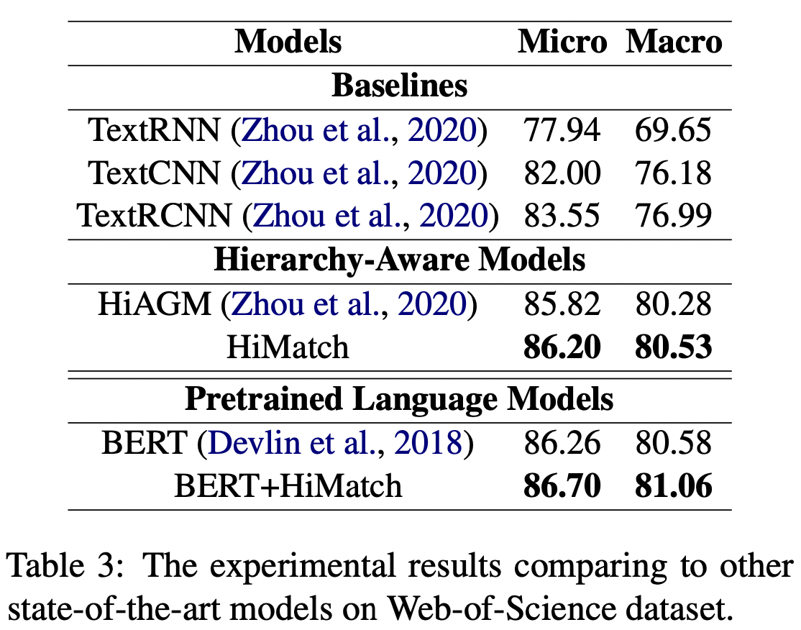
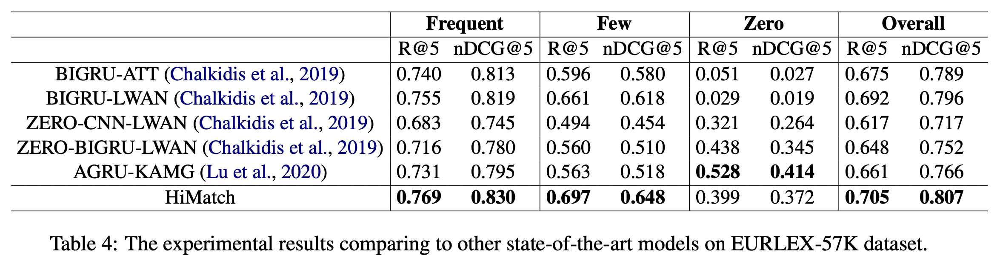
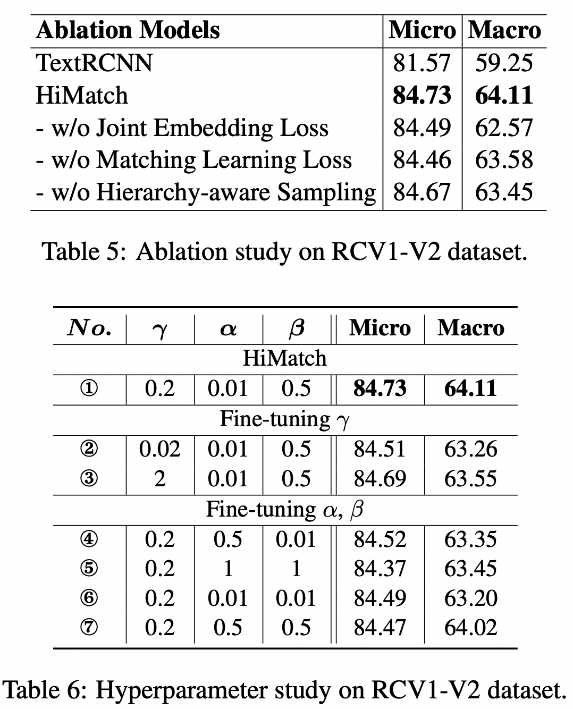

ACL 2021，提出层次感知的标签语义匹配网络处理层次多标签分类（HTC）问题。



<!--more-->

## Overview



- paper: <https://aclanthology.org/2021.acl-long.337.pdf>
- code: <https://github.com/RuiBai1999/HiMatch>
- dataset: RCV1-V2 WOS EURLEX-57K

## Background

有点类似对比学习的思想，将HTC问题形式华为一个语义匹配问题，希望文本表示与目标标签的表示更接近，与不相关的标签表示距离更远。

## Method

参考HiAGM，首先分别用LSTM和GCN对文本和标签提取特征，作者这里对文本也用了GCN进一步提取特征，称为hierarchy-aware text feature propagation module。
$$
\begin{align}
S_t = \textrm{ReLU}\left(\overleftarrow{E}\cdot V_t\cdot W_{g_1}+ \overrightarrow{E}\cdot V_t\cdot W_{g_2}\right) \\
S_l = \textrm{ReLU}\left(\overleftarrow{E}\cdot V_l\cdot W_{g_3}+ \overrightarrow{E}\cdot V_l\cdot W_{g_4}\right)
\end{align}
$$
其中$E\in\mathbb{R}^{k\times k}$表示父子节点的先验转移概率，$V$表示节点特征，$W$为GCN的权重。

在得到文本和标签的表示后，作者使用联合嵌入将二者映射到同一潜在空间。
$$
\begin{align}
\Phi_t = \textrm{FFN}_t(S_t) \\
\Phi_l = \textrm{FFN}_l(S_l) \\
\end{align}
$$
为了对齐表示，采用MSE作为损失函数。
$$
L_{joint} = \sum_{p\in P(y)}\lVert\Phi_t - \Phi_l^p\rVert_2^2
$$
除了文本和标签之间的相关性，还需要考虑不同粒度标签的相关性，因此作者提出了一种margin-based triplet loss来衡量文本表示与标签之间的相关性。
$$
L_{match} = \max(0,D(\Phi_t, \Phi_l^p)-D(\Phi_t, \Phi_l^n)+\gamma)
$$
其中$\Phi_l^p$表示目标标签语义，$\Phi_l^n$表示其他标签的语义，采用的是L2归一化的欧式距离，$\gamma$表示门限。

> 对Margin Loss的理解可参考<https://zhuanlan.zhihu.com/p/158853633>

此外，为了提高计算效率，作者还进行了采样。为每个细粒度标签采样了所有父节点（粗粒度标签）和一个兄弟标签，并随机选择一个不正确标签得到负样本集$n\in N(y)$。

在采样了标签对后，为每个标签对设置相同的margin也不合理。作者的想法是，如果两个标签在层次结构中更接近，那么其语义也应该更近。为此作者提出了四个距离

1. $d_1$应当为最小距离，表示正例，其他表示负例。
2. $d_2$表示文本与粗粒度标签的语义距离。
3. $d_3$表示文本与不正确的细粒度标签的距离。
4. $d_4$应当是最大的距离。



针对上述，引入了四个margin $\gamma_1,\gamma_2,\gamma_3,\gamma_4$建模这种比较关系，随着距离的增大惩罚的margin也更大。作者在此忽略了$\gamma_1$，因为文本与细粒度标签的匹配关系已经在联合嵌入中得到充分的利用。
$$
\gamma_2 = \alpha\gamma;\quad\gamma_3=\beta\gamma;\quad\gamma_4=\gamma
$$
最终的损失函数是三者的加权
$$
\mathcal{L} = \mathcal{L}_{cls}(y,\hat{y})+\lambda_1\mathcal{L}_{joint}+\lambda_2\mathcal{L}_{match}
$$

## Experiment









## Implementation

Margin Loss的实现

```python
class MarginRankingLoss(torch.nn.Module):
    def __init__(self, config):
        """
        Criterion loss
        default torch.nn.MarginRankingLoss(0.01)
        """
        super(MarginRankingLoss, self).__init__()
        self.dataset = config.data.dataset
        base = 0.2
        self.ranking = [torch.nn.MarginRankingLoss(margin=base*0.1), torch.nn.MarginRankingLoss(margin=base * 0.5),
                        torch.nn.MarginRankingLoss(margin=base)]
        self.negative_ratio = config.data.negative_ratio


    def forward(self, text_repre, label_repre_positive, label_repre_negative, mask=None):
        """
        :param text_repre: torch.FloatTensor, (batch, hidden)
        :param label_repre_positive: torch.FloatTensor, (batch, hidden)
        :param label_repre_negative: torch.FloatTensor, (batch, sample_num, hidden)
        :param mask: torch.BoolTensor, (batch, negative_ratio, negative_number), the index of different label
        """
        loss_inter_total, loss_intra_total = 0, 0

        text_score = text_repre.unsqueeze(1).repeat(1, label_repre_positive.size(1), 1)
        loss_inter = (torch.pow(text_score - label_repre_positive, 2)).sum(-1)
        loss_inter = F.relu(loss_inter / text_repre.size(-1))
        loss_inter_total += loss_inter.mean()

        for i in range(self.negative_ratio):
            m = mask[:, i]
            m = m.unsqueeze(-1).repeat(1, 1, label_repre_negative.size(-1))
            label_n_score = torch.masked_select(label_repre_negative, m)
            label_n_score = label_n_score.view(text_repre.size(0), -1, label_repre_negative.size(-1))
            text_score = text_repre.unsqueeze(1).repeat(1, label_n_score.size(1), 1)

            # index 0: parent node
            if i == 0:
                loss_inter_parent = (torch.pow(text_score - label_n_score, 2)).sum(-1)
                loss_inter_parent = F.relu((loss_inter_parent-0.01) / text_repre.size(-1))
                loss_inter_total += loss_inter_parent.mean()
            else:
                # index 1: wrong sibling, index 2: other wrong label
                loss_intra = (torch.pow(text_score - label_n_score, 2)).sum(-1)
                loss_intra = F.relu(loss_intra / text_repre.size(-1))
                loss_gold = loss_inter.view(1, -1)
                loss_cand = loss_intra.view(1, -1)
                ones = torch.ones(loss_gold.size()).to(loss_gold.device)
                loss_intra_total += self.ranking[i](loss_gold, loss_cand, ones)
        return loss_inter_total, loss_intra_total
```

mask的生成

```python
for sample_i, sample in enumerate(batch):
    batch_token.append(sample['token'])
    batch_label.append(sample['label'])
    batch_doc_len.append(sample['token_len'])
    if self.mode == "TRAIN":
        positive = np.zeros((self.positive_sample_num))
        negative = np.zeros((self.negative_sample_num))
        margin = np.zeros((self.negative_ratio, self.negative_sample_num))
        for i in range(self.positive_sample_num):
            positive[i] = sample['positive_sample'][i]
            for i in range(self.negative_sample_num):
                negative[i] = sample['negative_sample'][i]
                # use mask matrix 'margin' to differentiate different sampling label
                margin[sample['margin'][i], i] = 1
                batch_ranking_positive_mask.append(positive)
                batch_ranking_negative_mask.append(negative)
                batch_margin_mask.append(margin)
```

