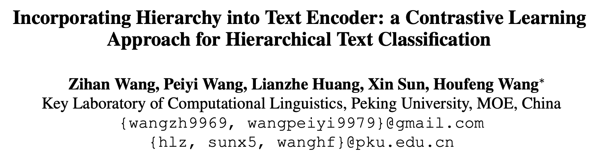
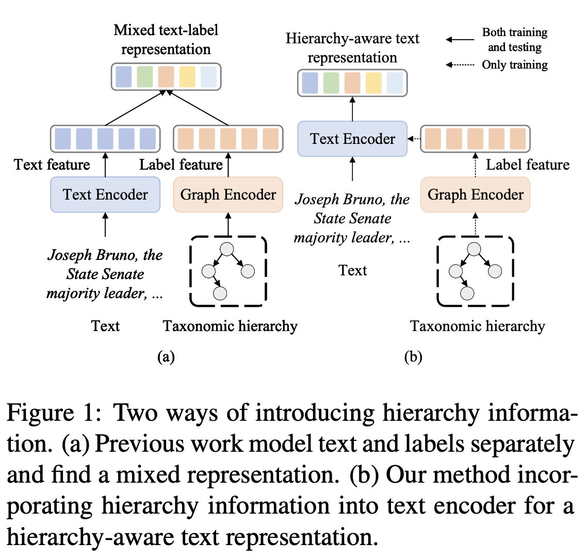

ACL 2022，使用Graphormer与对比学习处理层次文本分类（HTC）。

<!--more-->

## Overview

- paper: <https://arxiv.org/pdf/2203.03825.pdf>
- code: <https://github.com/wzh9969/contrastive-htc>
- dataset: RCV1-V2 WOS NYT

## Background

现有的HTC方法已经引入了各种层次信息，主要有两种方式。

- 将文本和标签分别编码，得到混合表示。
- 将层次信息融入编码器，得到层次感知的文本表示。

本文引入了对比学习以获得层次感知的表示，尝试构建高质量的正样本。现有的方法包括数据增强和对抗攻击等，这些要么是无监督要么是任务无关的。

作者的motivation主要是：文本分类时大多数的词或token其实并不重要，而少量的关键词对结果有很大的影响。给定文本序列及其标签，只保留少量关键词的短序列也应该保持同样的标签。因此，本文的idea和对抗攻击有点像，希望找出对分类影响最大的tokens，但对抗攻击是试图修改它们，而本文修改的是不重要的tokens。

## Method

### Text Encoder

文本嵌入采用BERT，老生常谈。
$$
x = \{[CLS], x_1, x_2, \cdots, x_{n-2}, [SEP]\}
$$
文本表示$H\in\mathbb{R}^{n\times d_h}$，采用$h_x=h_{[CLS]}$作为句子表示
$$
H = \mathrm{BERT}(x)
$$

### Graph Encoder

本文采用[Graphormer](https://entropy2333.github.io/2021/06/20/Do-Transformers-Really-Perform-Bad-for-Graph-Representation)建模标签的层次关系，在Transformer的基础上使用spatial encoding和edge encoding建模图结构。节点特征是标签嵌入和名称嵌入的和：
$$
f_i = \mathrm{label\_emb}(y_i) + \mathrm{name\_emb}(y_i)
$$
标签嵌入是可学习的，名称嵌入利用了标签的名称（其中可能蕴含了丰富信息），采用BERT编码得到，最终得到所有节点特征$F\in\mathbb{R}^{k\times d_h}$。

为了利用结构信息，采用Graphormer中魔改的self-attention
$$
A_{ij}^{G} = \frac{(f_iW_Q^G)(f_jW_K^G)^T}{\sqrt{d_h}} + c_{ij} + b_{\phi(y_i, y_j)}
$$
其中$c_{ij} = \frac1D\sum_{n=1}^Dw_{e_n}$，$D=\phi(y_i,y_j)$。$A_{ij}^G$中的第一项是标准的点积注意力，$c_{ij}$表示edge encoding，$\phi(y_i,y_j)$表示两个节点间的距离。

因为在HTC问题中，图实际上是一个树，因此两个节点间只有一条路径$(e_1, e_2, \cdots, e_D)$，所以$c_{ij}$表示了两个节点间的边信息，$w_{e_i}\in\mathbb{R}^1$是可学习的权重。$b_{\phi(y_i, y_j)}$为spatial encoding，衡量了两个节点间的连通性。

和Transformer里一样，对注意力做softmax后LayerNorm即可。
$$
L = \mathrm{LayerNorm}(\mathrm{softmax}(A^G)V+F)
$$

### Positive Sample Generation

对于对比学习来说，最重要的就是构建正样本。这一步的目标是保留部分token，同时维持标签不变。对于BERT的token embedding来说：
$$
\{e_1,e_2,\cdots,e_n\} = \mathrm{BERT\_emb}(x)
$$
可以用cross attention衡量token与label之间的相关性
$$
q_i = e_iW_Q,k_j=l_jW_K,A_{ij}=\frac{q_ik_j^T}{\sqrt{d_h}}
$$
其中$W_Q, W_K\in\mathbb{R}^{d_h\times d_h}$为权重矩阵。对注意力矩阵计算Softmax即可得到token $x_i$属于标签$y_i$的概率，给定$y_j$可以从分布中采样关键token，构建正样本$\hat{x}$。为了使得采样操作可微，采用Gumbel-Softmax代替Softmax。
$$
P_{ij} = \mathrm{gumbel\_softmax}(A_{i1},A_{i2},\cdots,A_{ik})_j
$$

> Gumbel-Softmax是一种重参数化（Reparameterization）的技巧，可以参考[苏神的讲解](https://kexue.fm/archives/6705)。

将所有真实标签的概率相加，作为token $x_i$属于真实标签集合 $y$的概率
$$
P_i = \sum_{j\in y}P_{ij}
$$
最终的正样本通过门限控制得到
$$
\hat{x} = \{x_i\ \text{if}\ P_i > \gamma\ \text{else}\ \mathbf{0}\}
$$
其中$\mathbf{0}$表示全零向量，保持关键词的位置不变。因为选择操作也不可微，所以作者还给出了一种等价实现：
$$
\hat{e_i} = e_i((P_i+Detach(1-P_i))\ \text{if}\ P_i > \gamma \ \text{else}\ 0）
$$
其中$\hat{e_i}$要么为$e_i$要么为0，从而对应的梯度为
$$
\frac{\partial \hat{e}_i}{\partial P_i} = e_i\ \text{if}\ P_i > \gamma \ \text{else} \ 0
$$
将构建的正样本也送入BERT，得到表示
$$
\hat{H} = \mathrm{BERT}(\hat{x})
$$

### Contrastive Learning Module

至此，已经有了文本序列和缩减字符的正样本，它们的句子表示应当相似。给定$N$个正样本对$(h_i,\hat{h_i})$，首先过一层全连接
$$
\begin{align}
	c_i &= W_2\mathrm{ReLU}(W_1h_i) \\
	\hat{c_i} &= W_2\mathrm{ReLU}(W_1\hat{h_i})
\end{align}
$$
其中$W_1, W_2\in\mathbb{R}^{d_h\times d_h}$。对于每个样本来说，同一个batch内的其他样本都是负例，所以共有$2(N-1)$个负样本对。之后和[SimCSE](https://entropy2333.github.io/2021/07/06/SimCSE-Simple-Contrastive-Learning-of-Sentence-Embeddings/)一样，采用交叉熵计算
$$
\begin{equation}
    L_m^{con}=-\log\frac{\exp ({\rm sim}(z_m, \mu(z_m))/\tau)}{\sum^{2N}_{i=1,i\not= m}\exp ({\rm sim}(z_m, z_i)/\tau)}
\end{equation}
$$
其中$\rm{sim}$为cosine相似度，$${\rm sim}(u, v)=u\cdot v/ \|u\|\|v\|$$，$\mu$为匹配函数：
$$
\begin{equation}
    \mu(z_m)=\left\{ \begin{array}{ll}
         c_i, \text{ if } z_m=\hat{c_i}&\\
         \hat{c_i}, \text{ if } z_m=c_i&
    \end{array}
    \right.
\end{equation}
$$
对比损失是所有样本的和
$$
\begin{equation}
    L^{con}=\frac{1}{2N}\sum_{m=1}^{2N}L_m^{con}
\end{equation}
$$
至于HTC任务，全连接+BCE即可。
$$
\begin{equation}
L_{ij}^C=-y_{ij}\log(p_{ij})-(1-y_{ij})\log(1-p_{ij})
\end{equation}
$$

$$
\begin{equation}
    L^C=\sum_{i=1}^N\sum_{j=1}^kL_{ij}^C
\end{equation}
$$

最终的损失函数是三者的加权和，在推理时模型退化为BERT+分类头。
$$
\begin{equation}
    L=L^C+\hat{L^C}+\lambda L^{con}
\end{equation}
$$

## Experiment

选择了WOS、NYT和RCV1-V2数据集，使用bert-base-uncased作为基准模型。对于Graphormer，设置8个头，768的特征维度。batch size设置为12，学习率3e-5。

对于WOS，$\gamma$为0.02，对于NYT和RCV1-V2，$\gamma$为0.005。WOS和RCV1-V2的$\lambda$为0.1，NYT的$\lambda$为0.3。

之前的部分模型采用TextRCNN作为文本编码器，作者也给出了BERT的结果。值得一提的是，作者没有复现出HiMatch的BERT结果，因此采用的是自己的结果。

