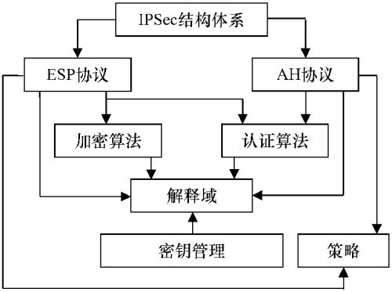
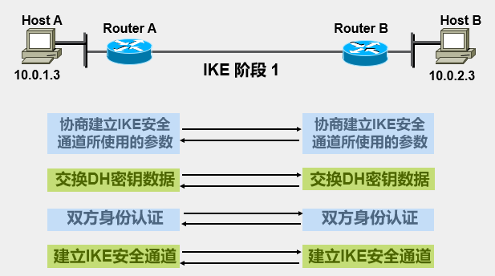

介绍IPSec协议与IKE协议 。
<!--more-->

## IP安全问题

IP协议从本质上就是不安全的，仅仅依靠IP头部的校验和字段无法保证IP包的安全。

## IPSec

### 概述

IPSec旨在把安全机制引入IP协议，使用密码学方法支持机密性和认证性服务，确保公网上数据通信的可靠性和完整性。

IPSec对IPV4可选，对IPV6必须，由三种机制共同保障

- 认证
- 信息机密性
- 密钥管理

### 体系结构

### 基本概念

#### 安全联盟（SA）

- Secure Association
- 是两个通信实体之间建立的一个简单单向协定
- 由SPI（Security Parameter Index）和目标地址组成
- 单个IPSec连接至少需要两个SA

#### 安全关联数据库（SAD）

- Secure Association Database
- SAD包含了所有活跃的SA的所有参数信息
- 流出数据：会有一个SPD数据项包含指向某个SAD数据项的指针，SPD决定了一个给定的数据包究竟使用哪一个SA。
- 流入数据：由SAD决定如何对给定数据包做处理。

#### 安全策略库（SPD）

- Secure Policy Database
- SPD用于为IPSec实现提供安全策略配置，指定哪些数据流必须经过IPSec的处理。

### AH协议

- Authentication Header
- 在每一个数据包上添加一个身份验证报头，包含一个带密钥的hash，提供了完整性保护。
- 不提供机密性保护。

#### 传输模式

- 如果传送过程中经过NAT网关，源/目的IP将被改变，导致完整性验证失败。AH在传输模式下与NAT冲突。

#### 隧道模式

- 依旧与NAT冲突。

### ESP协议

- 将需要保护的数据加密后，封装在IP包中。

#### 传输模式

#### 隧道模式

### AH vs ESP

## IKE

​		IKE（Internet Key Exchange）因特网密钥交换协议，是IPSec的信令协议，为IPSec提供了自动协商交换密钥、建立安全联盟的服务，能够简化IPSec的使用和管理，大大简化IPSec的配置和维护工作。

### IKE与IPSec关系

- IKE位于UDP之上，属于应用层协议。
- IKE为IPSec协商建立SA，并将参数与密钥交给IPSec。
- IPSec使用IKE建立的SA对IP报文加密或验证处理。
- AH和ESP的协议号是51和50。

### IKE的作用

- 降低手工配置的复杂度
- SA和密钥定时更新
- 允许IPSec提供反重放服务
- 允许在端与端之间动态认证

### IKE的协商过程

#### 两个阶段

- 阶段一：在网络上建立IKE SA，为阶段二提供保护和快速协商。通过协商创建一个通信信道，并对其进行认证，为通信提供机密性、消息完整性以及消息源认证服务。
- 阶段二：在IKE SA的保护下完成IPSec的协商。

#### 交换信息

- SA交换，协商确认有关安全策略的过程。
- 密钥交换，交换Diffie-Hellman公共值和辅助数据，产生加密物。
- ID交换和验证数据交换，进行身份验证和对整个SA交换进行验证。

#### 阶段一协商过程

双方建立了一个已通过身份验证和安全保护的通道，此阶段建立了一个ISAKMP。

- 两种协商模式
  - 主模式协商
    - 适合两设备的公网IP固定，实现设备之间点对点的环境。

  

  - 野蛮模式协商

  

#### 阶段二协商过程

- 使用“快速模式”交换，实现两个主要功能
  - 协商安全参数保护数据连接
  - 周期性地更新密钥信息
- 协商出IPSec单向SA，保护数据流。
- 协商过程受第一阶段ISAKMP/IKE SA保护。

