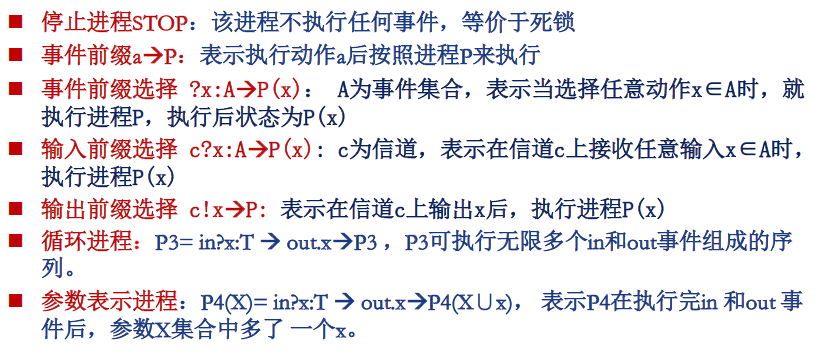
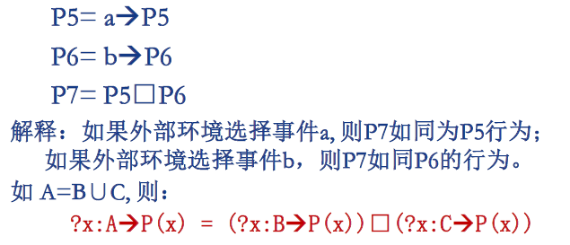
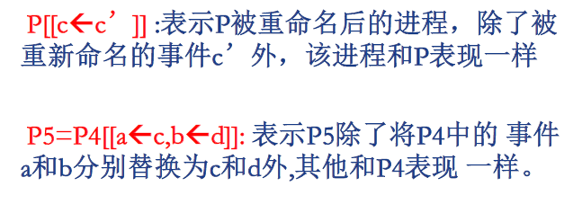
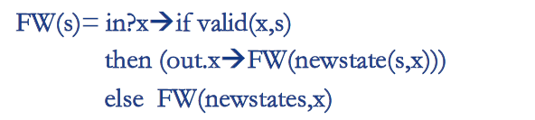
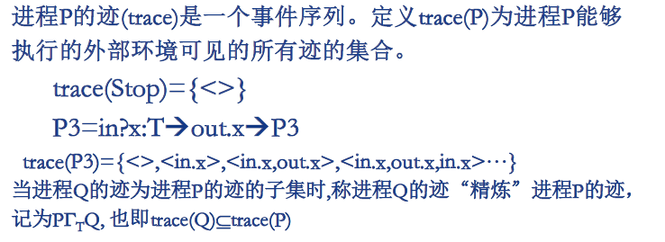

介绍攻击结构性方法。

<!--more-->

## 攻击结构性方法

从反面寻找协议的漏洞，如果能找到合适的攻击步骤，则说明协议有缺陷。

如果找不到攻击，不能说明协议是安全的，但安全性可以得到一定程度的保证。

- 主体数据的有限性：通常只分析有限个主体实例
- 无法解决状态空间爆炸问题
- 无法揭示安全协议的内部机理

## CSP

通信顺序进程（Communicating Sequential Processes）

- 描述并发系统的消息交互
- 将协议的安全问题描述为CSP进行是否满足其CSP规约的问题，并用FDR对协议的性质进行分析与验证。

### 基本术语

- 事件

  - 一个典型的CSP事件形式为：c.i.j.m，包括信道c、消息源i、目的地j和消息m。

- 信道

  - 不同事件类型看成不同信道，并规定它所传递的数据类型。

- 进程

  - 包括执行状态中的一个动作（事件）以及动作结束后的状态。

  

- 进程间选择 P▢Q

  - 表示在两个进程事件间的外部选择

  

- 并行进程

  

- 重命名

  

- 条件结构

  

- 迹与精炼

  

### 协议目标的CSP描述

看得头大，啥也记不住

TO BE COMPLETED