介绍SET协议。

<!--more-->

## 电子商务安全

### 电子交易的主要模式

#### 支付系统无安全措施

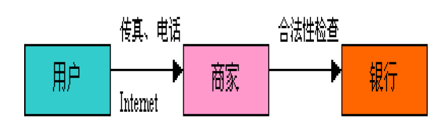

- 风险由商家承担
- 商家完全掌握用户的信用卡信息
- 信用卡信息的传递无安全保障

#### 通过第三方代理人支付

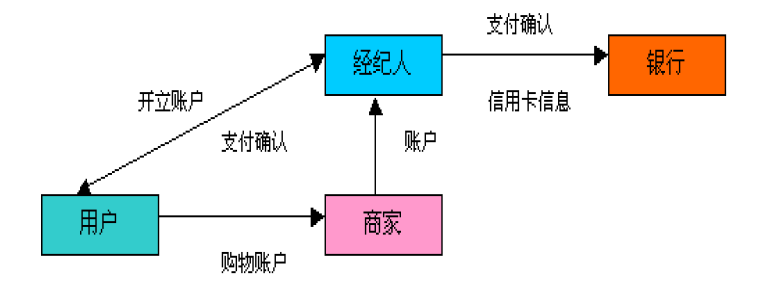

- 用户账户的开设不通过网络
- 信用卡信息不在开放的网络上传送
- 通过电子邮件来确认用户身份
- 商家自由度大，风险小
- 支付是通过双方都信任的第三方(经纪人)完成的

#### 数字现金支付

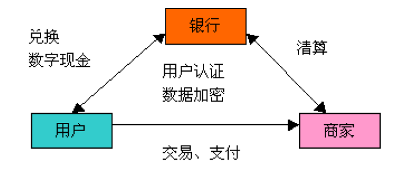

- 银行和商家之间应有协议和授权关系
- 用户、商家和数字现金的发行都需要使用数字现金软件
- 适用于小额交易
- 身份验证是由数字现金本身完成的
- 数字现金的发行负责用户和商家之间实际资金的转移
- 数字现金与普通现金一样，可以存、取和转让

#### 简单加密支付

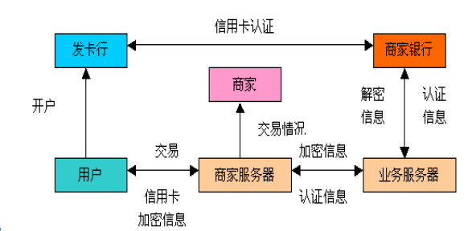

- 信用卡等关键信息需要加密
- 使用对称和非对称加密技术
- 可能要启用身份认证系统
- 以数字签名确认信息的真实性
- 需要业务服务器和服务软件的支持

#### 安全电子交易SET支付

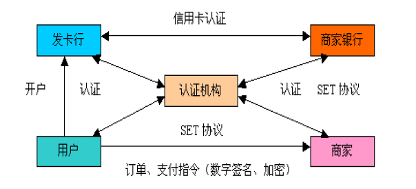

- SET协议的目标
  - 信息在互联网上安全传输，不能被窃听或篡改
  - 用户资料要妥善保护，商家只能看到订货信息，看不到用户的账户信息
  - 持卡人和商家相互认证，以确定对方身份
  - 软件遵循相同的协议和消息格式，具有兼容性和互操作性

## SET

- Secure Electronic Transaction
- Visa和MasterCard研发的专门用于Internet上安全信用卡交易的协议

### 交易中的主体

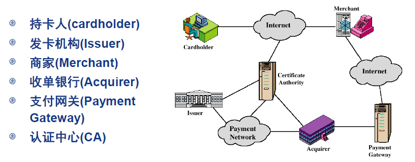

### 主体证书

- 协议各方持有名字和密钥对
- 身份使用X.509 V3证书和密钥关联

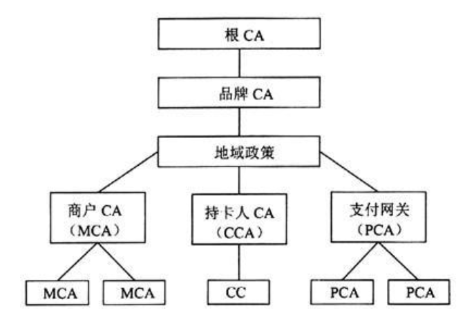

### SET电子支付的流程

- 客户在发卡行开户
- 客户持有银行签发的X.509 V3证书
- 商家持有两个同类品牌的证书X.509 V3
  - 一个用于签名，一个用于密钥交换
- 客户向商家发订单
- 商家发送证书向客户出示自己身份

### SET双重数字签名

- 将两个消息连接在一起，这两个消息面对的对象不同。
  - Order Information：客户给商家
  - Payment Information：客户给银行
- 商家不需要卡信息，银行需要订单信息，保护客户隐私。

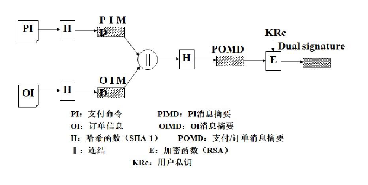

- 商家收到OI校验签名
- 银行收到PI校验签名
- 客户连接OI和PI，证明该关联。

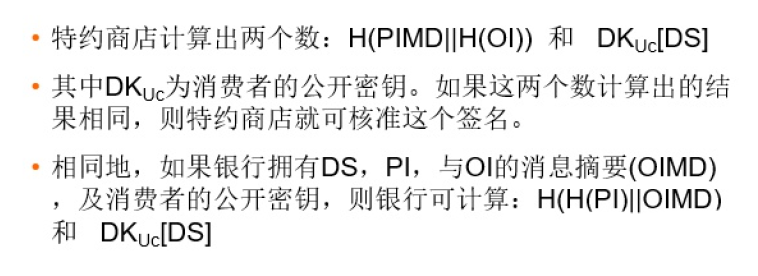

### SET电子支付的流程

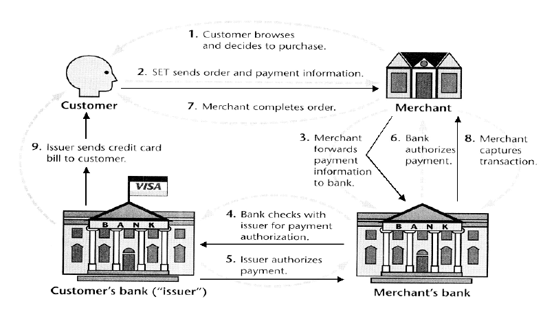

- 客户发送订单和支付信息给商家
- 商家向支付网关请求支付授权
- 商家确认向客户订单
- 商家向客户提供商品或者服务
- 商家向支付网关请求支付

### SET消息流

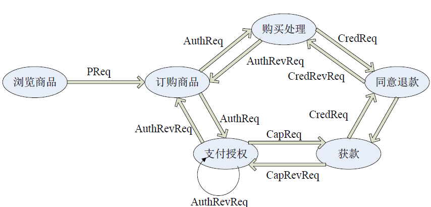

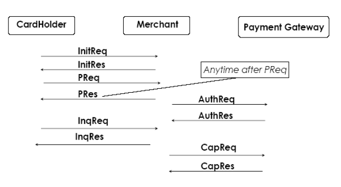

#### 支付过程初始化

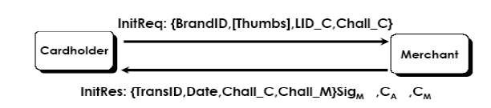

- 持卡人向商家发送初始请求，包括
  - 持卡人使用的语言，交易ID，交易卡类型
- 商家接收初始请求，产生初始应答，对初始应答生成消息摘要，并进行数字签名，包括
  - 商家证书、网管证书、初始应答、消息摘要的数字签名等。

#### 购物请求

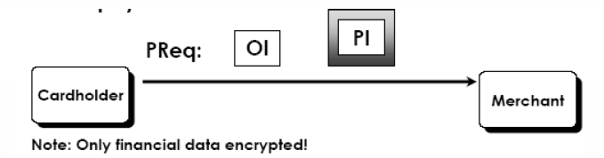

- 持卡人接收初始应答，检查商家证书和网关证书。用商家公钥解开数字签名，验证数据未被篡改，否则丢弃。
- 持卡人发出购物请求，包含了真正的交易行为，包括
  - 发往商家的订单信息（OI）
  - 通过商家转发往网关的支付信息（PI）
- 通过双重数字签名将OI与PI进行关联。
- PI被加密，商家只能看到OI。

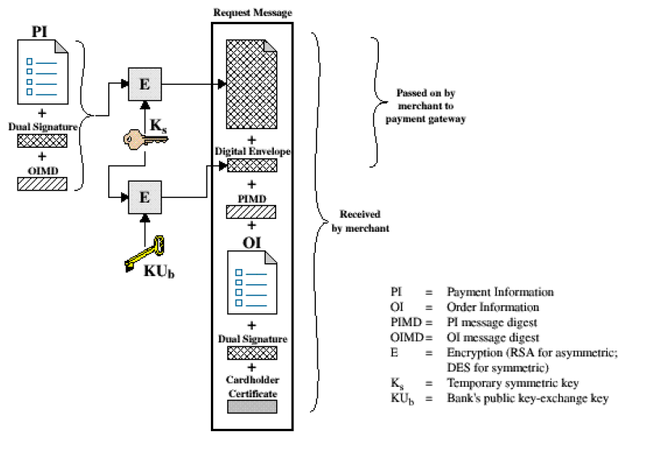

#### 商家验证

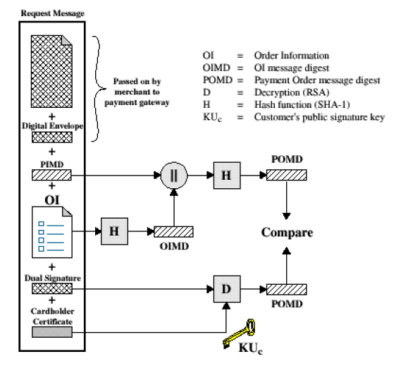

- 商家接受持卡人的购物请求，认证持卡人的证书。验证双重签名，看数据在传输过程中是否被篡改，若数据完整则处理订单信息，产生支付请求。
- 将支付请求用HASH生成摘要，并签名，网关收到后用商家公钥解密，并确认支付请求是此商家所发且在途中未被修改。生成对称密钥对支付请求加密，并用网关公钥加密形成数字信封。
- 将商家证书、支付请求密文、商家数字签名、数字信封和持卡人通过商家转发的：sign[H(OP)]、OI摘要、PI密文、持卡人数字信封、持卡人证书等发往支付网关。

#### 支付网关认证过程

- 支付网关分别检查确认商家发来的数据和持卡人发来的数据
- 用HASH算法作用于支付请求，形成摘要，与商家发来的支付请求
  摘要（解开数字签名所得）相比较，如果相同则表示数据完整，否
  则丢弃数据
- 网关检查持卡人证书，然后用私钥打开持卡人数字信封，得到他的
  帐号和对称密钥。用此对称密钥解开PI密文，得到PI，接着验证双
  重签名，生成PI的摘要，与OI摘要相连接，再次生成摘要，其结果
  与H (OP)(解双重签名所得)相比较，如果相同则数据完整，如果
  不同则丢弃。
- 网关将信息发送往银行

#### 收单银行处理

- 解密AuthReq
- 校验商家签名
- 解密来自于持卡人的PI
- 校验双重签名
- 从PI中抽取卡数据

TO BE COMPLETED