介绍SSL协议与WTLS协议 。
<!--more-->

## 不同协议层的安全

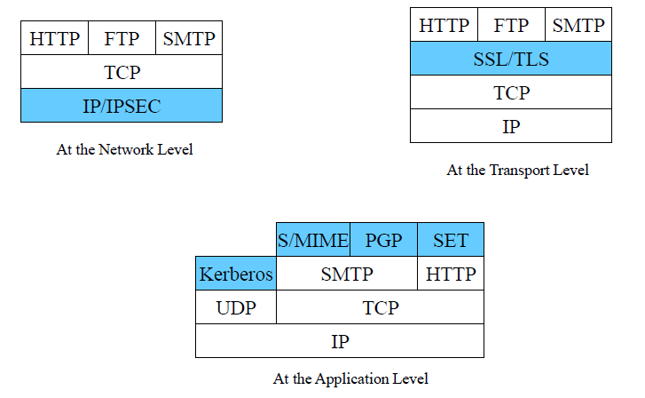

## SSL

1994年，由Netscape公司提出SSL，为HTTP提供安全连接。

### 安全机制

- 机密性：使用对称密钥算法对传输的数据进行加密。
- 身份验证：基于证书利用数字签名对server和client进行身份验证。
- 消息完整性验证：使用MAC算法检验消息的完整性。

### SSL版本

- SSL由Netscape公司设计，是用于web的安全传输协议。
- IETF将SSL标准化，称为TLS，TLS1.0与SSL3.0差别非常小。
- wap论坛在TLS基础上做了WTLS协议，以适应无线的特殊环境。

### SSL的分层结构

- 上层协议
  - SSL握手协议
  - SSL passowrd变化协议
  - SSL警告协议
- 下层协议为SSL记录协议

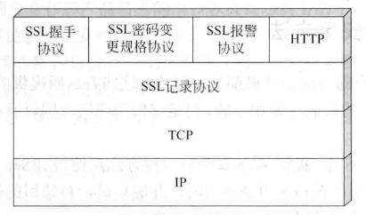

### SSL基本过程

- 建立会话
- 传输应用数据

### 连接&会话

- SSL连接

  - 点对点
  - 连接是暂时的，每个连接和一个会话关联。

- SSL会话

  - 会话是在server和client之间的一个关联，由握手协议建立，定义了一组密码安全参数。
  - 避免为每一个连接提供新的安全参数所需昂贵的协商代价。

- 在任意一对通信主体之间，可以有多个安全连接。

  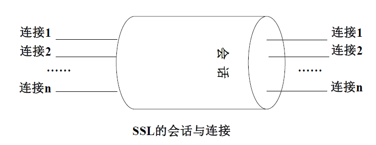

### 握手协议

握手协议允许服务器和客户端相互验证，协商加密和MAC算法以及保密密钥。

握手协议的消息都含有以下三个字段

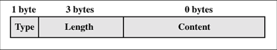

#### 阶段1：建立安全能力

- SSL握手第一阶段启动逻辑连接，建立这个连接的安全能力。
- client向server发送client hello消息
  - 支持的协议版本，比如TLS 1.0。
  - 客户端生成的随机数，用于生成“对话密钥”。
  - 支持的加密方法，比如RSA。
  - 支持的压缩方法。
- server向client发送server hello消息
  - 确认使用的协议版本，如果版本不一致则关闭加密通信。
  - 服务器生成的随机数，用于生成“对话密钥”。
  - 确认使用的加密方法。
  - 服务器证书。
- 此阶段后，client、server知道了以下内容
  - SSL版本
  - 密钥交换、信息验证和加密算法
  - 压缩方法
  - 密钥生成的两个随机数

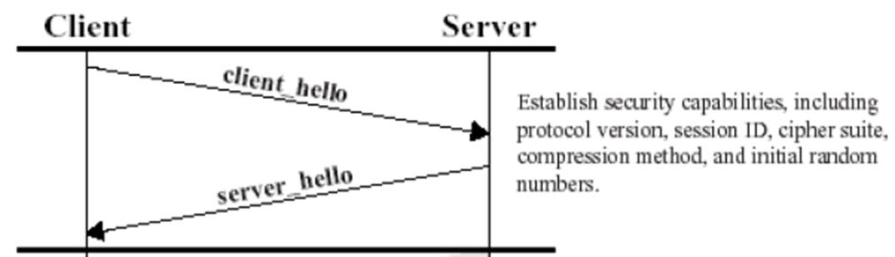

#### 阶段2：服务器鉴别与密钥交换

- server发送证书，包含一个X.509证书，或一条证书链。
- server发送server_key_exchange消息
  - 可选，服务器证书没有包含必需数据时发送。
  - 包含签名，签名内容包括两个随机数以及服务器参数。
- server发送certificate_request消息
  - 非匿名server可以像client请求一个证书。
  - 包含证书类型和CAs。
- 服务器发送server_hello_done，等待应答。

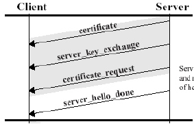

#### 阶段3：客户机鉴别与密钥交换

- client收到server_done消息后，检查server提供的证书，判断参数是否可以接收，如果没有问题就发送消息。
- 如果server请求证书，就发送certificate，若client没有证书，则发送no_certificate警告，然后发送client_key_exchange消息。
- 最后，client发送certificate_verify消息，包含一个签名，对第一条消息以来的所有握手消息的MAC值进行签名。

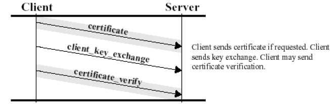

#### 阶段4：完成

- 第四阶段建立起一个安全连接。
- client发送change_cipher_spec消息，将协商得到的CipherSuite拷贝到当前连接的状态之中。
- client用新的算法、密钥参数发送一个finished消息，检查密钥交换和鉴别过程是否已经成功。其中包括一个校验值，对所有以来的消息进行校验。
- 服务器同样发送change_cipher_spec和finished消息。
- 握手过程完成，client和server可以交换应用层数据。

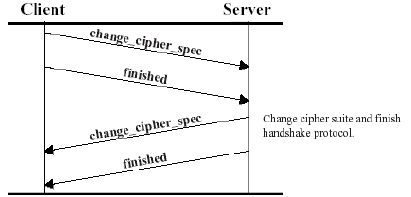

### ChangeCipherSpec

- 在数据包中就是一个字节的数据，用于告知服务端，客户端已经切换到之前协商好的加密套件的状态，准备使用之前协商好的加密套件加密数据并传输。

### 记录协议

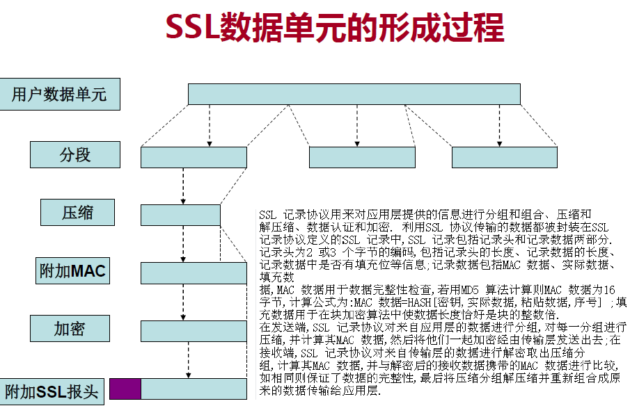

### 警告协议

当握手过程或者数据加密等操作出错或者发生异常情况时，向对方发出警告或中止当前连接。

### SSL的加密和认证算法

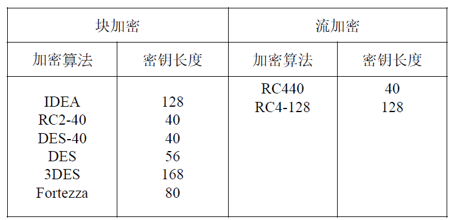

认证算法采用X.509电子证书标准，通过RSA算法进行数字签名来实现。

### SSL安全性分析

- 鉴别机制
  - 客户端与服务器交换了证书
- 加密机制
  - 对称加密保护数据传输，非对称加密协商会话密钥。
- 完整性机制
  - 数据分组压缩后，产生MAC。
- 抗重放攻击
  - 使用序列号，传输中被加密。

### SSL脆弱性分析

- 客户端假冒
- 无法提供基于UDP应用的安全保护
- 不能对抗通信流量分析
- 进程中主密钥泄露

## WTLS

- 保证传输层安全，作为WAP协议栈的一个层次向上层提供安全传输服务接口。

### 提供的安全服务

- 第一类服务：使用交换的公共密钥建立安全传输，使用对称算法加解密数据，检查数据完整性，可以建立安全通信的通道，但没有对通信双方的身份进行鉴别，
- 第二类服务：在第一类服务的基础上，可以交换服务器证书，完成对服务器的鉴别。
- 第三类服务：在第二类服务的基础上，可以交换客户端证书，对恶意的用户冒充也能抗击。

### 协议栈

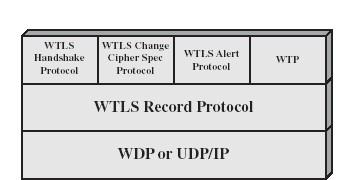

### 握手协议

- 和SSL一致？

### 记录协议

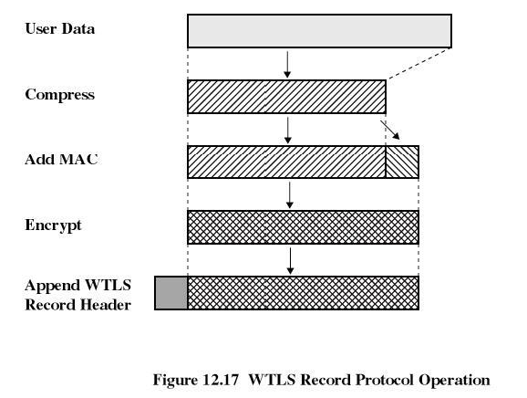

### 告警协议

- 描述信息错误的严重程度及告警描述
- 警告、危急、致命

### 密钥交换

- 共享密钥方法
- RSA加密传输方法
- DH密钥交换方法
- EC-DH密钥交换方法
  - 椭圆曲线版本的DH密钥交换

