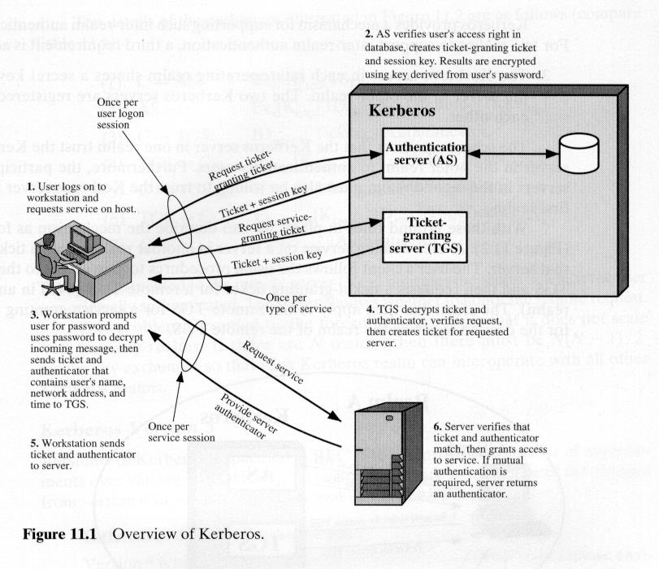
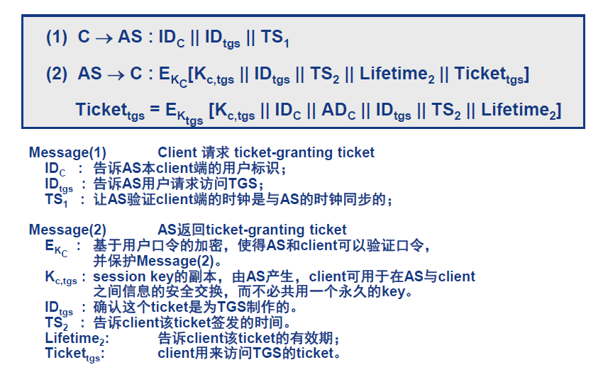
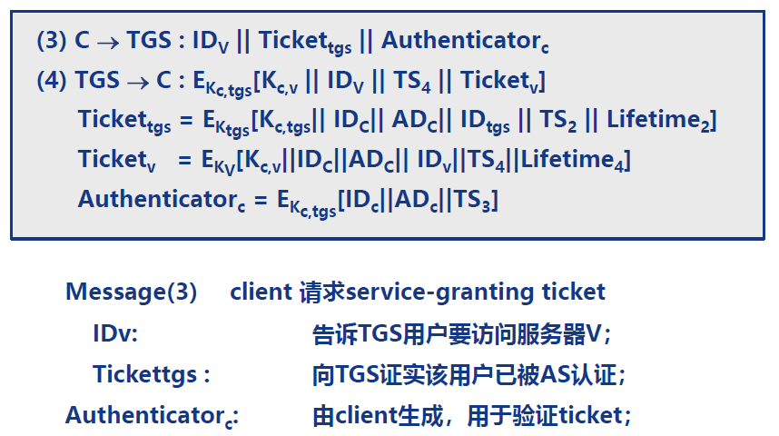
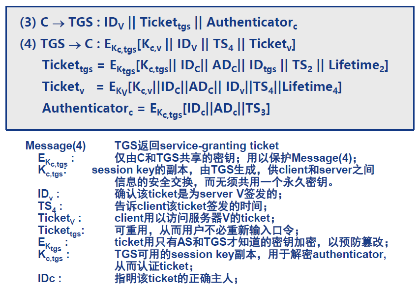
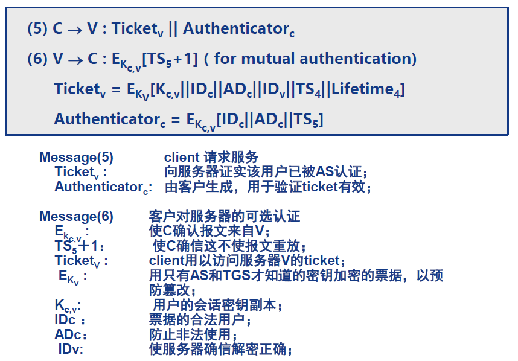
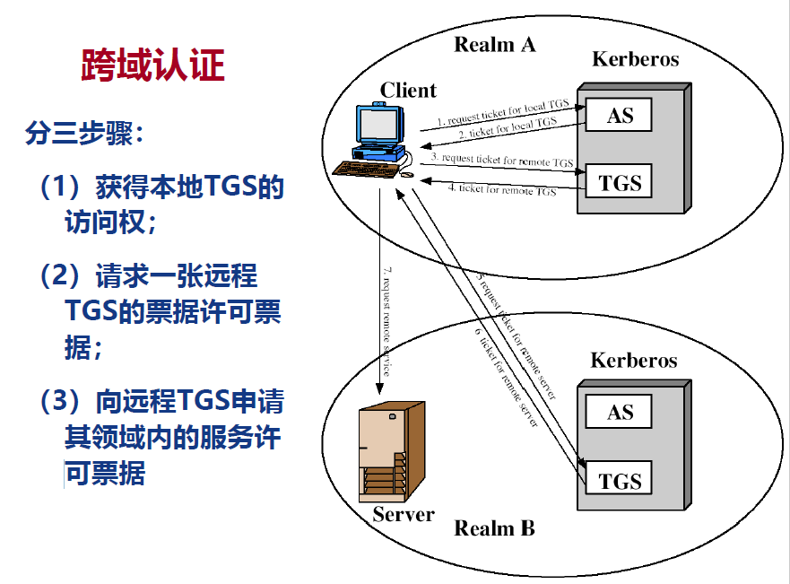
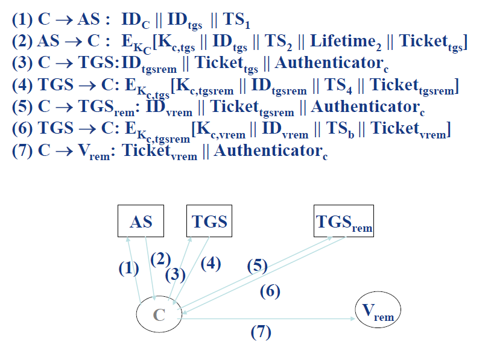
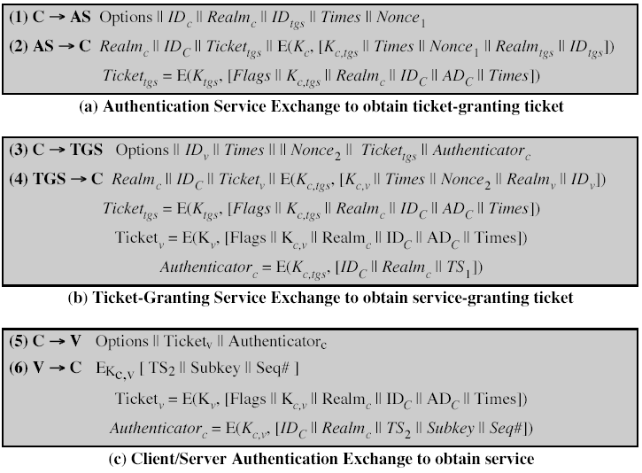
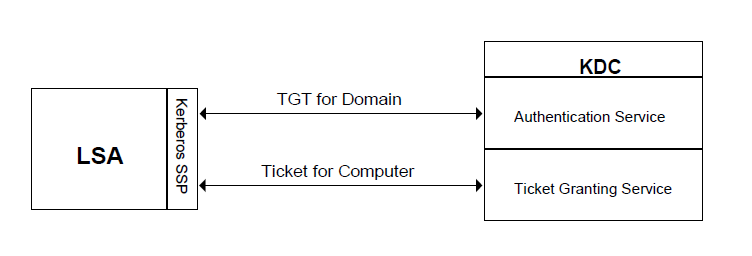
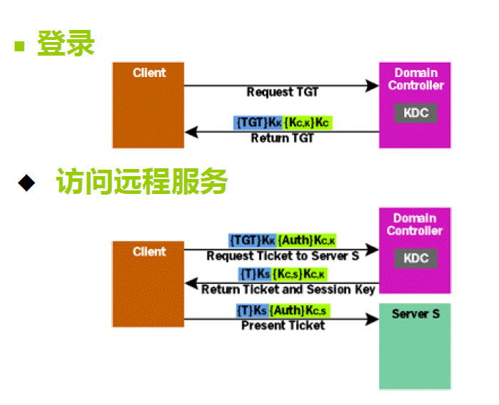

介绍Kerberos协议。

<!--more-->

## 密钥管理问题

所有的密码系统都存在这样的问题：如何安全/可靠地分配密钥。理想的情况是，密钥分配协议应该得到形式化验证。

### 单点登录

- 用户只需要登录一次，就可以访问多个系统，不需要记忆多个口令密码。
- 优点
  - 用户可以快速访问网络，提高工作效率，也能帮助提高系统的安全性。
  - 有利于进行账户密码管理、用户审计。
  - 方便进行企业应用部署。

## Kerberos认证服务协议

- 提供一个在客户端跟服务器端之间或服务器与服务器之间的身份验证机制（并且是相互的身份验证机制）·
- 解决的问题
  - 在公开的分布式环境中，工作站上的用户希望访问分布在网络中的服务器上的服务。
  - 服务器希望能够限制授权用户的访问，并对服务请求进行鉴别。

### Kerberos的加密体制

- Kerberos提供一个中心认证服务器，提供用户和服务器之间的认证服务。
- 采用传统加密算法，**无公钥体制**。
- 常用版本：Kerberos Version 4 和 Kerberos Version 5

### 主要功能

- 在分布式的client/server体系结构中，采用Kerberos服务器提供认证服务。
- 总体方案是提供一个可信第三方的认证服务。
  - 用tickets验证
  - 避免本地保存密码和在互联网上传输密码
  - 包含可信第三方
  - 使用对称加密
  - 客户端与服务器之间能够相互验证

### Kerberos Version 4

- 引入可信第三方的认证服务，基于Needham & Schroeder协议。
- 采用DES加密算法，提供认证服务。

#### 基本概念

- Principal
  - 安全个体，被认证的个体，有名字和口令。
- KDC
  - 密钥分发中心，提供票据和临时的会话密钥。
- Ticket
  - 用户可以用它向服务器表明身份，包含客户标识、会话密钥、时间戳等信息。其中的大多数信息被加密，密钥为服务器的密钥。
- Authenticator
  - 包含最近产生的信息，需要用到会话密钥。
- Credentials
  - 票据加上会话密钥
- Authentication Server(AS)
  - 通过long-term key认证客户
  - 给予客户ticket granting ticket和short-term key
  - **认证服务**
- Ticket Granting Server(TGS)
  - 通过short-term key和ticket granting ticket认证客户。
  - TGS发放tickets给客户以访问其他服务器。
  - **授权与访问控制服务**

这样做的动机

- 将认证与授权在逻辑上分离
- 设置不同的生命周期
  - TGT通常10h，ST通常5min。
  - 方便客户，降低密钥的暴露时间。

#### 认证服务交换：获得TGT

#### 票据许可服务交换：获得ST

#### 客户/服务器认证交换：获得服务

#### Kerberos和多个域

- 完整的Kerberos环境包括Kerberos服务器、一组工作站和一组应用服务器
  - 所有用户和服务器均在Kerberos服务器上注册。
  - Kerberos服务器必须在数据库中拥有所有用户的ID和口令散列表。
  - Kerberos服务器必须与每一个服务器之间共享一个保密密钥。
- 对于不同的域
  - 每个辖区的Kerberos服务器与其他辖区的Kerberos服务器之间共享一个保密密钥，两个服务器互相注册。

#### 跨域认证

### Kerberos Version 5

- 标准化为RFC 1510
- 改进之处

|              | v4          | v5                                           |
| ------------ | ----------- | -------------------------------------------- |
| 加密算法     | DES         | 扩展                                         |
| 网络协议地址 | IP          | OSI                                          |
| 票据生命周期 | 最大1280min | 不限制                                       |
| 认证转发     |             | 允许服务器在事务中代表客户端访问另一台服务器 |

- 双重加密
  - V4中的票据被重复加密
- 消息重放
  - AS->Client和TGS->Client消息在票据生命周期中或可被重放，V5采用新鲜数。
  - 采用同一票据的多个cs连接使用相同的会话密钥，因而会遭受重放，**V5使用subkey机制**。

### 小结

- 认证方法
    - 本地机器录入密码
    - 经由中央KDC认证
    - 网上不传输密码
- 单点登录
    - KDC给予票据TGT
    - TGT可以用于获取其他的服务票据
- 优点
    - 密码不容易被窃听
    - 密码不在网上传输
    - 密码猜测更困难
    - 单点登录
        - 便捷，不用记忆多个口令。
    - 票据被盗之后难以使用，因为需要配合认证头来使用。

## Windows下的Kerberos应用

- Windows 2000中代替了NTLM
  - 支持公钥加密来保护client/AS消息
  - 允许使用基于smart cards的认证
  - 使用了Kerberos数据授权字段
  - 传递Win2K访问控制权限
  - 源于Active Directory，以SIDs的形式。
  - 消息格式公开，单为微软专有。

### Windows下域登录的机理

#### 开始步骤

- CTRL + ALT + DEL
- Winlogon service & GINA (MSGINA.DLL)
- 用户输入被转到LSA
- LSA加密缓存并经有Kerberos SSP和KDC交互

#### 交互过程

- LSA向KDC发送KRB_AS_REQ消息
  - 包括主体名称Alice和域名，加密密钥基于Alice口令生成。
- KDC返回KRB_AS_REO消息
  - 包括会话密钥、TGT、授权数据（SID）。
- LSA向KDC发送KRB_TGS_REQ消息
  - 包括目标计算机名Bob、目标计算级域名、TGT、认证头。
- KDC返回KRB_TGS_REP消息
  - 包括会话密钥（被Alice与KDC的会话密钥加密）、会话票据（被Bob和KDC的会话密钥加密）
  - 会话票据包括Bob和Alice的会话密钥和TGT中的授权数据。

#### 组装本地令牌

- 收到Alice的会话票据后，LSA解密并提取出授权数据。
- 查询本地SAM数据库，检查Alice是否属于本地安全组及其可能被授予的特权。
- 若有，则将所查询得到的SIDs加入授权数据的列表，根据此构造访问令牌，将令牌句柄和Alice会话的ID，确认返回给Winlogon。

#### 进入系统

- Winlogon创建窗口和桌面对象并且附带令牌，启动Shell。
- Alice的访问令牌被其进程所继承。

