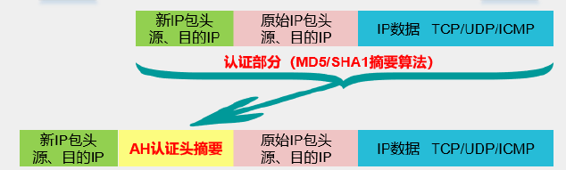
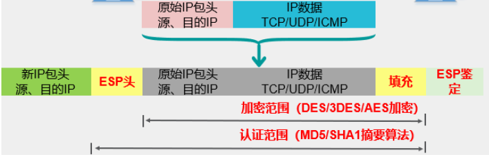

复习所学知识，应付考试orz。

<!--more-->

## 名词解释

### 挑战-应答

- 客户端向服务器发出请求，请求身份认证。
- 服务器查询用户是否合法，合法则进行下一步。
- 服务器产生随机数，作为“挑战”发给客户端。
- 客户端将ID和随机数Hash，发送给服务器。
- 服务器比较结果，相同则通过认证，并通知客户端。

### 数字信封

- 将对称密钥通过非对称加密的方式分发。
- 发送方用对称密钥加密明文，并用接收方公钥加密对称密钥，将消息发给接收方。
- 接收方用私钥解密获得对称密钥，随后解密得到明文。

### 公钥环&私钥环

- 公钥环保存该结点拥有的其他用户的公钥
- 私钥环保存该节点拥有的公私钥对（加密）

### 隧道模式

- AH

  

- ESP

  

## 简答

### BAN分析Otway-Rees

- 密钥有效性

$$
bel(A, goodkey(S, K_{as}, S)) \\
bel(B, goodkey(S, K_{bs}, S))
$$

- S的权威性

$$
bel(A, cont(S, skey(A, K_{ab}, B))) \\ 
bel(B, cont(S, skey(A, K_{ab}, B))) \\
bel(A, cont(S, fresh(skey(A, K_{ab}, B)))
$$

- 随机数的新鲜性

$$
bel(A, fresh(N_a)) \\
bel(B, fresh(N_b))
$$

### Kerberos协议中$$Ticket_v$$和认证头的结构和作用

- $$Ticket_v$$表示该用户已被AS认证
- 验证头用于验证ticket有效

### 安全协议中Nonce和时戳的作用和区别

- 随机数是为了提供消息的新鲜性
  - 可以用于挑战应答，只使用一次，防止重放攻击。
- 时戳依赖于时钟的同步。

## 分析

### PGP

- 发送方
  - 签名消息
    - 使用用户ID作为索引获取发送者的私钥
    - 提示用户输入口令解密私钥
    - 创建签名
  - 加密消息
    - 生成会话密钥，加密消息。
    - 使用用户ID作为索引获取接收方公钥
    - 创建会话消息
- 接收方
  - 解密消息
    - 使用消息内ID字段作为索引获取私钥
    - 提示用户输入密钥解密私钥
    - 恢复会话密钥，解密消息。
  - 认证消息
    - 使用签名密钥ID作为索引获取公钥
    - 恢复消息摘要
    - 计算消息摘要并和传输版本比较认证

