介绍基于推理结构性方法。

<!--more-->

## 安全协议的形式化分析

- 目前的技术主要用于对密钥正确的认证。
- 安全协议的形式化有助于减轻协议设计者的工作量
  - 界定安全协议的边界，即协议系统与其运行环境的界面。
  - 更准确地描述安全协议的行为。
  - 更准确地定义安全协议的特性。
  - 证明安全协议满足其说明，以及证明安全协议在什么条件下不能满足其说明。

### 逻辑--推理结构性方法简介

- 运用逻辑系统从用户接收和发送的消息出发，通过一系列的推理公理推证协议是否满足其安全说明。
- 典型：BAN逻辑、Kailer逻辑、RV逻辑。
- 特点
  - 简洁直观，易于使用。
  - 理想化方法。分析协议之前对协议进行形式化处理，依赖经验。
  - 使用假设和推理规则。
    - 假设不正确，不能得到正确的信念。
    - 公理和推理规则是否合理和完备也影响性能。

## BAN逻辑系统

- 定义：基于主体知识和信念推理的模态逻辑。
- 过程：通过推导主体是否能够从接收到的消息中获得信念来判断协议是否能够达到认证目标。

### 常用符号

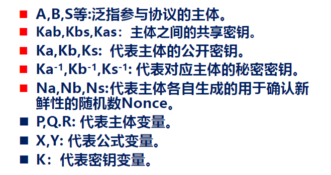

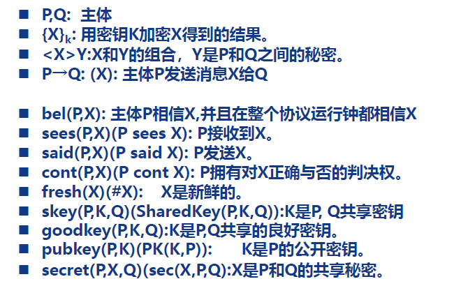

### 推理规则

#### 消息意义规则

- 从加密消息所使用的密钥以及消息中包含的秘密来推断消息发送者的身份

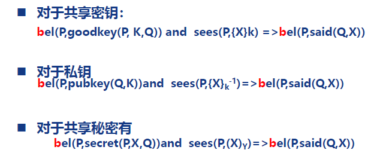

#### 随机数验证规则

#### 仲裁规则

- 拓展主体的推知能力，使主体可以基于已有信仰上推知新的信仰。

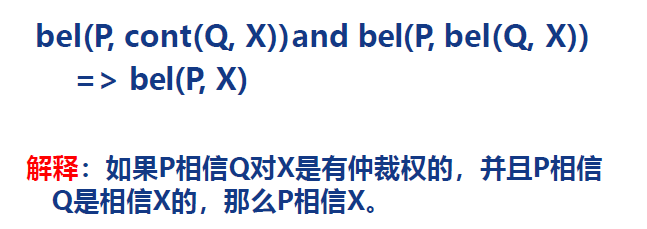

#### 信念规则

- 反映信念在消息的级联与分割的不同操作中的一致性以及信仰在此类操作中的传递性。

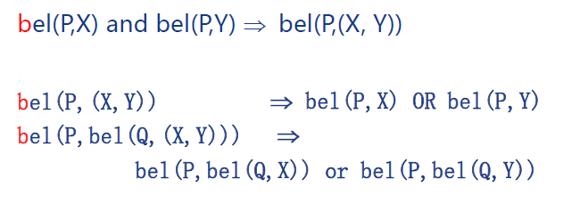

#### 接收规则

- 定义了主体在协议运行中获取消息

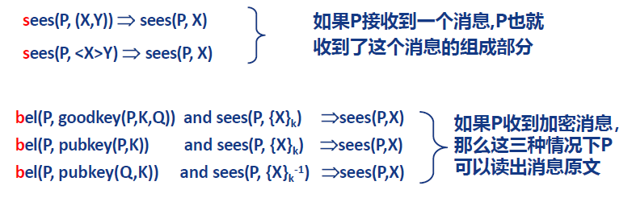

#### 新鲜规则

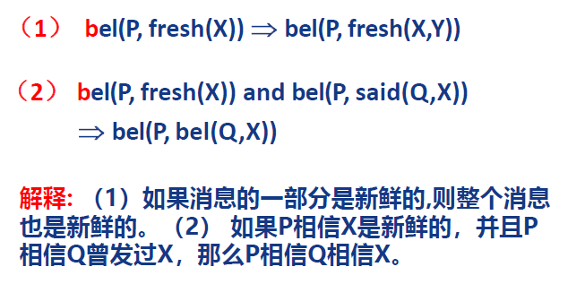

#### 传递规则

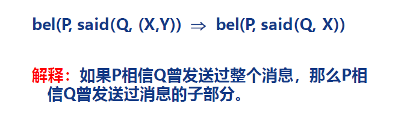

### 若干假设

#### 时间假设

- current-time：起始于本次协议运行的开始阶段
- past-time：current-time之前的时间
- 如果某一观点在协议开始时是成立的，那么在整个current-time中也是成立的，但是在past-time中成立的观点在current-time中却并不一定成立。

#### 密钥假设

- 密钥不能从密文中推导出来。
- 不拥有正确密钥不能解密报文。
- 主体能够知道他是否正确地使用了解密密钥。正确的密钥解密得到的明文有意义，错误的密钥解密得到的明文没有意义。

#### 主体假设

- 假设参与协议运行的主体都是诚实的。

#### 自身消息可识别假设

- 假设接收方能分辨接收到的消息是否为自己发送过的消息。使得消息含义规则的成立有合理性。

### 应用BAN逻辑

- 对协议进行理想化预处理（初始化）
- 给出协议初始状态及其所基于的假设。
- 形式化说明协议将达成的安全目标。
- 运用公理和推理规则以及协议会话事实和假设，从协议的开始进行推证直至验证协议是否满足最终运行目标。

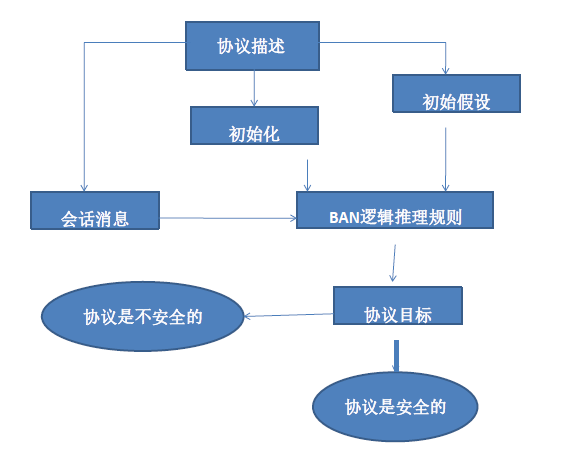

#### 实例：NS协议漏洞

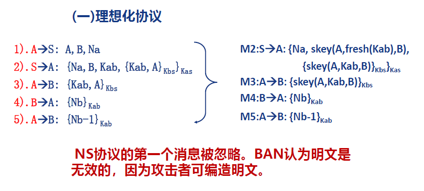

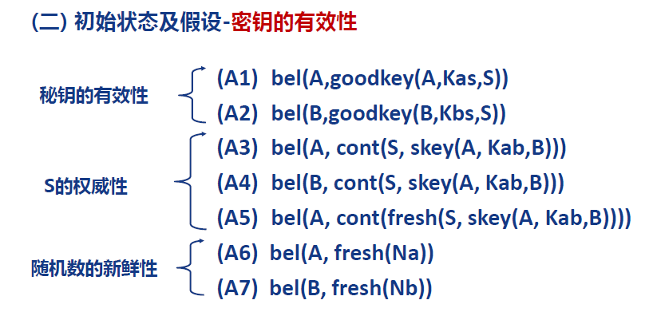

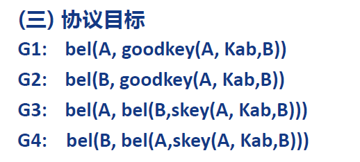

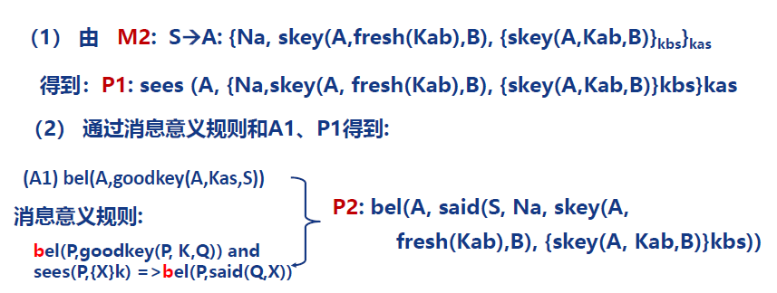

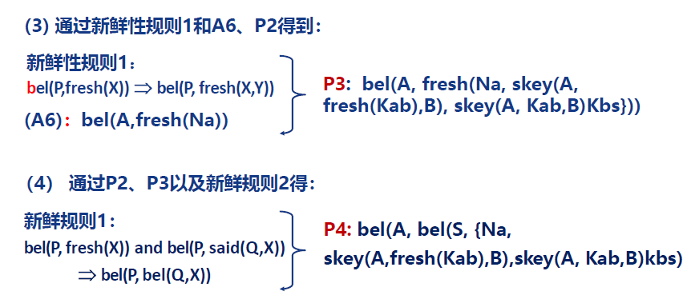

goodkey = skey + fresh

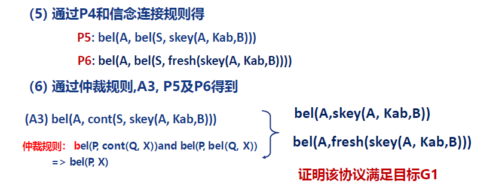

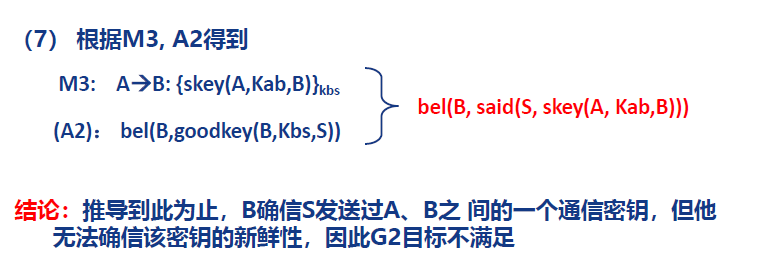

### 局限性

- 省略掉对于推知主体信仰无用部分，如明文。
- 协议的理想化过于依赖于分享者的直觉，使得原始协议与理想化协议间存在语义鸿沟。
- 协议的理想化是将协议过程语言中对协议主体行为的描述解释为用逻辑语言描述的主体的知识和信仰，并以此来表示协议说明的语义。现有的逻辑形式化分析系统很难解决此问题。
- BAN证明没有问题，并不能保证该协议没有问题。

