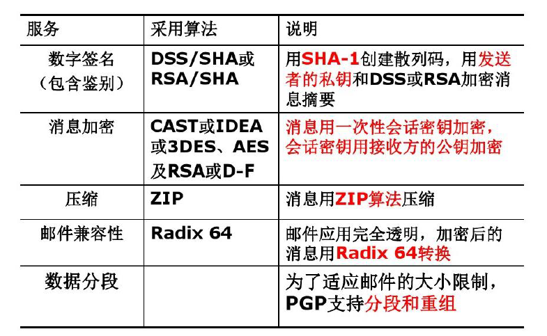
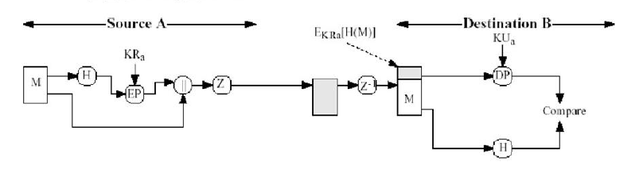
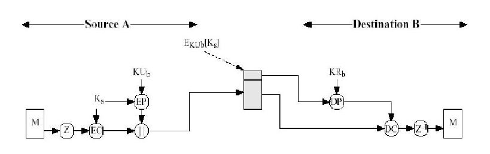
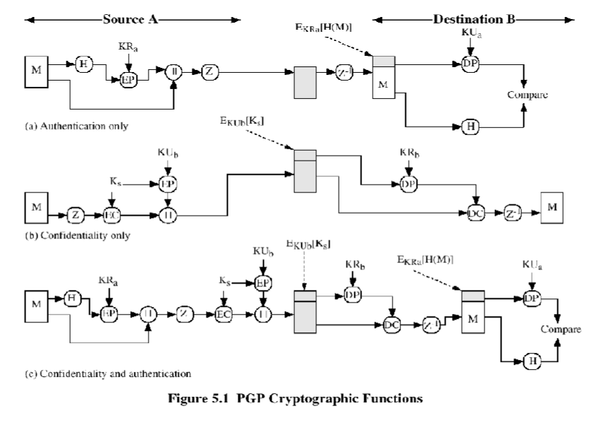
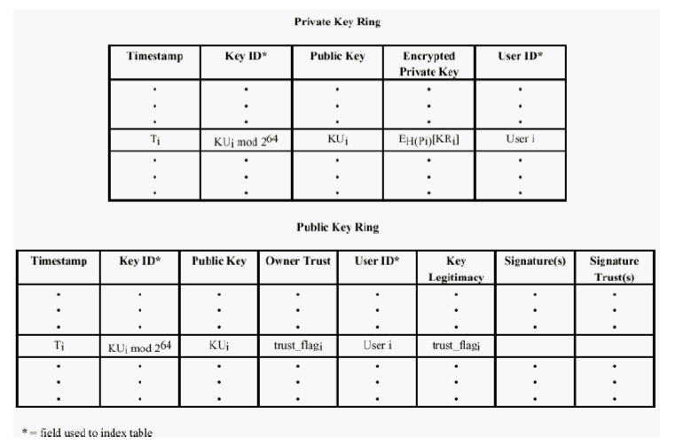

介绍PGP协议。

<!--more-->

## 电子邮件概述

- 电子邮件不是一种端到端的服务，而是一种**存储转发式**的服务。
- 一个完整的电子邮件系统包括三个主要成分
  - 客户端用户代理MUA（mail user agent）
  - 邮件传输代理MTA（mail transfer agent）
  - 邮件投递代理MDA（mail delivery agent）
- 电子邮件相关协议
  - SMTP、POP3、IMAP、MIME

### 电子邮件系统安全问题

- 匿名转发
  - 发件人隐瞒自己的电子邮箱地址和其他信息
  - 用户必须使用邮件加密和数字签名技术
- 电子邮件欺骗
  - 假冒一个用户身份给其他用户发送邮件
  - 通过身份认证避免邮件欺骗
- 邮件炸弹和垃圾邮件
  - 安装过滤器，预先检查发件人资料。
- 邮件病毒
  - 通过预杀毒防止病毒的传播

### 解决方案

- 端到端的安全电子邮件技术
  - S/MIME和PGP，**一般只对信体进行加密和签名，而信头必须保证原封不动**。
- 要求信头在传输过程中也保密，使用传输层技术作为后盾
  - 使用SSL SMTP和SSL POP
  - 使用VPN或其他IP通道技术
- 邮件服务器本身安全可靠

## PGP

- Pretty Good Privacy

### PGP数字签名与认证

- 发送者
  - 产生消息M
  - 使用SHA-1生成160位散列码H
  - 使用私钥签名，并与M连接。
- 接收方
  - 使用公钥解密，恢复散列码H。
  - 计算M的散列码，与H比较，两者匹配则报文通过鉴别。

### 保密性操作

- 发送者
  - 生成消息M和128位随机数作为会话密钥
  - 使用CAST-128（或IDEA或3DES）加密报文
  - 用接收者的公钥加密会话密钥，并与M连接。
- 接收者
  - 使用私钥解密报文，恢复会话密钥。
  - 用会话密钥解密恢复消息M。

### PGP加密认证处理过程

### PGP密钥环

- PGP在每个结点提供一对数据结构
  - 私钥环——存储该节点拥有的公开/私有密钥对
  - 公钥环——存储该节点知道的其他所有用户的公开密钥

### 信任网

- 通过自己的数字签名进行确认
- 通过自己完全信任的人的数字签名进行确认
- 通过自己有限信任的多个人的数字签名进行确认