介绍密码学的基础知识，包括公钥体制、数字签名、密钥分配等。

<!--more-->

## 信息安全

### 信息安全的范围

- 物理安全
- 计算机安全
- 网络安全

### 信息安全的目标

- 保密性
- 完整性
- 可用性

### 计算机网络面临的安全性威胁

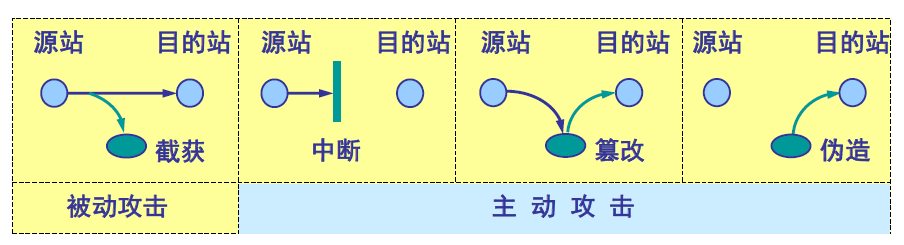

## 密码学回顾

### 基本概念

明文、密文、加密（算法）、解密（算法）

加密系统可以用五元组描述（P, C, K, E, D）

- P表示明文空间
- C表示密文空间
- K表示密钥空间
- E表示加密算法
- D表示解密算法

数据加密系统可以用下图表示

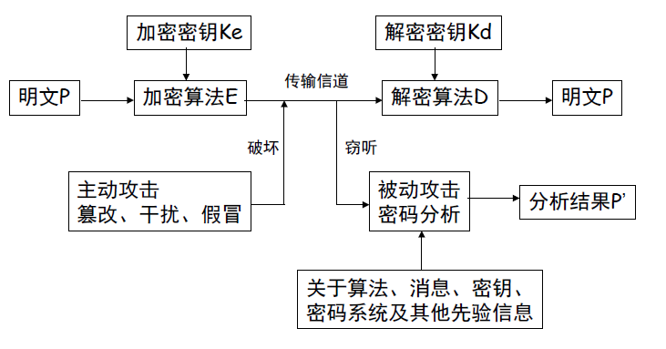

### 密码体制

#### 对称密钥

- 加密密钥和解密密钥相同
- DES是一种分组密码
  - 加密前对明文分组，组长64位。
  - 密钥为64位（8位用于奇偶校验）

#### 公钥体制

- 使用不同的加密密钥和解密密钥

- 可以解决密钥分配问题，也用于数字签名。

- 公钥不能用于解密
  $$
  D_{PK_B}(E_{PK_B}(X))\neq X
  $$

- 加密和解密可以对调
  $$
  D_{PK_B}(E_{SK_B}(X)) = D_{SK_B}(E_{PK_B}(X)) = X
  $$

### 数字签名

- 签名者事后不能否认自己的签名。
- 接收者可以验证签名，但其他人不能伪造签名。
- 双方关于签名真伪发生争执时，第三方可以解决争执。

#### 鉴别

- 发送方用自己的私钥加密摘要，附到明文之后。
- 提供完整性鉴别，但不提供保密性。
- 为了满足保密性，需要结合加密。

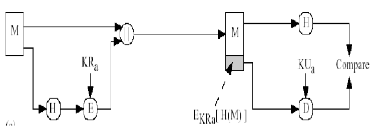

#### 数字信封

- 发送方用对称密钥加密明文，并用接收方的公钥加密对称密钥，附到密文之后。

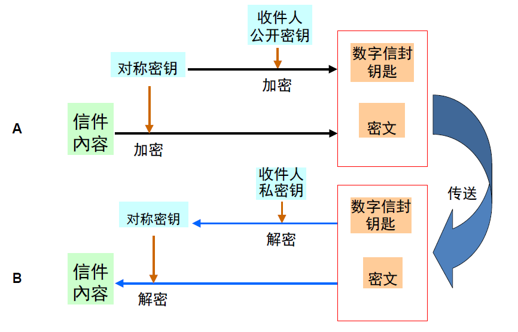

#### 数字证书

- 用户提交公钥等信息P，CA机构用私钥签名摘要产生S，P和S一起被称为数字证书。
- 用户可以用CA的公钥解密获取证书里的公钥，结合数字签名，验证证书的完整性。
- 下图的解释
  - 发送方首先产生摘要，用自己的私钥加密形成数字签名，附到消息之后。
  - 因为有数字签名，所以接收方需要获得发送方的公钥，发送方需要发送自己的数字证书。
  - 因为需要传递对称密钥，所以需要数字信封，用接收方的公钥加密对称密钥。
  - 接收方收到消息后，首先用私钥解密获得对称密钥，随后解密获得明文。用CA公钥验证证书的完整性，由此获得发送方的公钥，用其解密数字签名，确保消息没有被篡改。
  - 满足了保密性和完整性。

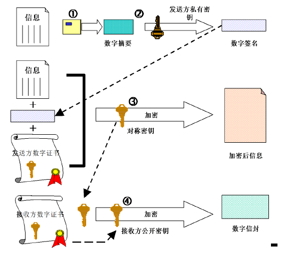

## 基于Hash的鉴别

### 基本用法

- 直接Hash

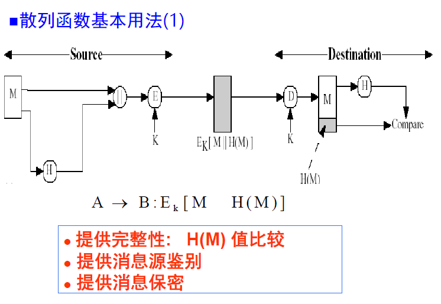

- 与加密结合

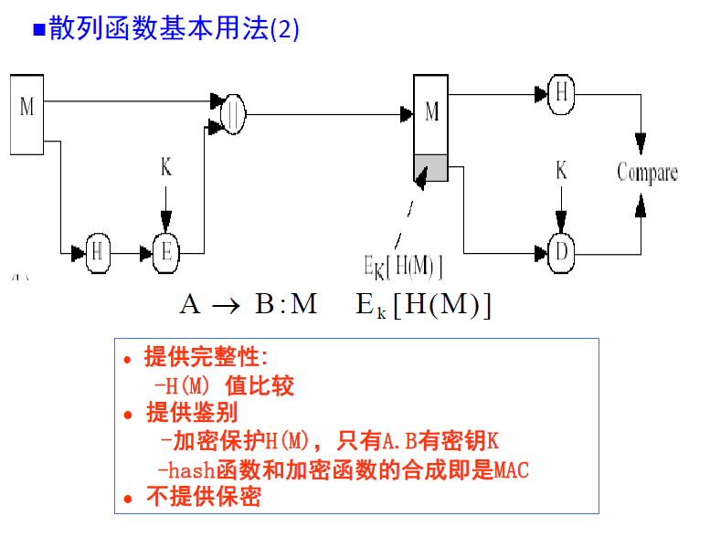

- 结合公钥体制（数字签名）

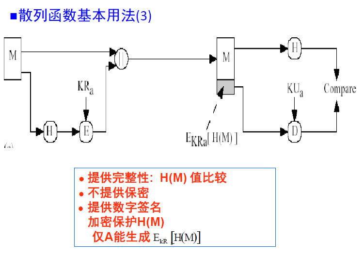

- 结合对称密钥体制

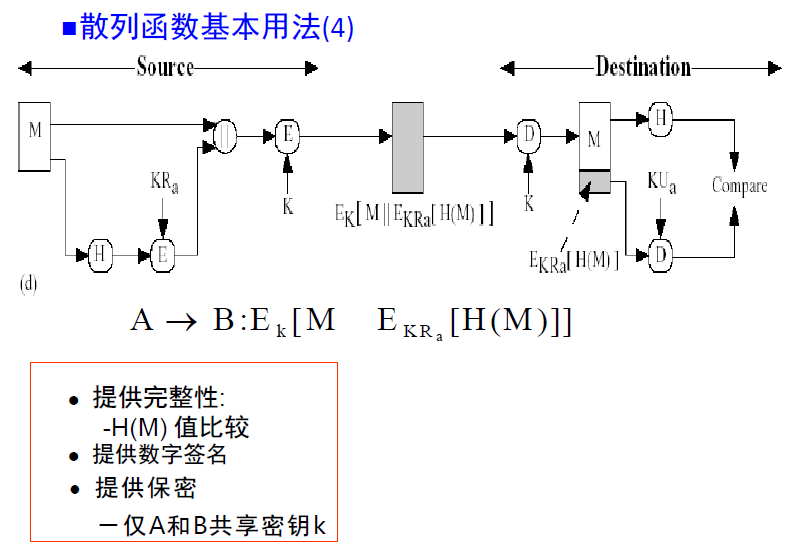

- 加盐

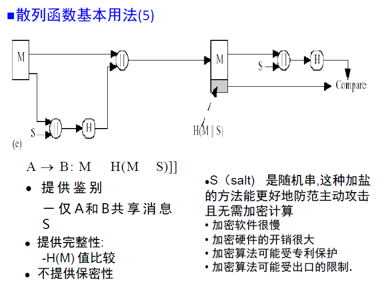

- 大杂烩

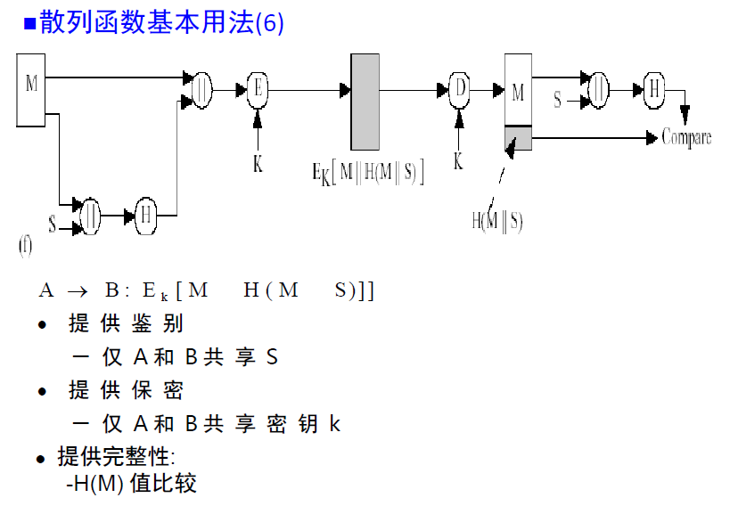

### 分类

- 根据安全水平
  - 弱无碰撞
  - 强无碰撞
- 根据是否使用密钥
  - 带私密密钥，此时称作MAC。
  - 不带私密密钥，此时称为MDC。

## 密钥管理与分配

### 密钥生命周期

- 产生、存储、使用、更新、删除

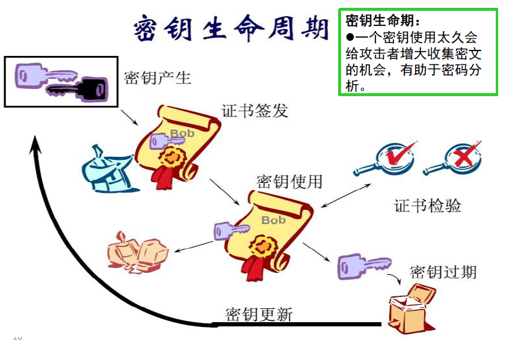

### 对称密钥的分配

- 设立密钥分配中心KDC。
- KDC给需要进行秘密通信的用户临时分配一个会话密钥。
- KDC的登记用户在KDC的服务器上安装了自己与KDC进行通信的主密钥，可简称为密钥。

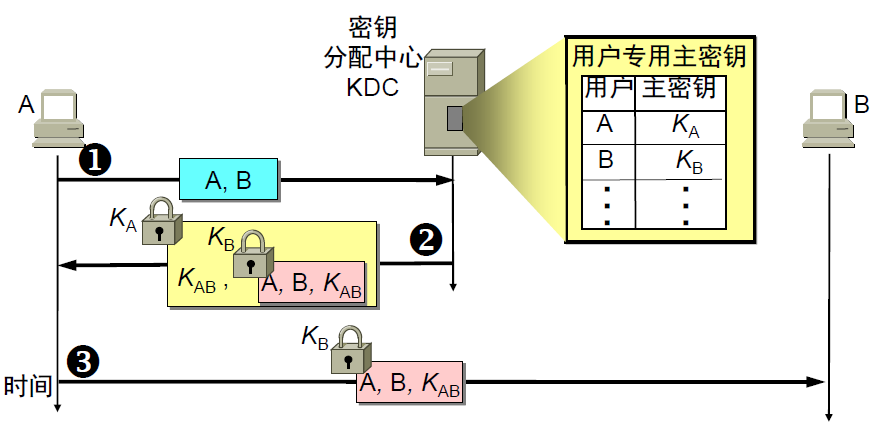

#### 基于公钥体制的对称密钥分配

- 公钥密码体制未必在通讯中直接使用，但却很适合用于对称密钥分配。

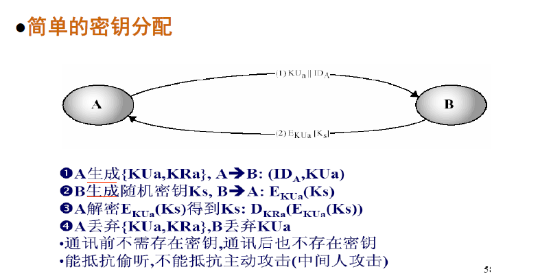

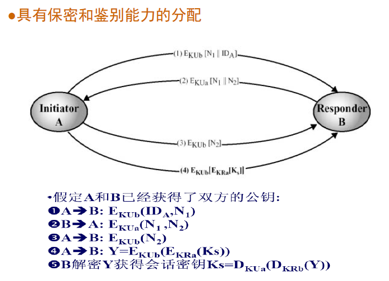

### 公钥体制的密钥分配

#### 公开发布

用户将自己的公钥发给其他用户，一般将公钥附在消息上（PGP）。

- 实现简单
- 容易假冒

#### 公用目录表

建立一个公用的公钥动态目录表，由可信的实体建立、维护和发布。

- 有一定的安全性
- 目录表容易受到攻击

#### 公钥授权

在公钥目录表的基础上，由公钥管理机构为用户建立、维护和发布公钥目录表。

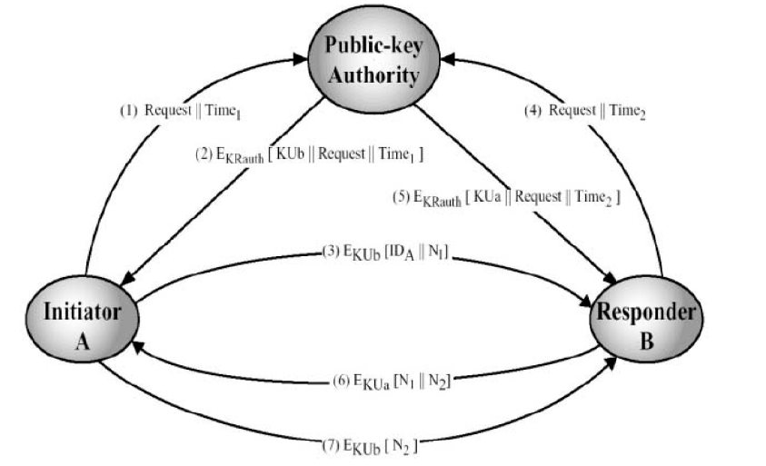

#### 公钥证书

用户通过公钥证书相互交换公钥，公钥证书由CA为用户建立。

公钥证书的数据项包括

- 用户的公钥、用户身份标识和时间戳等。
- 所有数据项经CA的私钥签名后形成证书。

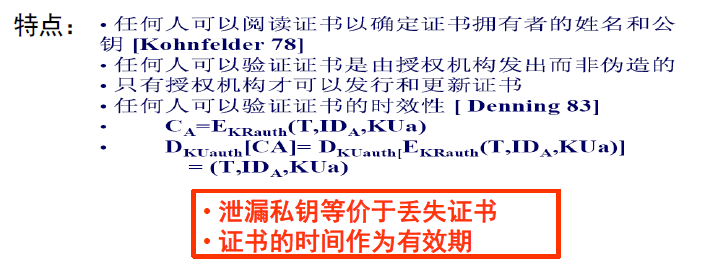

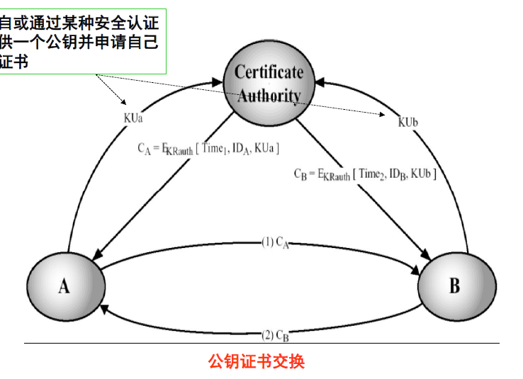