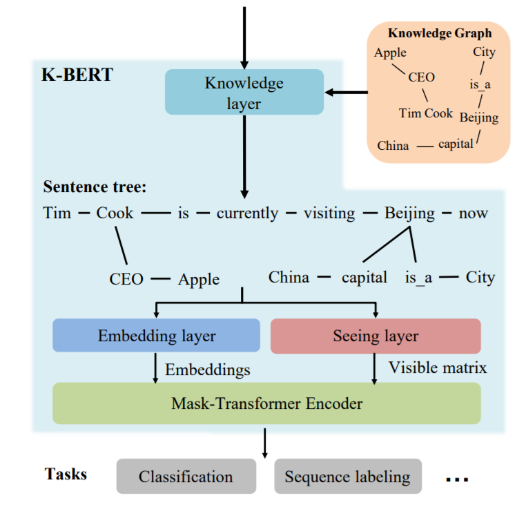
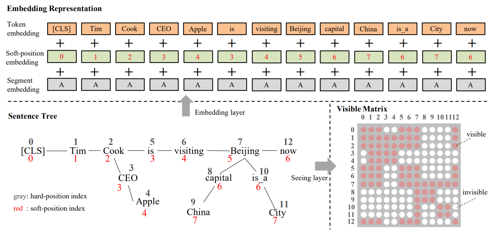
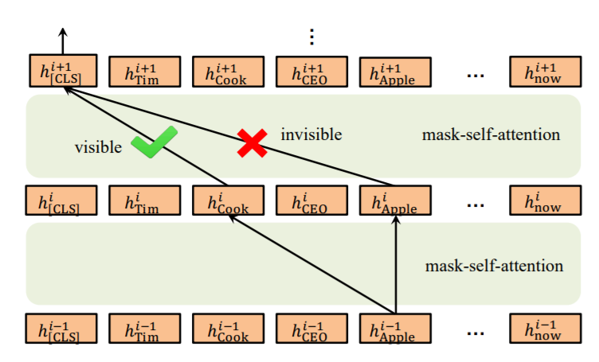

AAAI 2020, 介绍K-BERT模型。

<!--more-->

## 概述

- arxiv：<https://arxiv.org/abs/1909.07606v1>
- code：<https://github.com/autoliuweijie/K-BERT>

## 细节

模型结构如下图，输入的文本经过知识层后，变成树状结构后和可见矩阵一起送入模型训练。

具体来说，算法分为以下几步。

- 预先准备KG，建立查找表（关键词表）。
- 对于给定的输入文本，利用工具分词（pkuseg）。
- 将分词得到的结果去表中查询，得到对应的实体。
- 计算实体位置，得到位置编码，也即论文中的soft-position index。
- 计算可见矩阵，控制每个词受哪些词影响（如Cook不会被Beijing关联的China影响）。

K-BERT并不算预训练模型，嵌入层依旧是使用的BERT模型，应该算基于BERT的fine-tuning网络，可以用于分类和序列标注。同时，K-BERT也可以加载其他BERT类模型，如ERNIE、RoBERTa等。

创新点在于使用可见矩阵控制了Self-Attention的计算（如下图）。

## 不足

- 模型的鲁棒性受限于知识图谱的质量，取自于开放领域图谱中的信息，其实BERT通过大语料学习也能获得，可以考虑特定领域的知识。
- 关联的三元组没有筛选，一词多义会引入错误的实体关联。
- 对于非知识驱动的任务，引入知识反而会效果下降。