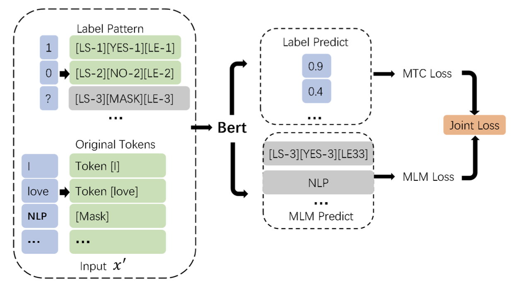
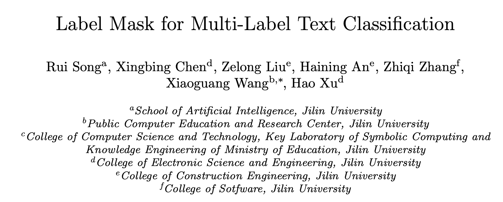
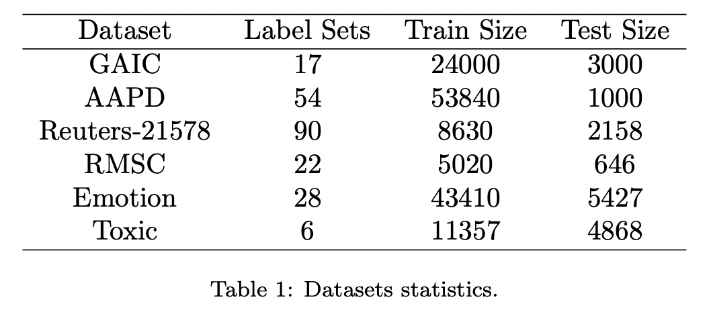
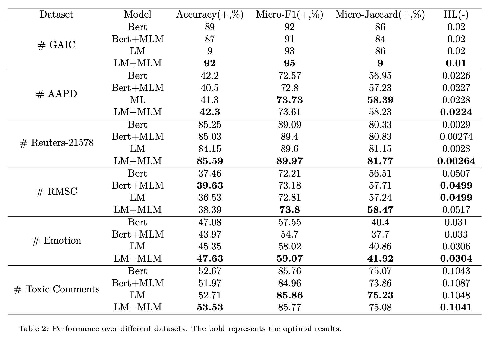
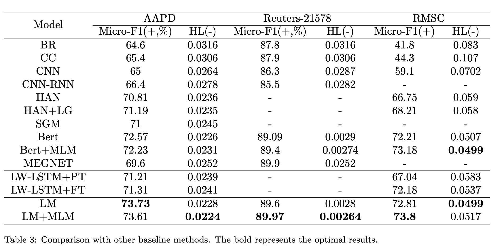
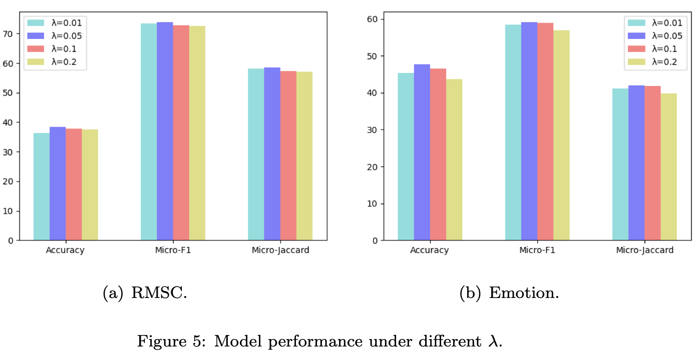
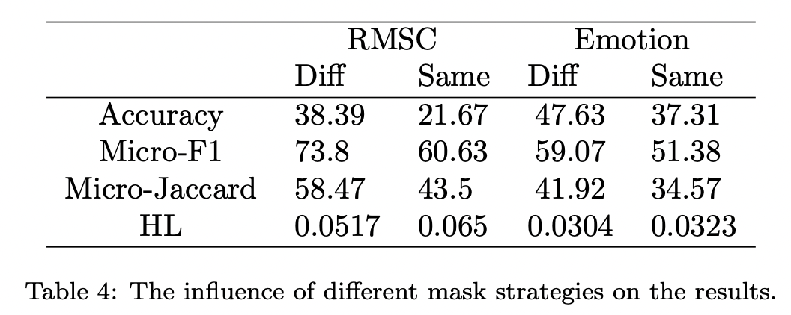

采用Prompt方法做多标签分类，使用MLM提升模型的泛化性。

<!--more-->

## Overview

- paper: <https://arxiv.org/pdf/2106.10076.pdf>
- code: <https://github.com/DunZhang/LM-MLC>

## Background

受完形填空的启发，本文提出了标签掩码多标签文本分类模型（Label Mask Multi-label Text Classification, LM-MTC），以捕获标签间的相关性。

作者将不同的标签映射为不同的token，并构建了前缀模版的集合。训练时将这些模版与语句拼接送入BERT，预测时就掩码所有的标签token。

## Method

对于多标签分类任务，为每个标签都构建模版不现实，因此本文为整个标签空间构建了一个模版系统。每个位置的标签有三种状态：0、1或mask，其对应的模版如下：
$$
[LS-1][YES-1][LE-1] \\
[LS-2][No-2][LE-2] \\
[LS-3][MASK-3][LE-3]
$$
其中$LS$代表标签开始，$LE$代表标签结束。若$N$表示标签数，那么最终的输入序列长度为$3N+L$，。

模型训练主要有两个目标：

1. 预测多标签的分布概率
2. 使用MLM预测掩码

最终的损失函数是交叉熵与MLM的加权和
$$
\mathcal{L} = \mathcal{L}_{mtc} + \lambda\mathcal{L}_{mlm}
$$

## Experiment

选用六个数据集进行实验，所选的数据集标签数都不多，可能这也是Prompt方法目前的不足之处。

采用四个评价指标，其中Micro-Jaccard表示$\frac{\lvert A\cap B\rvert}{\lvert A\cup B\rvert}$，Hamming Loss表示误分类标签的比例。

实验设置学习率5e-5，batch_size为16，训练epoch为40，MLM的比例为0.15。

调参结果

模型对于模版还是比较敏感的，采用不用的掩码可以更好地提升模型效果

## Conclusion

文章采用Prompt方法尝试多标签分类，算是一个比较新的方向。但引入模版增大了输入文本的长度，且模版的选取很重要，模型对此很敏感。

Prompt方法应该在小样本场景下表现更好，期待有这方面的具体实验。
