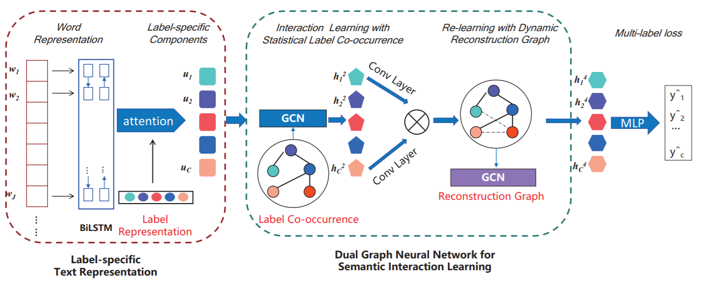
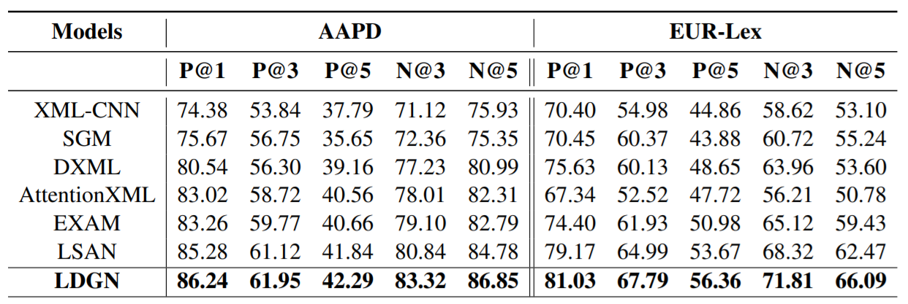
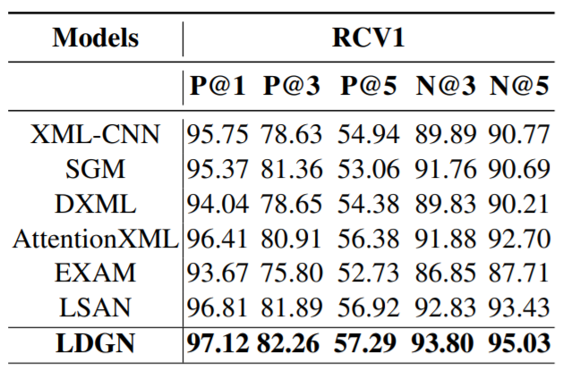

ACL2021，来自中国科学院大学。提出LDGN，融入类别信息，基于label occurrence和dynamic reconstruction使用GCN建模。

<!--more-->

## Overview

- pdf: https://aclanthology.org/2021.acl-long.298.pdf

多标签文本分类（MLTC）有许多应用，如情感分析、网页标注等，但如何处理标签之间的复杂关系是一个困难的问题。

现有方法主要关注建模增强的文本表示和标签依赖关系，这些模型考虑了标签的结构和语义信息，但不能很好地处理相似标签。作者提出他们忽略了标签和文本的关联，使得从不同标签学得的文本表示是相同的。

最近有一些工作使用attention机制探索标签的语义联系，学习label-specific文本表示。在此基础上，可以进一步探索label-specific components之间的语义交互，这可以利用一些统计信息，比如使用类别间的统计互信息建立标签共现图，但统计信息也有不足之处。

- 训练数据中的共现特征是不完整并且带有噪声的
- 对于少样本的标签可能会有bias
- 形成长尾分布，导致过拟合

## Model

模型可以分为两部分：label-specific文本表示和用于语义交互学习的dual graph neural network。

### Label-specific Document Representation

文章使用BiLSTM作为编码器，得到文本表示，采用随机初始化的label表示计算attention score。
$$
\begin{align}
\alpha_{i,j} &= \frac{\exp(\mathbf{h_jc_i^T})}{\sum_{j}\exp(\mathbf{h_jc_i^T})} \\
\mathbf{u_i} &= \sum_j{\alpha_{i, j}\mathbf{h_j}}
\end{align}
$$

### Dual Graph Neural Network

基于label co-occurrence的先验，建立label graph，随后采用一个两层的GCN进行学习。

具体而言，对训练集中的所有标签对计算概率，得到转移矩阵$\mathbf{A}^s\in R^{|C|\times|C|}$，其中$\mathbf{A}^s_{ij}$表示样本属于第j类时，属于第i类的概率。

GCN以$\mathbf{U}\in R^{|C|\times D}$作为输入，输出$\mathbf{H}^2\in R^{|C|\times D'}$。

label graph基于训练集建立，可能带有噪声并形成长尾分布，本文采用了re-learning的方法处理这个问题。

采用1×1卷积和点积，得到动态重建之后的图。
$$
\mathbf{A}^D=f((\mathbf{W}_a*\mathbf{H}^2)^{\mathbf{T}}(\mathbf{W}_b*\mathbf{H}^2))
$$
其中激活函数采用sigmoid，随后归一化得到最终的邻接矩阵$\hat{\mathbf{A}}^D$，再用一个两层的GCN学习，得到$\mathbf{H}^4\in R^{|C|\times D'}$。

### Multi-label Text Classification

将两次GCN学习的节点表示拼接，作为最终的节点表示，送入全连接层中分类，采用BCE Loss。
$$
\mathbf{H^O = [H^2,H^4]} \\
\hat{y} = \sigma(\mathbf{W_1H^O})
$$

## Experiment

刷新SOTA。

