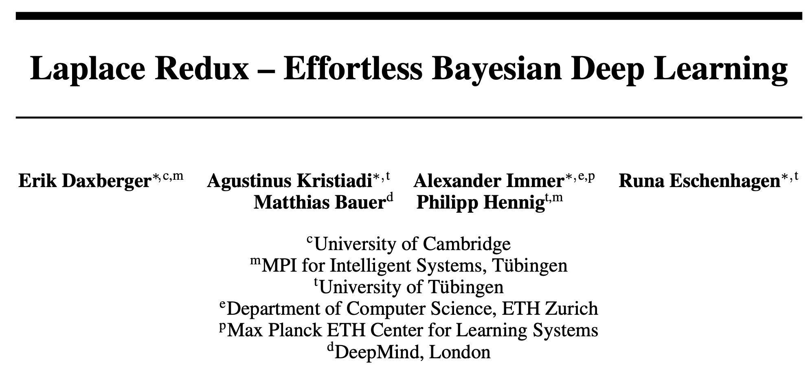
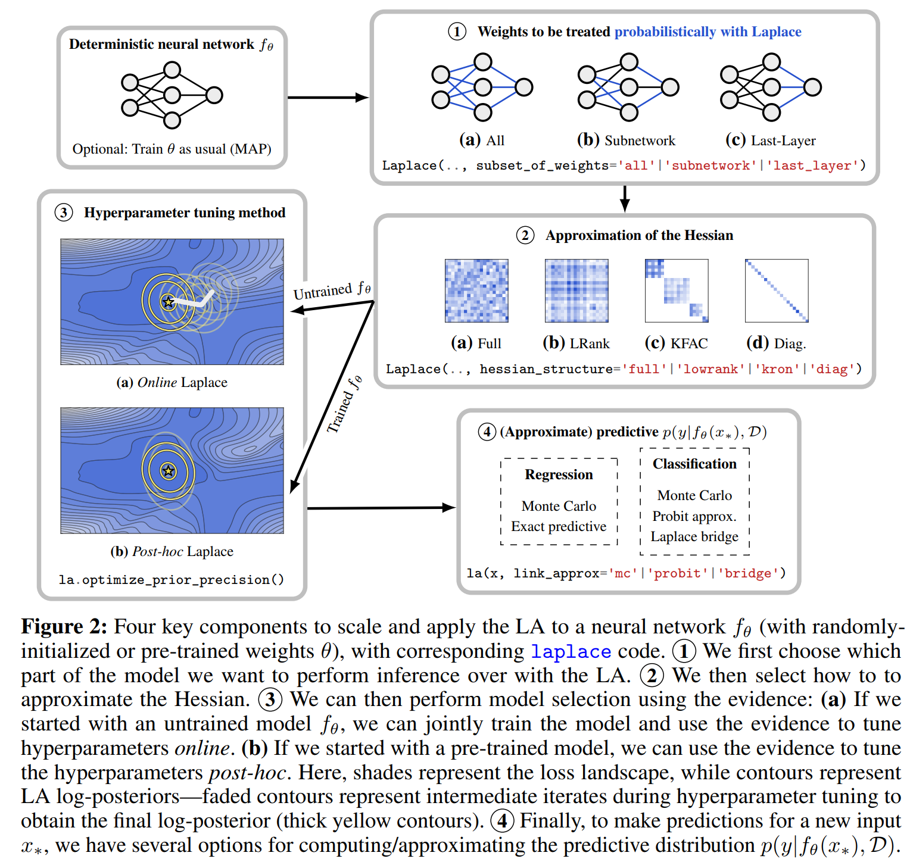
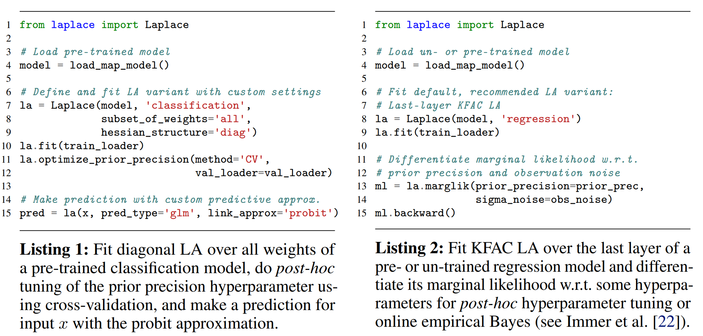
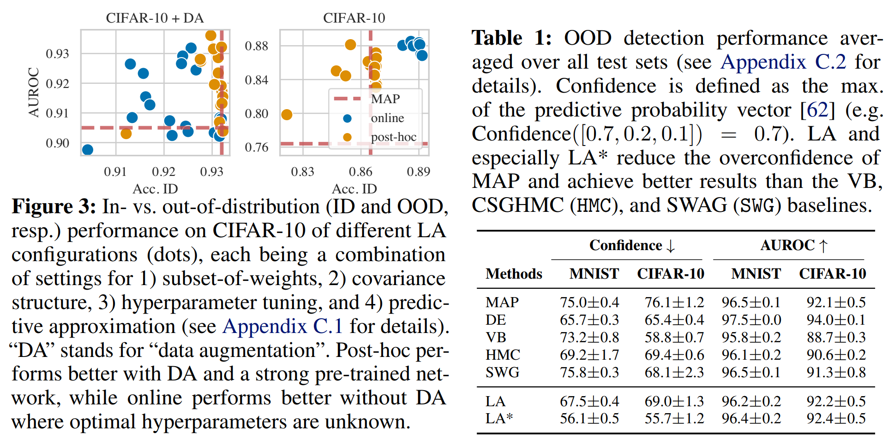

NIPS 2021，拉普拉斯近似（Laplacian Approximation）。

<!--more-->

## Overview

- paper: <https://proceedings.neurips.cc//paper/2021/file/a7c9585703d275249f30a088cebba0ad-Paper.pdf>
- library: <https://github.com/AlexImmer/Laplace>
- experiment: <https://github.com/runame/laplace-redux>

## Background

现代神经网络有几个缺点

- 校准能力差，过度自信（overconfidence）。
- 持续训练时对先前任务的灾难性遗忘（catastrophic forgetting）。
- 选择合适的网络架构和超参数很困难。

贝叶斯模型为解决这些问题，采取了如下措施：

- 给模型配备鲁棒的不确定估计。
- 捕获过去的信息，使得模型能够持续学习。
- 通过在数据拟合和模型复杂度间寻找最优的trade-off，实现自动的模型选择。

> 贝叶斯神经网络介绍：<https://zhuanlan.zhihu.com/p/81170602>

但是贝叶斯神经网络并没有投入实施，主要是因为其难以实现和调参，训练代价大，很难scale到现代的模型和数据集。

本文认为，拉普拉斯近似（Laplace Approximation，LA）是贝叶斯深度学习中一种简单高效，同时有竞争力的近似方法。

- 本文率先调研了深度学习中LA的发展，并展现了可扩展且实用的LA的关键要素。
- 提供了基于Pytorch的LA库laplace，实现了大量LA变种。
- 使用laplace库进行了大量实验，展现了LA的竞争力。

## Method

### Laplace Approximation in Deep Learning

深度学习中，LA有两种方式使用：

1. 采用LA近似模型的后验分布，使得模型能够概率预测。
2. 使用LA近似model evidence，从而可以模型选择（调超参数）。

给定数据集$\mathcal{D} := \{ (x_n \in \mathbb{R}^M, y_n \in \mathbb{R}^C)\}$，参数为$\theta\in\mathbb{R}^D$，$L$层的神经网络$f_\theta:\mathbb{R}^M\rightarrow \mathbb{R}^C$旨在最小化经验风险，通常可以分解为经验损失项$\ell(x_n,y_n;\theta)$和正则项$r(\theta)$的和。
$$
\theta_{MAP} = \arg\min_{\theta\in\mathbb{R}^D}\mathcal{L}(D;\theta)
= \arg\min_{\theta\in\mathbb{R}^D}\left(r(\theta) + \sum_{n=1}^N\ell(x_n,y_n;\theta)\right)
$$
从贝叶斯的角度来看，这些项可以看作独立同分布的对数似然（log-likelihood）和对数先验（log-prior），此时$\theta_{MAP}$事实上就是最大后验估计（Maximum A Posteriori, MAP）。
$$
\ell(x_n,y_n;\theta) = -\log p(y_n|f_\theta(x_n))\qquad \text{and} 
\qquad r(\theta) = -\log p(\theta)
$$
广泛使用的正则方法$r(\theta)= \frac{1}{2} \gamma^{-2}\|\theta\|^2$（也被称为权重衰减），对应一个中心的高斯先验$p(\theta)=\mathcal{N}(\theta;0,\gamma^2 I)$。训练损失取负后的指数$\exp(-\mathcal{L}(\mathcal{D};\theta))$就相当于未归一化的后验，归一化后可得
$$
\begin{equation}
p(\theta \mid \mathcal{D}) = \tfrac{1}{Z} \,p(\mathcal{D} \mid \theta) \, p(\theta) = \tfrac{1}{Z}\exp(-\mathcal{L}(\mathcal{D};\theta)), \qquad Z:= \textstyle\int p(\mathcal{D} \mid \theta) \, p(\theta) \,d\theta
\end{equation}
$$
拉普拉斯近似用一个$\mathcal{L}$的二阶展开去构造对$p(\theta|\mathcal{D})$的高斯近似，因此考虑
$$
\begin{equation}
    \mathcal{L}(\mathcal{D}; \theta) \approx \mathcal{L}(\mathcal{D}; \theta_\text{MAP}) + \tfrac{1}{2} (\theta - \theta_\text{MAP})^\intercal \left( \nabla^2 _\theta \mathcal{L}(\mathcal{D}; \theta) \vert_{\theta_\text{MAP}} \right)(\theta - \theta_\text{MAP}) ,
\end{equation}
$$
其中一阶项在$\theta_{\text{MAP}}$处消失，从而可以将其看作**高斯分布**，即拉普拉斯后验近似：
$$
\begin{equation}
	p(\theta \mid \mathcal{D}) \approx \mathcal{N}(\theta; \theta_\text{MAP}, \varSigma) \qquad\text{with}\qquad \varSigma := -\left( \nabla^2_\theta \mathcal{L}(\mathcal{D};\theta) \vert_{\theta_\text{MAP}} \right)^{-1}.
\end{equation}
$$
归一化常数$Z$（通常被称为marginal likelihood或evidence）可用于模型选择，可以通过下式近似：
$$
Z \approx \exp(-\mathcal{L}(\mathcal{D};\theta_\text{MAP})) \, (2\pi)^{D/2} \, (\det \varSigma)^{1/2}
$$
$\theta_{\text{MAP}}$可以通过标准的深度学习得到，唯一的额外步骤就是计算Hessian矩阵在$\theta_{\text{MAP}}$处的逆。因此在得到预训练模型后，可以离线计算LA。

一般来说，具有两次微分后对数密度的先验都可以使用。由于权重衰减的广泛使用，本文假设先验是零均值的高斯分布$p(\theta)=\mathcal{N}(\theta;0,\gamma^2 I)$。从而Hessian矩阵取决于对数先验的正则器，以及复杂的对数似然。
$$
\begin{equation}
    \nabla^2_\theta \mathcal{L}(\mathcal{D};\theta) \vert_{\theta_\text{MAP}} = -\gamma^{-2} I - \textstyle\sum_{n=1}^N \nabla^2_\theta \log p(y_n \mid f_\theta(x_n)) \vert_{\theta_\text{MAP}}.
\end{equation}
$$
Hessian矩阵之所以没有简单实现，就是因为式中第二项随着网络参数的规模平方增长。

### Four Components of Scalable Laplace Approximation

### laplace: A Toolkit for Deep Laplace Approximation

## Experiments

本文的实验分为四个部分

1. 寻找LA的最佳设计选择。
2. 在in-distribution、dataset-shift和out-of-distribution三种设置下，验证LA相比于贝叶斯baseline的竞争力。
3. 展现LA适用于各种数据模态和网络架构（包括transformer），这种情况下贝叶斯方法难以使用。
4. 展示LA可以作为持续学习的一个易用baseline。

实验结果表明，在CIFAR-10有数据增强的情况下，后处理的LA表现更好。

laplace中默认设置是一个后处理KFAC最后一层的LA，采用GGN近似Hessian矩阵。这适用于所有最后一层为全连接层的网络架构，因此适用于预训练网络。对于需要自己训练的模型，采用GGN或经验Fisher的在线KFAC LA是一个不错的baseline。

