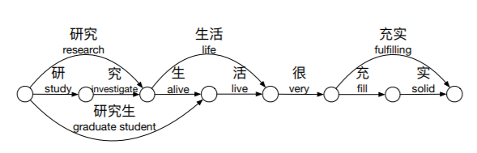
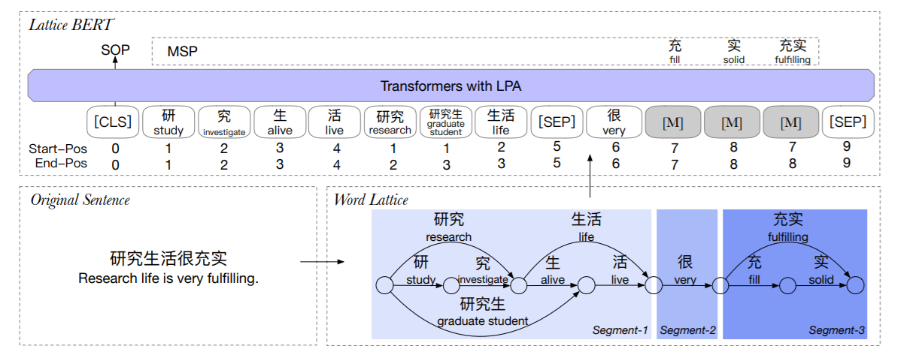
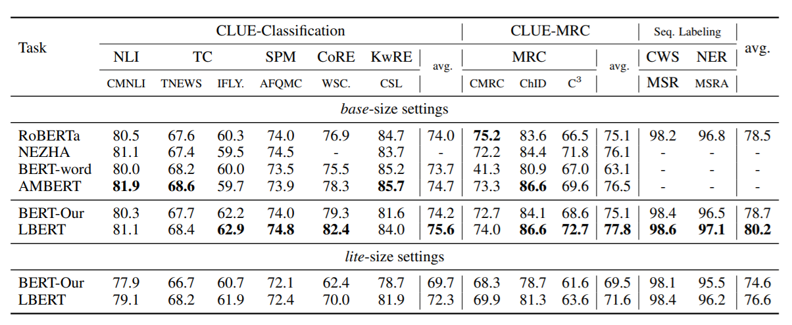

将词汇信息融入BERT（NAACL 2021）

<!--more-->

## Overview

- arxiv: https://arxiv.org/pdf/2104.07204v1.pdf
- code: 暂无

## Background

中文预训练模型将文本作为字符序列处理，忽略了粗粒度的语义特征。对于中文来说，词义并不完全是字义的组合，如”老板“并不等于“老的板”。将词级别的特征加入模型，可以有效补充字级别的不足。

本文设计了word lattice的结构来利用多粒度的输入，让预训练模型在下游任务中学会利用这些特征。

让Bert学会单词主要有两个难点：

- Bert原本的输入是字符序列，加入lattice后怎样描述位置信息。
- 对于Masked Languaged Model，怎样针对lattice结构设计mask任务。

本文设计了lattice position attention（LPA），以帮助transformer利用lattice中文本单元的位置和距离信息。此外，还提出了masked segment prediction（MSP）任务。
$$
\rm{Lattice-BERT} = \rm{BERT} + \rm{word\ lattice} + LPA + MSP
$$

## Methodology

### Word Lattice

Lattice就是一个有向无环图，和Lattice-LSTM的思想类似。难点在于如何在编码层保持lattice的结构，以及如何避免冗余信息带来的潜在影响。

### Lattice Position Attention

在BERT的attention基础上，加了三个位置相关项。
$$
\tilde{\alpha}_{ij} = \alpha_{ij} + \rm{att}_{ij} + b_{ij} + r_{ij}
$$

其中，$\alpha_{ij}$表示原来的attention，$\rm{att}_{ij}$计算了绝对位置的attention权重，$b_{ij}$则是对相对距离的计算，$r_{ij}$是对相对位置的缩放项。

$$
\rm{att}_{ij} = \frac {1} {\sqrt{2d_k}}([P_{s_i}^S;P_{e_i}^E]W^q)([P_{s_i}^S;P_{e_i}^E]W^k)^T
$$

$$
b_{ij} = b_{s_j-s_i}^{ss} + b_{s_j-e_i}^{se} + b_{e_j-s_i}^{es} + b_{e_j-e_i}^{ee}
$$

> 感觉和FLAT类似，也是计算四个距离。

### Masked Segment Prediction

BERT对单字掩码，Lattice-BERT则是对Segment掩码。

Segment定义为：lattice的一个连通子图，且Segment之间彼此token不重叠，如下图。具体来说，为了句子分段，需要逐字遍历，判断当前的字是否是之前所有单词的结尾（真拗口）。

## Experiment

本文在11个中文NLU任务上进行实验，包括文本分类、阅读理解、序列标注等，在MSRA-NER和CLUE数据集上进行了实验，并与RoBERTa等预训练模型进行了比较。

