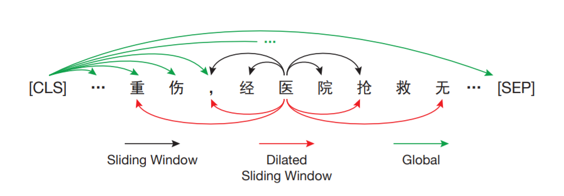
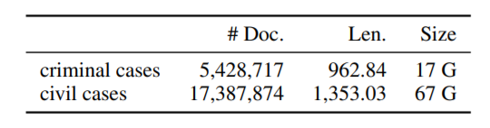

来自清华刘知远老师组，release了针对法律长文件的预训练语言模型。

<!--more-->

## Overview

- code: https://github.com/thunlp/LegalPLMs
- arxiv: https://arxiv.org/pdf/2105.03887v1.pdf

## Background

法律领域有许多长文件，刑事案件的平均长度为1260.2，远远超过了主流预训练模型的最大长度（BERT、RoBerta等）。如果对于这样长的序列采用注意力机制，会带来很大的计算复杂度，也很容易爆显存。

本文提出了Lawformer模型，在大规模的中文法律长文本上预训练得到。Lawformer基于Longformer，可以处理上千个token。并且Lawformer并没有采用标准的self-attention，而是结合局部滑窗和全局attention机制来捕获长程依赖。

### Contribution

- 发布了第一个中文法律预训练模型Lawformer，可以处理上千个字符的法律长文本。
- 在典型的LegalAI任务上评估了Lawformer，并为刑事和民事案件提出了一个新的法律诉讼判决数据集。
- 大量实验结果表明，Lawformer在长文本任务上能取得很好的表现。对于短文本，在法律领域也可以媲美RoBerta。

## Approach

采用Longformer作为编码器，其结合了三种注意力机制来编码长序列：

- Sliding Window attention
  - 每个token只计算周围w/2的的attention，随着层数增加，全局信息也可以被整合进隐层表示。
- Dilated Sliding Window Attention
  - 类似于dilated CNN，窗口增大但之间有间隔。在多头注意力中，间隔可以不同，可以促进模型性能。
- Global Attention
  - 对于选定的token，关注整个序列产生隐层表示。

### Data Processing

从中国裁判文书网上搜集了千万份的法律文书，只保留了刑事和民事案件。将每份文书分为四个部分：当事人信息、事实描述、法院意见和判决结果，只保留了事实描述长于50的文书。

### Pre-training Details

基于RoBERTa-wwm-ext的checkpoint训练，以MLM为任务。学习率为5e-5，序列长度4096，batch_size为32。为充分利用长序列，将一些短文书拼接。优化器为Adam，模型采用8块32G V100训练。

## Experiment

选了BERT、RoBERTa和Legal-RoBERTa作为基线，在多个法律任务上进行比较，包括判决预测、案例检索、阅读理解和问答。
