本文提出了一种新的基于注意力的分类头ML-Decoder，使用query预测类别标签的存在。ML-Decoder是计算高效的，并且是多功能的，在query的加持下可以泛化到unseen类别。

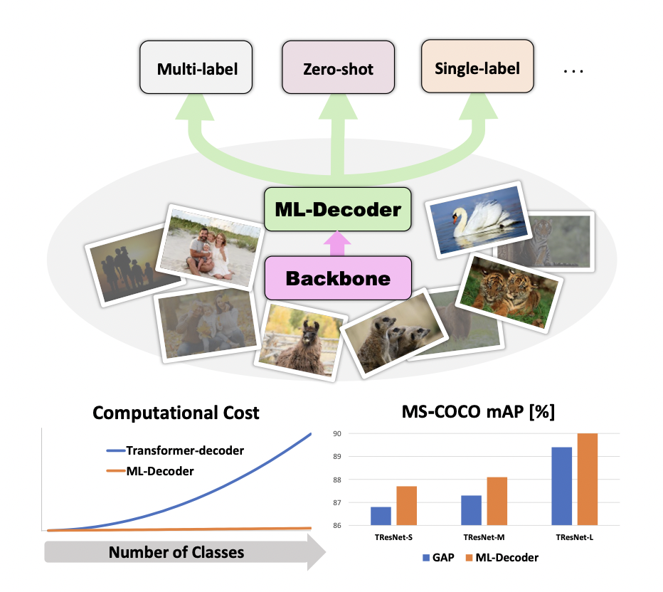

<!--more-->

## Overview

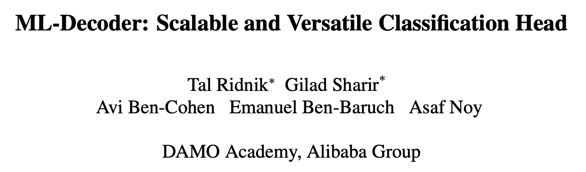

- paper: <https://arxiv.org/pdf/2111.12933v1.pdf>
- code: <https://github.com/alibaba-miil/ml_decoder>

## Background

对于单标签分类，通常使用GAP（Global Average Pooling）后接全连接层，这也可以扩展到多标签分类。

基于GAP的方法简单高效，但性能往往不是最佳的，且不能直接应用于零样本学习。基于注意力的方法往往性能更好，但是计算代价大，对于超大规模分类的场景不适用。

本文提出了ML-Decoder，统一了单标签、多标签和零样本的分类，并取得了SOTA的结果。其基于原生的Transformer Decoder，主要做了两点修改。

- 去除了冗余的自注意力块，将复杂度由平方降低为线性。
- 使用了一种新颖的group-decoding机制，使用固定数目的query而非给每个类指派一个query，之后使用group全连接池化层插值到最终的类别数。

## Method

### Baseline

经典的分类网络由backbone和分类头两部分组成。backbone输出空间特征$E\in\mathbb{R}^{H\times W\times D}$，分类头将其转化为N个logit$\{l_n\}_{n=1}^N$，$N$表示类别数。

处理空间特征的baseline主要由GAP和注意力两种。

基于GAP的方法，首先在样本空间维度上做全局平均得到$z\in\mathbb{R}^{D\times1}$，随后接一个全连接层$W\in\mathbb{R}^{N\times D}$得到分类结果。

基于注意力的方法，较为典型的就是类似于DETR提出的Transformer Decoder，已经在多标签分类上取得了顶尖的结果（这里引用的就是Query2Label）。这种方法在类别数较少的数据集上表现很好，比如MS-COCO和Pascal-VOC，但计算代价与类别数的平方相关，对于Open Images（9600个类别）这种大规模数据集难以适用。

### Recap

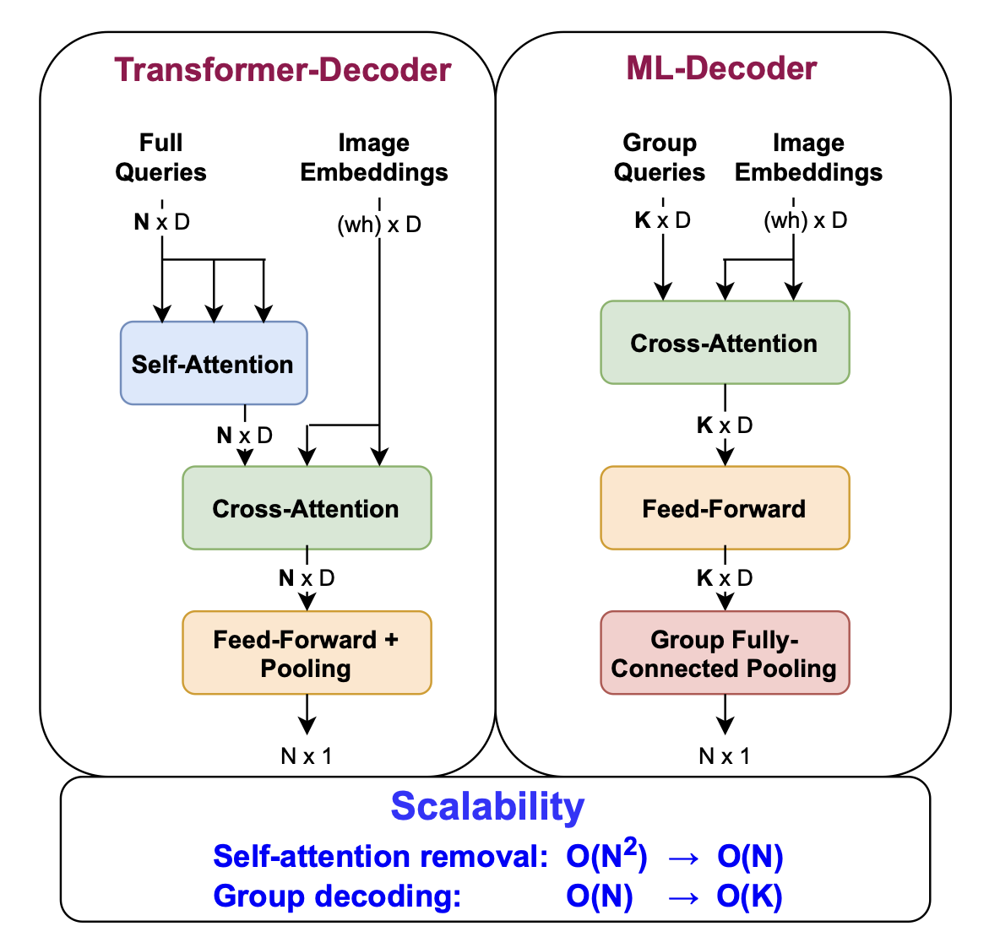

<center>ML-Decoder与原生的区别</center>

ML-Decoder主要做了以下两个修改

- **去除自注意力**：Transformer Decoder对query会计算self-attention，在推理阶段实际上这实际上是一个固定的变换，但之后进入cross-attention也会经过全连接层，意味着这个self-attention实际上是冗余的。

- **Group-decoding**：对于超大规模分类，即使是线性复杂度代价也很高，作者希望cross-attention和feed-forward层与类别数无关，因此将输入的query数目固定为$K$。

在feed-forward后，query送入Group全连接池化层，这一层主要做两件事。

- 将每个query扩展到$\frac NK$个输出。
- 对embedding的维度做池化。

$$
\begin{gather*}
L_i = (W_k·Q_k)_j \\
\text{where: }k=i\ \textbf{div}\ g,\ j=i\ \textbf{mod}\
g
\end{gather*}
$$

其中$g=\frac NK$，$Q_k\in\mathbb{R}^{D}$表示第$k$个query，$W_k\in\mathbb{R}^{g\times D}$表示第$k$个可学习的变换矩阵。计算过程示意如下图所示（$g=4$）。

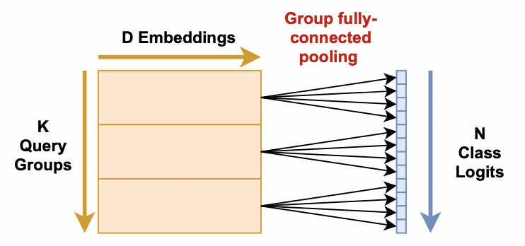

```python
@torch.jit.script
class GroupFC(object):
    def __init__(self, embed_len_decoder: int):
        self.embed_len_decoder = embed_len_decoder

    def __call__(self, h: torch.Tensor, duplicate_pooling: torch.Tensor, out_extrap: torch.Tensor):
        for i in range(h.shape[1]):
            h_i = h[:, i, :]
            if len(duplicate_pooling.shape)==3:
                w_i = duplicate_pooling[i, :, :]
            else:
                w_i = duplicate_pooling
            out_extrap[:, i, :] = torch.matmul(h_i, w_i)
```

此外，Query2Label中使用了可学习的query，本文认为全连接层可以变换到任意值，所以使用固定query也是可以的，这也使得ML-Decoder能做零样本学习。

### ML-Decoder for ZSL

对于零样本学习，ML-Decoder使用固定query。采用语言模型提取标签语义，得到embedding向量作为输入的query，共享其他参数。作者针对零样本修改了Group-decoding，细节在此就不赘述了。

作者认为这种query的设计方案，可以结合数据增强，比如random-query或者query-noise等，思路还是挺巧妙的。

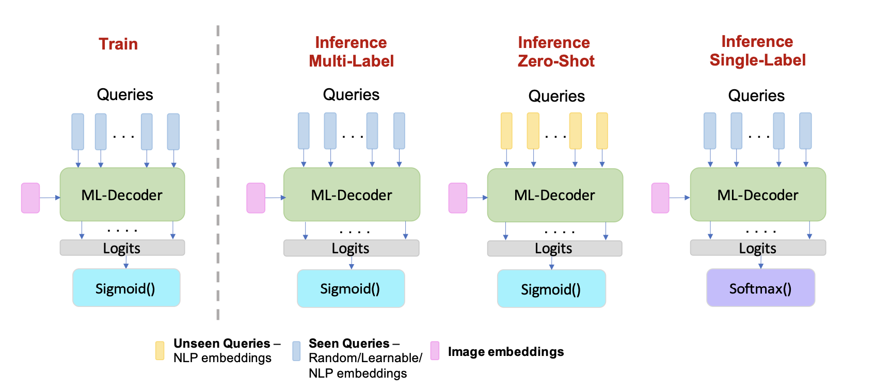

## Experiment

选取了MS-COCO、Pascal-VOC和Open Images，在NUS-WIDE上测试了零样本性能，并在ImageNet上测试了单标签分类性能。

### Ablation

Transformer Decoder的使用可以显著提高性能，在query数目相同的情况下性能相同，说明自注意力确实是冗余的。

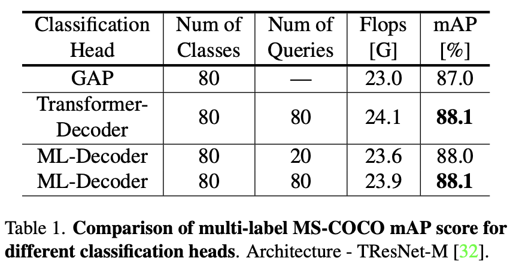

在Open Image上的实验表明，相比原生Decoder，ML-Decoder大幅降低了计算复杂度，在计算量提高10%-20%的情况下比GAP取得了更好的结果。同时增加query的数目边际效益递减。

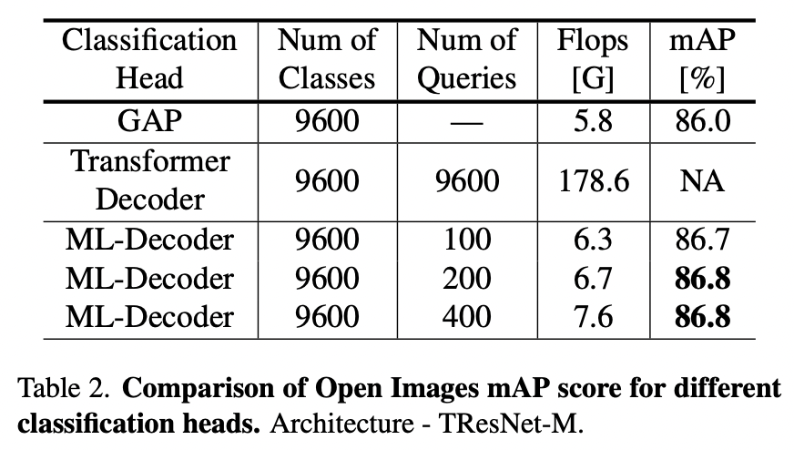

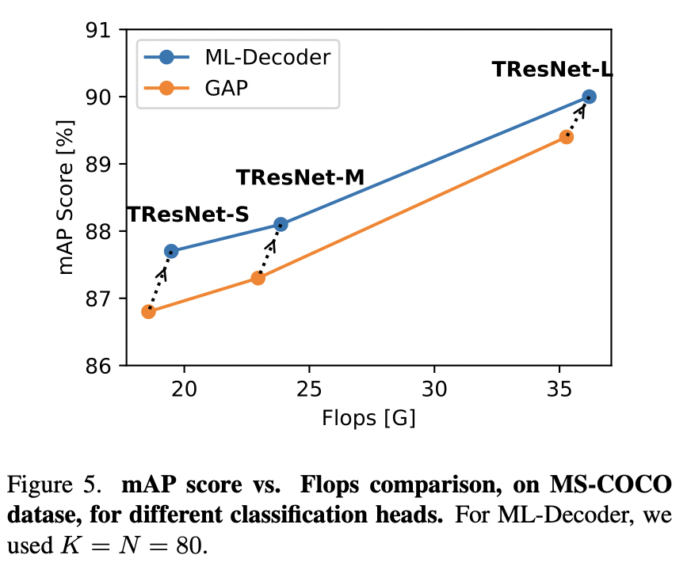

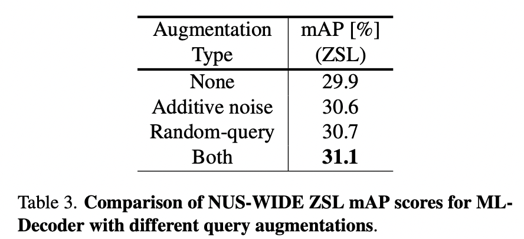

### Results

刷新SOTA。

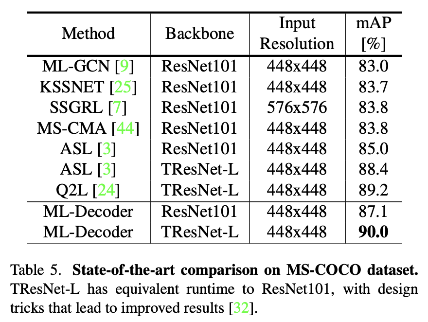

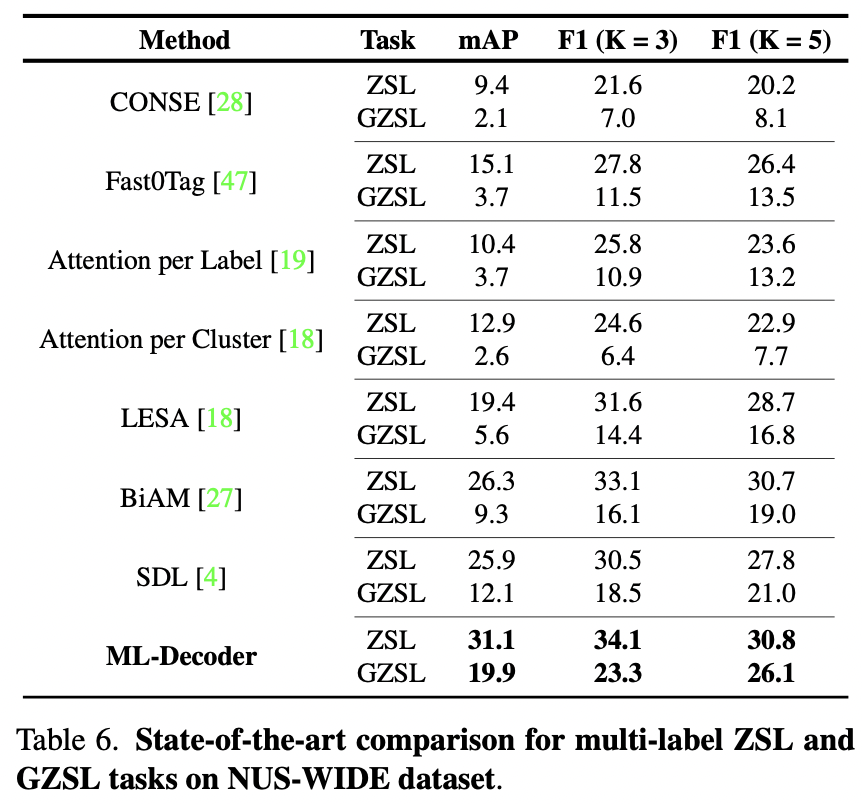

在ImageNet上，使用ResNet50达到80.7%。

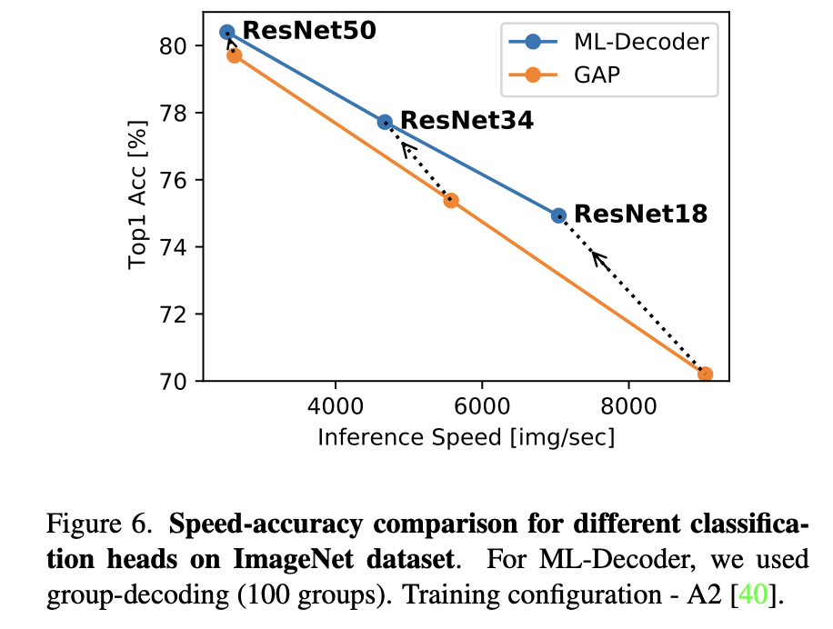
