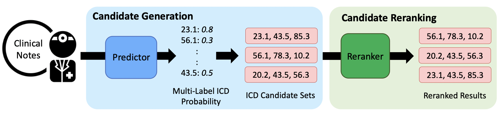
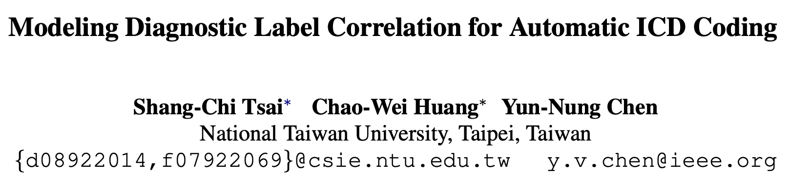
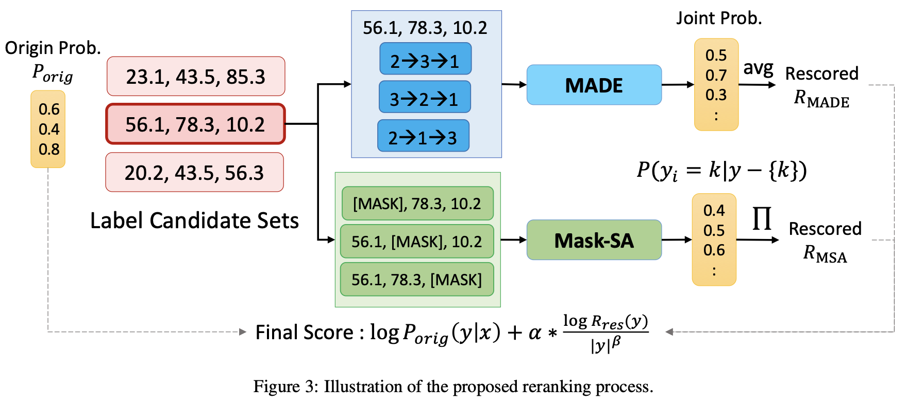
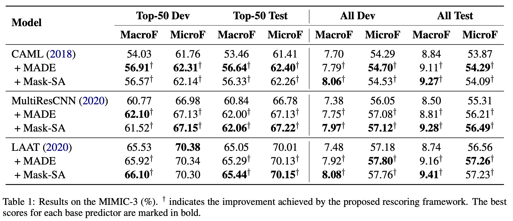
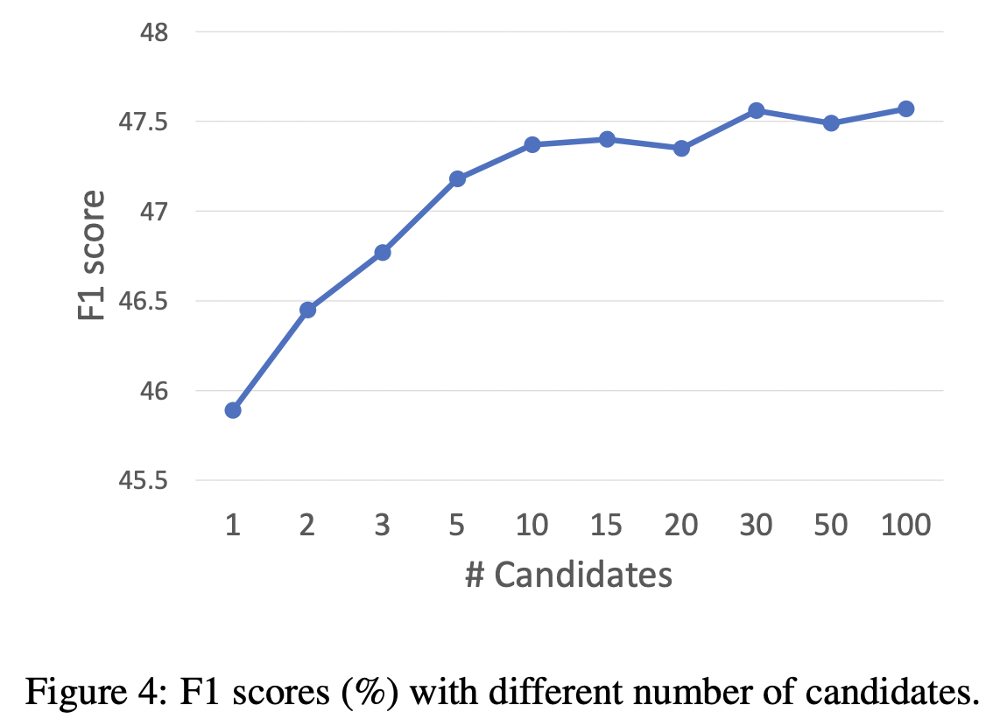

NAACL 2021，提出了一个two-stage框架以捕获标签相关性，提升自动ICD编码的性能。



<!--more-->

## Overview



- paper: <https://aclanthology.org/2021.naacl-main.318.pdf>
- code: <https://github.com/MiuLab/ICD-Correlation>

## Background

国际疾病分类（International Classification of Disease, ICD），是根据疾病的某些特征，采用编码方法来表示的系统。自动ICD编码近年来是一个热点任务，一般将其当作多标签分类问题处理。ICD编码呈现层次结构，因此考虑标签相关性很重要。

本文受自动语音识别和依存分析中reranking技术的启发，本文为ICD编码提出了一个two-stage的reranking框架，不需要任何专家知识也可以捕获标签相关性。

## Method

本文提出的框架分为两个阶段：

1. 标签候选集生成，采用基本的分类器得到标签概率。
2. 标签候选集重排，利用标签相关性重排候选标签。

### Candidate Generation

此阶段产生top-k的标签集合，给定标签概率$P_{base}(y_i=1|\mathbf{x}, \theta_{base}),\ i=1,2,\cdots,|\mathcal{Y}|$，标签集合的概率为各标签的概率乘积：
$$
P_{base}(\hat{\mathbf{y}}|\mathbf{x}, \theta_{base}) = \prod_{i=1}^{|\mathcal{Y}|}P_{base}(y_i=\hat{\mathbf{y}_i}|\mathbf{x}, \theta_{base})
$$

虽然标签组合共有$2^{|\mathcal{Y}|}$个子集，但可以采用动态规划的方式高效生成。

> [ICML 2016] Conditional bernoulli mixtures for multi-label classification [[paper]](http://proceedings.mlr.press/v48/lij16.pdf)

```python
def get_n_best(probs, n=10):
    flip_idx = np.argsort(np.abs(probs-0.5))[:n]
    labels = np.zeros(len(probs))
    cum_prob = 0.0
    for i, prob in enumerate(probs):
        if i in flip_idx:
            continue
        if prob >= 0.5:
            labels[i] = 1
            cum_prob += np.log(prob)
        else:
            labels[i] = 0
            cum_prob += np.log(1-prob)

    last_queue = PriorityQueue()
    last_queue.put((cum_prob, labels))
    for i, prob in enumerate(probs):
        if i not in flip_idx:
            continue
        queue = PriorityQueue()
        for cum_prob, labels in last_queue.queue:
            labels2 = np.copy(labels)
            labels[i] = 1
            queue.put((cum_prob + np.log(prob+1e-6), labels))
            labels2[i] = 0
            queue.put((cum_prob + np.log(1-prob+1e-6), labels2))

        while len(queue.queue) > n:
            _ = queue.get()

        last_queue = queue

    n_best = []
    while not queue.empty():
        n_best.append(queue.get())
    n_best = n_best[::-1]
    return n_best
```

### Candidate Reranking

基本分类器假设标签是独立的，为此本文引入了标签集合的重排器（reranker），以捕获标签的共享性与共现性。

给定候选集$\hat{\mathbf{y}}$，重排器计算得分$R(\hat{\mathbf{y}})$，根据得分的加权和重排。
$$
\log P_{base}(\hat{\mathbf{y}}|\mathbf{x},\theta_{base})+\alpha\cdot R(\hat{\mathbf{y}})
$$
其中$\alpha$为超参数。本文设计了两个reranker用于重排，分别是MADE和Mask-SA，如下图所示。



MADE采用了一个掩码自编码器估计密度，通过自回归的方式估计联合概率$P(\hat{\mathrm{y}})$。
$$
P_{MADE}(\hat{\mathrm{y}})=\prod_{i=1}^{|\mathcal{Y}|}P_{MADE}(y_i=\hat{\mathrm{y}}_i|\hat{\mathrm{y}}_{o<i},\theta_{MADE})
$$
其中$o$表示$\{1,2,\cdots,|\mathcal{Y}|\}$中的随机排列，$o(i)$表示新的排序，$\hat{\mathrm{y}}_{o<i} = \{\hat{\mathrm{y}}_j|o(j)<o(i)\}$表示新的排序中先于$\hat{\mathrm{y}}_i$的所有元素集合。

给定候选集$\hat{\mathrm{y}}$，MADE得分定义为
$$
R_{MADE}(\hat{\mathrm{y}}) = \frac{\log P_{MADE}(\hat{\mathrm{y}})}{|\hat{\mathrm{y}}|^{\beta}}
$$
其中$|\hat{\mathrm{y}}|$表示子集的大小，作为一个长度惩罚项，作者发现不加这一项的话模型容易偏向更小的集合。

此外，受BERT的MLM启发，作者还提出了一个掩码自注意力重排器Mask-SA。将对角线的标签掩码，输入到BERT中做MLM。

```python
input_ids, attention_mask = build_masked_input(
    token_ids, tokenizer, mask_positions=[i]
)
all_input_ids.append(input_ids)
all_attention_mask.append(attention_mask)

all_input_ids = torch.tensor(all_input_ids).cuda()
all_attention_mask = torch.tensor(all_attention_mask).cuda()
with torch.no_grad():
    output = model(all_input_ids, all_attention_mask)
prediction_scores = output[0]
log_prob = 0.0
for i, token_id in enumerate(token_ids):
    log_prob += prediction_scores[i, i].detach().log_softmax(dim=-1)[token_id].cpu().item()
nbests_with_bert.append((0.0, log_prob, len(token_ids), prob, labels))
```

这实际上等价于预测其他标签的概率$P_{MSA}(\hat{\mathrm{y}}_i|\hat{\mathrm{y}}-\{\hat{\mathrm{y}}_i\},\theta_{MSA})$，最终的得分定义为
$$
R_{RSA}(\hat{\mathrm{y}})=\frac{\log\prod_{i=1}^{|\hat{\mathrm{y}}|}P_{MSA}(\hat{\mathrm{y}}_i|\hat{\mathrm{y}}-\{\hat{\mathrm{y}}_i\},\theta_{MSA})}{|\hat{\mathrm{y}}|^{\beta}}
$$

## Experiment

选取MIMIC-2和MIMIC-3数据集，MIMIC-2有5031个标签，MIMIC-3有8922个标签。





