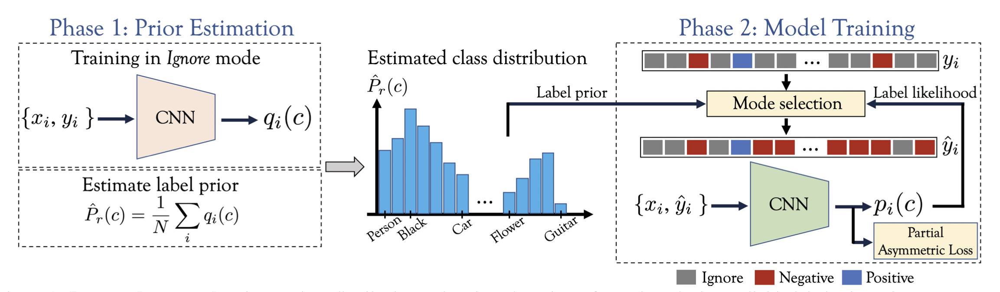
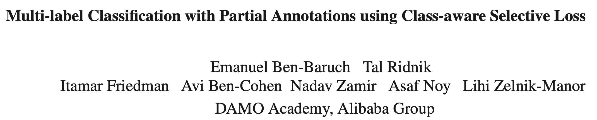
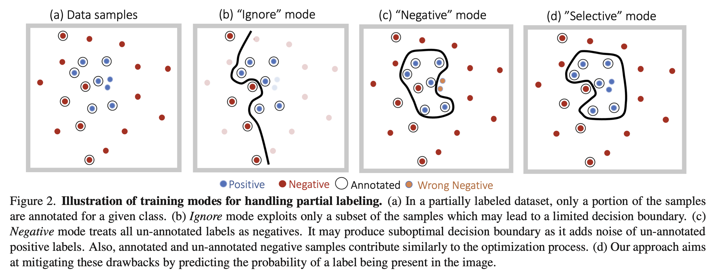
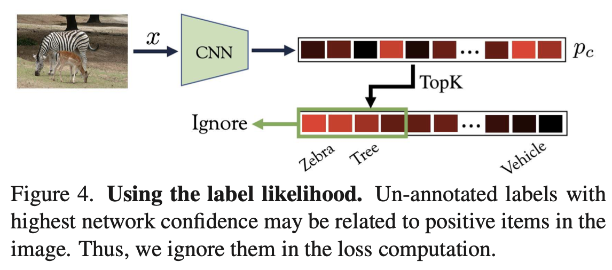
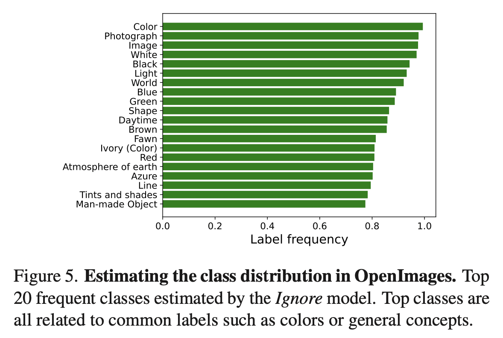
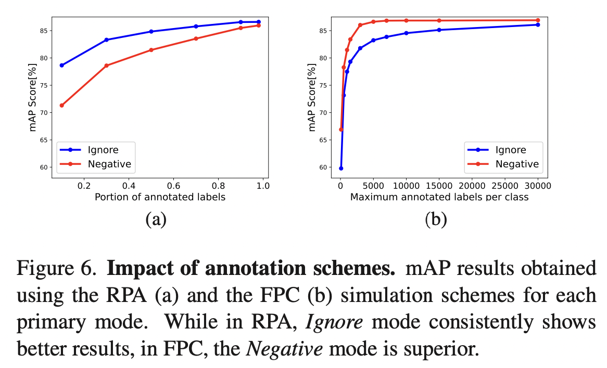
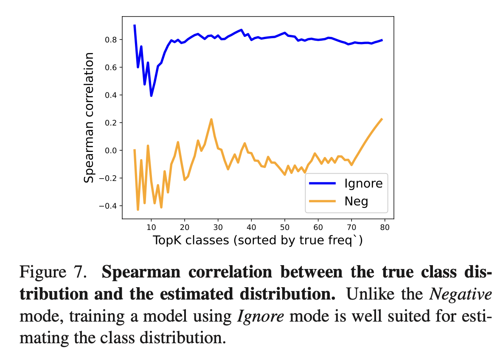
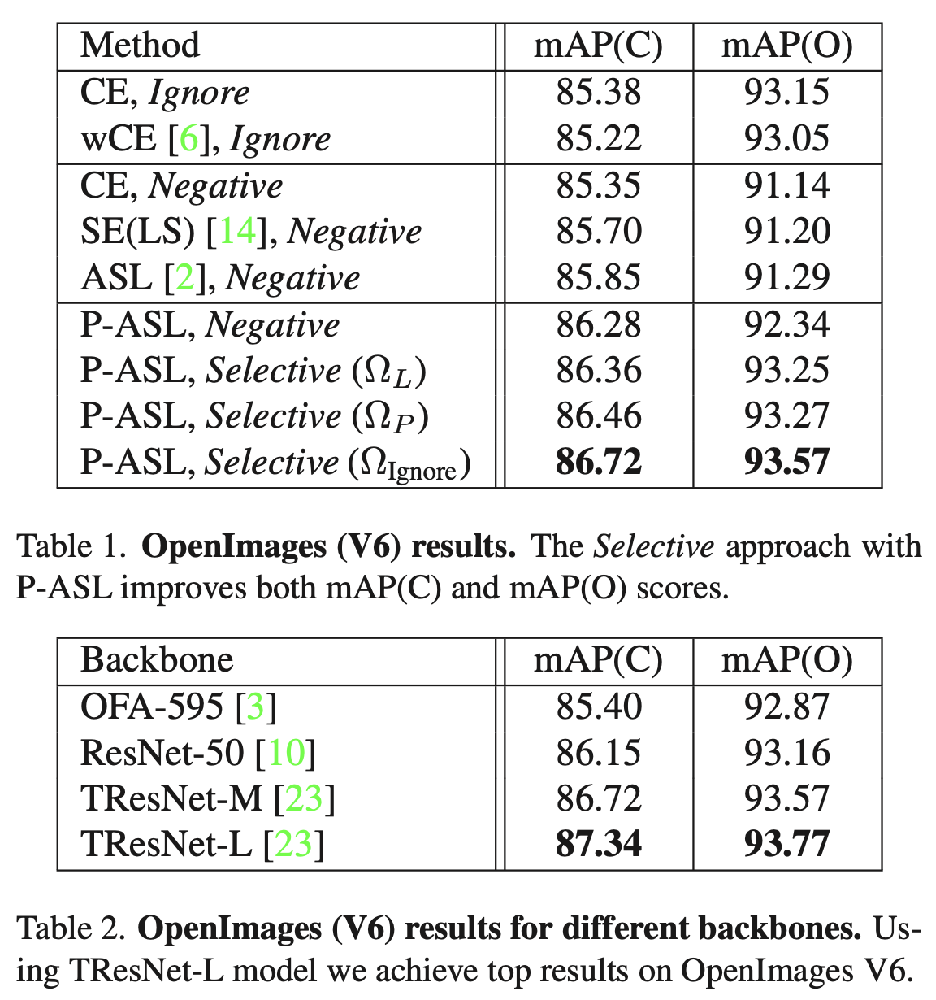
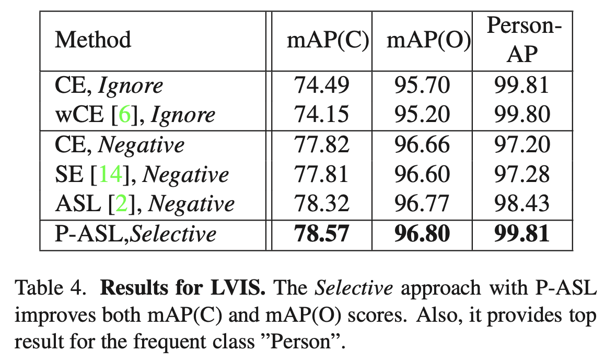

分析了多标签分类中的部分标注问题，设计了Loss函数处理这个问题。

<!--more-->

## Overview

- paper: <https://arxiv.org/pdf/2110.10955v1.pdf>
- code: <https://github.com/alibaba-miil/partiallabelingcsl>
- dataset: OpenImages LVIS MS-COCO

## Background

近年来，对每张图像进行完整标注变得越来越困难。例如OpenImages的训练集有900万张图像，包含9600个类别。在现实的大规模多标签分类任务中，部分标注的数据是不可避免的，如何处理那些未标注的标签是一个问题。

最简单的方法就是直接忽略未标注的标签，但这样只利用了数据的一部分。将其直接当作负标签也是一种方法，但会引入噪声，并加剧正负样本的不平衡。这两种方法分别对应于下图的b和c。

OpenImages中“黑色”标签只标注了1688个样本，占全体样本的0.02%，然而这是很可能频繁出现的标签。因此统计数据集中类别的频数往往不能反映真实的标签比例，需要从数据中估计类别的分布。

本文提出了选择性（Selective）的方法，利用**标签概率**（Label likelihood）和**标签先验**（Label prior）两项判断每个标签的模式（Ignore还是Negative）。为了获得一个可靠的标签先验，还提出了一种估计类别分布的方法。

## Method

给定部分标注的多标签数据集，类别标签$y_c\in\{-1,0,1\}$，其中0表示缺失。用$\mathcal{P}_{\mathbf{x}}=\{c|y_c=1\}$和$\mathcal{N}_{\mathbf{x}}=\{c|y_c=-1\}$分别表示正负标签，用$\mathcal{U}_{\mathbf{x}}=\{c|y_c=1\}$表示未标注的类别，通常有$|\mathcal{P}_{\mathbf{x}}\cup \mathcal{P}_{\mathbf{x}}|\ll|\mathcal{U}_{\mathbf{x}}|$。损失函数的通用形式可以定义如下：
$$
\mathcal{L}(x) =
\sum_{c\in\mathcal{P}_{\mathbf{x}}}\mathcal{L}^+(\mathbf{x}) +
\sum_{c\in\mathcal{N}_{\mathbf{x}}}\mathcal{L}^-(\mathbf{x}) +
\sum_{c\in\mathcal{U}_{\mathbf{x}}}\mathcal{L}^u(\mathbf{x})
$$
对于常见的BCE，只考虑标注数据则有$\mathcal{L}^+(\mathbf{x})=\log(p_c)$，$\mathcal{L}^-(\mathbf{x})=\log(1-p_c)$，$\mathcal{L}^u(\mathbf{x})=0$。

对于Ignore模式，即有$\mathcal{L}^u(\mathbf{x})=0$；对于Negtive模式，即有$\mathcal{L}^u(\mathbf{x})=\mathcal{L}^-(\mathbf{x})$。

本文采用非对称损失ASL（Asymmetric Loss）作为基准，其能够动态关注困难样本同时控制正负样本传播的比例。对于基本的Focal Loss，有
$$
\mathcal{L}_F(p_c,\gamma) = (1-p_c)^\gamma\log p_c
$$
部分非对称损失P-ASL定义为
$$
\begin{align}
\mathcal{L}(x) =
&\sum_{c\in\mathcal{P}_{\mathbf{x}}}\mathcal{L}_F(p_c, \gamma^+)\\
+&\sum_{c\in\mathcal{N}_{\mathbf{x}}}\mathcal{L}_F(1-p_c,\gamma^-)
+\sum_{c\in\mathcal{U}_{\mathbf{x}}}\omega_c\mathcal{L}_F(1-p_c, \gamma^u)
\end{align}
$$
通常设置$\gamma^+<\gamma^-$，因为正样本更少见。同时有$\gamma^-<\gamma^u$，因为有标注的负样本更值得信赖。

### Class-aware Selective Loss

标签概率表示未标注标签$c$的概率
$$
P(y_c=1|\mathbf{x};\mathbf{\theta});\quad\forall c\in\mathcal{U}_{\mathbf{x}}
$$
高置信度的标签可能出现在图像中，不能将其当作负样本，应该忽略。为此作者选了$K$个最高概率的标签：
$$
\Omega_L = \{c\in\mathcal{U}_{\mathbf{x}}|c\in\text{TopK}(\{p_c\})\}
$$

标签先验可以看作数据中标签的出现频率
$$
P(y_c=1);\quad\forall c\in\mathcal{U}_{\mathbf{x}}
$$
用$\hat{P}_r(c)$表示先验估计器，我们对于高先验值的标签感兴趣。
$$
\Omega_P = \{c\in\mathcal{U}_{\mathbf{x}}|\hat{P}_r(c)>\eta\}
$$
其中$\eta\in[0,1]$表示是否忽略的阈值。
$$
O_{\text{Ignore}} = \Omega_{L}\cup\Omega_P
$$
相应地，对应的权重定义为
$$
\omega_c = \begin{cases}
0 & c\in\Omega_{\textrm{Ignore}} \\
1 & c\notin\Omega_{\textrm{Ignore}}
\end{cases}
$$

### Estimating the Class Distribution

在MS-COCO中，89%的类别出现在少于5%的样本中。标签先验可以通过下式估计
$$
P(y_c=1;\theta) = \frac{1}{|\mathcal{X}|}\sum_{\mathbf{x}\in\mathcal{X}}P(y_c=1|\mathbf{x};\mathbf{\theta})
$$
在Ignore模式下训练模型，此时则有$\hat{P}_r(c) = P(y_c=1;\mathbf{\theta}_{\text{Ignore}})$。

## Experiment

采用完整标注的MS-COCO数据集，模拟部分标注进行实验。部分标注的模式有两种：

1. Fixed per class (FPC) 对于每个类别随机采样固定数目$N_s$的正负标注，丢弃其余标注。
2. Random per annotation (RPA) 按概率$p$删除每个标注。

作者比较了估计的标签分布与实际分布的相似度，可以看出Ignore模式更适合。

公开benchmark选择了OpenImages和LVIS，取得了SOTA结果。

