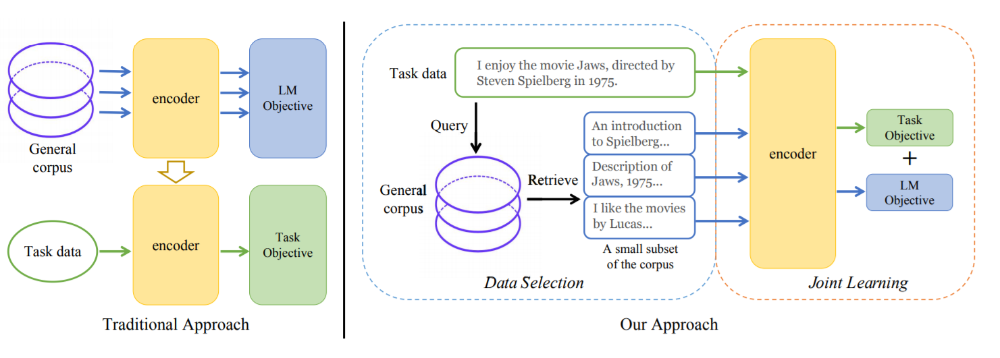
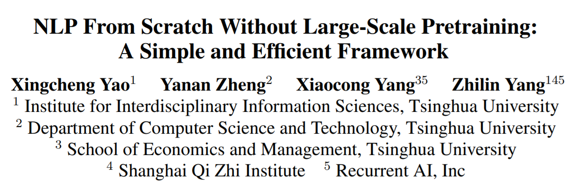
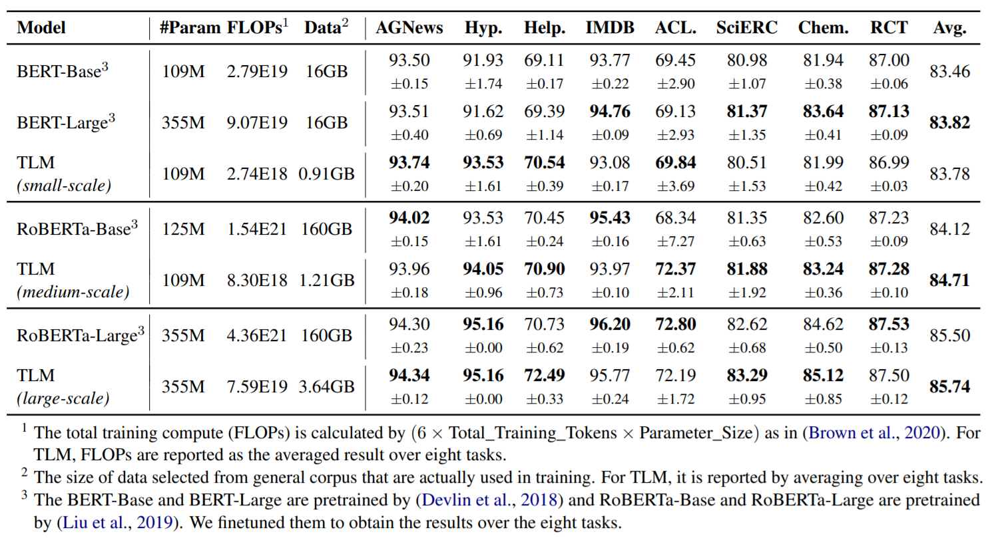
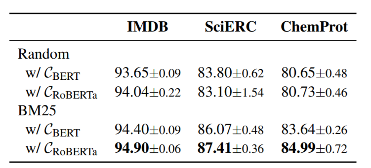
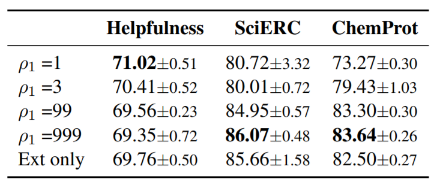
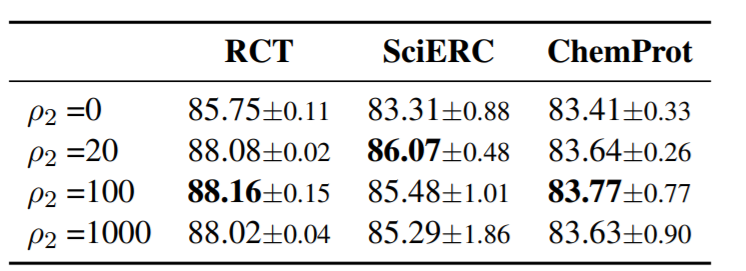
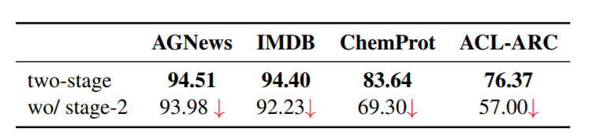

提出了一种简单有效的学习框架TLM，其不需要大规模的预训练。

<!--more-->

## Overview

- arxiv: https://arxiv.org/pdf/2111.04130v1.pdf
- code: https://github.com/yaoxingcheng/TLM

## Background

NLP领域中，预训练-微调的框架已经显著地提升了各项任务的表现，但是预训练需要的算力过于高昂。RoBERTa-Large需要$$4.36\times10^{21}$$FLOPs的算力，而更大的GPT-3需要的算力是前者的50倍以上。大规模的预训练阻碍了研究者们探索新的预训练框架或者改进预训练的损失函数，相较之下人们花了大量精力改进微调步骤的算法，而其实预训练很大程度上决定了微调的上界。

尽管也有工作研究和改善语言模型的预训练，但他们大部分专注于设计样本高效（sample-efficient）的自监督任务，或者设计更有效的Transformer架构用于预训练。此外还有通过知识蒸馏的方式，改进推理的效率，但蒸馏前依旧需要大规模的预训练。

基于上述，本文提出了一种简单高效且无需预训练的框架，称为任务驱动的语言建模（**T**ask-driven Language **M**odeling，**TLM**）。本文的Motivation主要有以下两点：

- 人类掌握任务只需要一小部分的知识，作者假设对于具体任务来说，大规模的语料过于冗余。
- 相较于优化无监督数据上的语言建模目标，在有监督的标注数据上训练对于下游任务是更高效的。

TLM需要大规模的通用语料以及一些标注数据，将任务数据作为query以获取通用语料中的一个小的子集。本文在八个不同的任务上进行实验评估，在训练算力减小两个量级的情况下，取得了近于甚至超过BERT和RoBERTa的效果。·

## Method

### TLM: Task-Driven Language Modeling

作者认为，学习一个任务的关键之一在于快速准确地定位任务相关的信息。因此TLM包括两步：

1. 将任务数据作为query，从通用语料中检索数据；
2. 在获取的数据和任务数据上，联合优化任务目标和语言建模目标。

#### Retrieval From General Corpus

给定任务数据$$x_i\in\mathcal{T} = \{(x_i, y_i)\}_i$$，从通用语料中$$\mathcal{D}=\{d_i\}_i$$获取子集$$\mathcal{S_i} = \{\tilde{d}_{i,1},\tilde{d}_{i,2},\cdots\}$$。
其中$$\mathcal{S_i}$$中包含了top-K个与$$x_i$$相似的样本，最后获取的数据即为并集$$\mathcal{S}=\cup_iS_i$$。

文章出于简单与高效性的考虑，使用BM25用于检索，而没有采用基于embedding的方法。

#### Joint Training

TLM的优化目标如下：
$$
\mathbb{E}_{x\sim\mathcal{S}} [\rho_1\mathcal{L}_{\mathrm{mlm}}(x)] + 
\mathbb{E}_{x,y\sim\mathcal{T}}[\rho_2\mathcal{L}_{\mathrm{mlm}}(x) +
\mathcal{L}_{\mathrm{task}}(f(x),y)]
$$
其中$$\rho_1$$和$$\rho_2$$为超参数。

训练分为两阶段：

- 第一阶段，将$$\rho_1$$个batch数据插入一个batch中用于梯度下降，这里$$\rho_1$$为整数；
- 第二阶段，将$$\rho_1$$和$$\rho_2$$都设为0，微调模型只优化任务目标。

### Comparison Between TLM and PLMs

|          |                         TLM                          |          PLMs           |
| :------: | :--------------------------------------------------: | :---------------------: |
| 损失函数 |    $$\mathcal{L}_{task}$$和$$\mathcal{L}_{mlm}$$     |  $$\mathcal{L}_{mlm}$$  |
| 训练数据 | $$\mathcal{D}$$的一个小子集和任务数据$$\mathcal{T}$$ | 完整语料$$\mathcal{D}$$ |
| 算力消耗 |                 8 GPUs 42 hours                 | 1000 GPUs one day  |
|  通用性  |                     Task-Driven                      |      Task-Agnostic      |

作者从高效性、灵活性和通用性上进行了比较。

## Experiment

作者将任务分为高资源和低资源两类，高资源有着超过5000个任务数据。

从结果上来看，TLM以更少的算力取得了相近甚至更好的结果。

本文还比较了不同的检索方法以及不同的通用语料对结果的影响：

也展现了不同超参的实验结果

此外也通过实验结果验证了第二阶段的有效性

