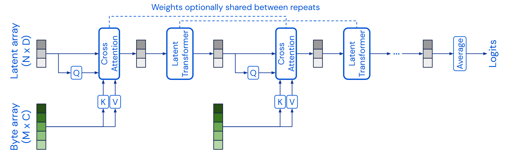
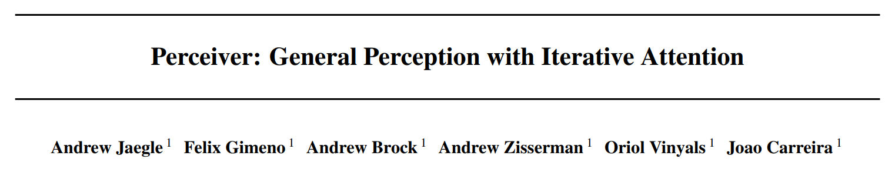
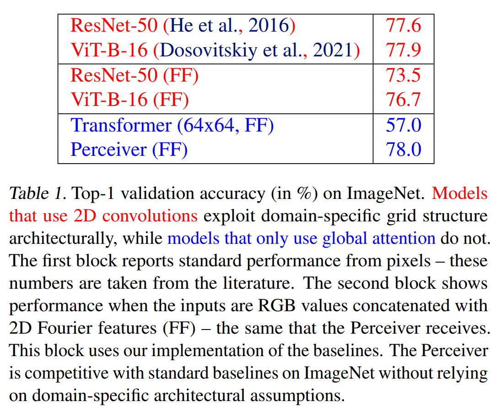
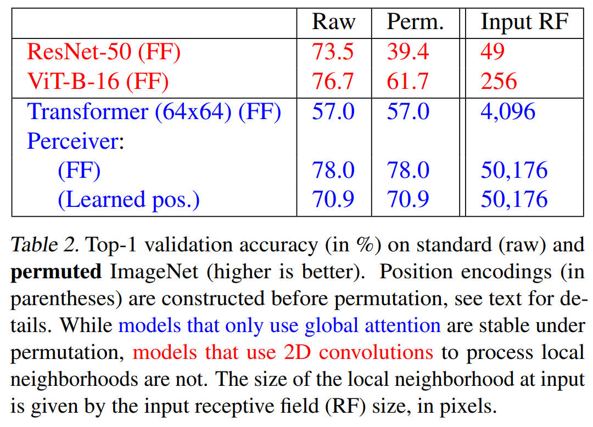
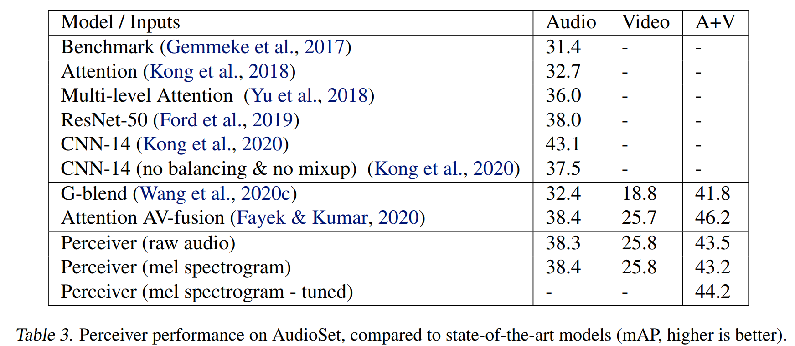
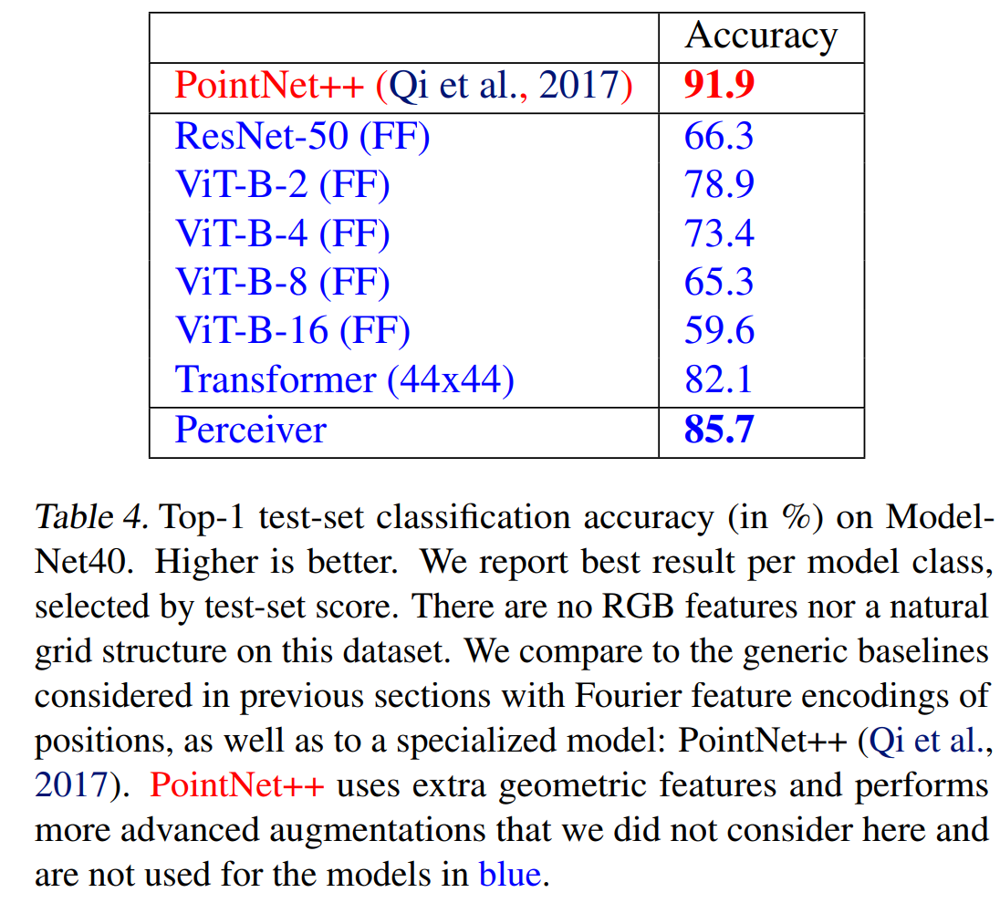

ICML 2021，来自DeepMind，目前大多数模型只能处理单模态，本文提出基于Transformer的Perceiver模型，适用于各种各样的输入，不需要过多的特定假设。模型利用非对称的注意力机制，将输入迭代地提取到一个很小的隐藏bottleneck，从而可以处理非常大的输入。

<!--more-->

## Overview

- paper: <https://arxiv.org/pdf/2103.03206v2.pdf>
- code: 
  - official: https://github.com/deepmind/deepmind-research/tree/master/perceiver
  - <https://github.com/lucidrains/perceiver-pytorch>

## Background

归纳偏置（Inductive bias）例如早期CV里的空间局部性，是非常有价值的。但随着大规模数据集越来越多，依然在模型中选择类似的偏置未必正确。

此外，大多数模型都只能处理特定模态。随着输入形式的改变，我们总得重新设计模型。

本文提出的Perceiver，旨在使用Transformer架构处理任意不同模态。Transformer不需要很多输入的假设，但随着输入规模增加，计算代价呈平方增长。本文提出了一种机制可以处理高维输入，同时保持表达能力和灵活性。

核心思想是引入一些潜在单元（latent units），形成注意力bottleneck，以消除Transformer的平方增长问题，并能够构建很深的网络。

## Method

### The Perceiver architecture

模型架构主要有两部分：

- 一个cross-attention模块，将一个字节序列和潜在序列映射到一个潜在序列。
- 一个Transformer tower，将一个潜在序列映射到一个潜在序列。

字节序列的尺寸由输入决定，通常比较大（ImageNet上224分辨率对应50176个像素）。潜在序列的尺寸是一个超参数，通常比较小（ImageNet上为512）。

模型将两个模块交替排布，先用cross-attention降维再通过Transformer，模型所有的注意力模块都不使用mask。

cross-attention将注意力的复杂度由$\mathcal{O}(M^2)$降低到了$\mathcal{O}(MN)$，其中$M$和$N$分别表示$Q$和$K$的长度，一般情况下$N\ll M$。从而在后续的Transformer中，计算代价由$\mathcal{O}(LM^2)$降低到了$\mathcal{O}(LN^2)$。

Transformer使用了GPT-2架构，潜在序列使用可学习的位置编码进行初始化。

也可以在相应的模块中共享权重，减小参数量的同时抑制过拟合。

### Position encodings

注意力机制是一种permutation-invariant操作，交换输入的顺序不会影响输出结果，因此需要手动引入位置信息。

本文选用了傅立叶特征位置编码（三角式），采用一种参数化的性质代表位置特征，形如$[\sin(f_k\pi x_d),\cos(f_k\pi x_d)]$。Transformer中的位置编码通常是相加的形式，本文采用了拼接的形式。

## Experiment

在图像、音频和点云数据上进行了实验，选择了ImageNet、AudioSet和ModelNet40。

