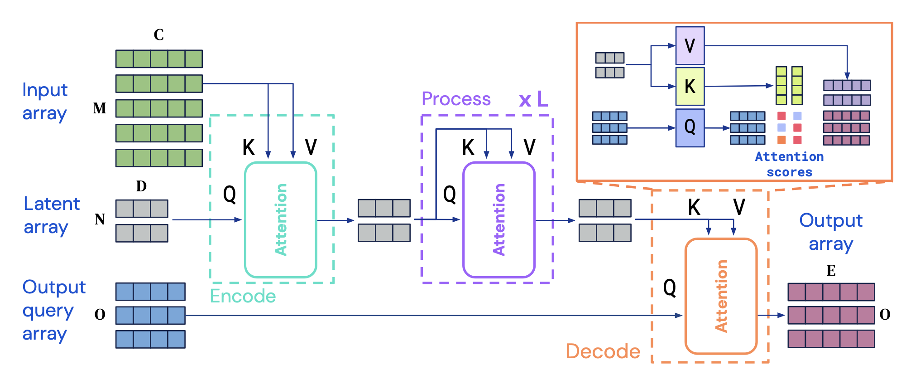
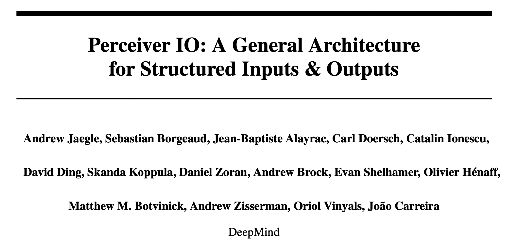
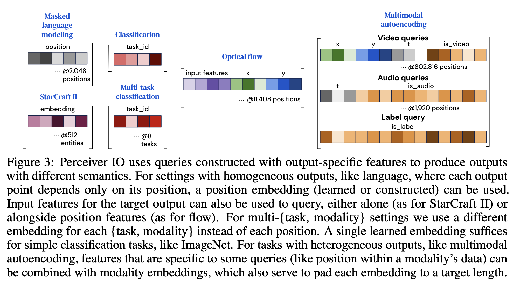
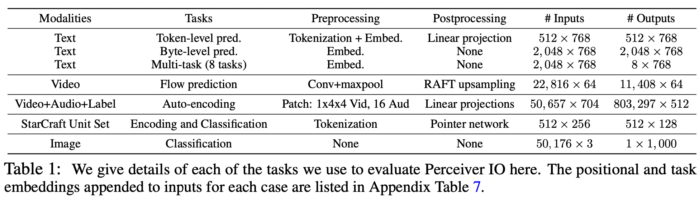
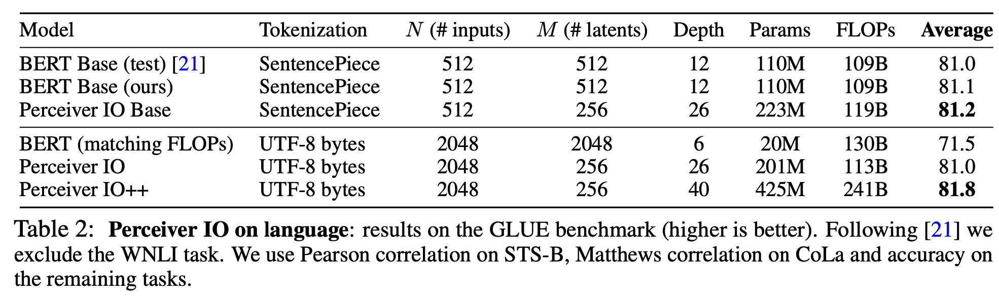

来自DeepMind，Perceiver的续作，不再局限于分类任务，在NLP、CV、多模态甚至星际争霸二上取得了不错的成绩。

<!--more-->

## Overview

- paper: <https://arxiv.org/pdf/2107.14795v2.pdf>
- code: 
  - official: https://github.com/deepmind/deepmind-research/tree/master/perceiver
  - <https://github.com/krasserm/perceiver-io>

## Background

Perceiver只能处理分类任务，本文提出了一种用于解码结构化输出的机制，使得模型能够处理大量新的任务而不需要领域特有的处理方法。

Perceiver IO是一个纯注意力的架构，输入编码到潜在空间，潜在的表示通过多层处理，经过解码得到最终的输出。

## Method

### Encoding, processing, and decoding

编码将输入序列$x\in\mathbb{R}^{M\times C}$映射到潜在序列$z\in\mathbb{R}^{N\times D}$，采用一系列模块进行处理，最终用一个注意力模块将潜在序列映射到输出序列$y\in\mathbb{R}^{O\times E}$。其中$N$和$D$为超参数，$C$、$O$和$E$为任务数据的属性，通常非常大。

如Perceiver一样，Perceiver IO没有平方复杂度，编码器和解码器随着输入规模线性增长，潜在注意力的代价取决于输入输出的尺寸。

### Decoding with a query array

给定$N\times D$维的潜在表示，需要得到最终$O\times E$维的输出序列。

对于分类这样的简单任务，直接使用position encoding。对于多任务或多模态，为每个任务或模态学习query。

## Experiment

选择了多种任务，如下表所示。

## Conclusion

在Perceiver的基础上加了Decoder，从而可以处理多种任务。
