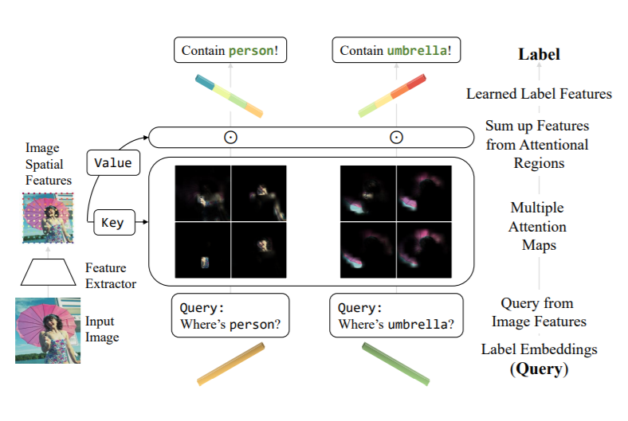
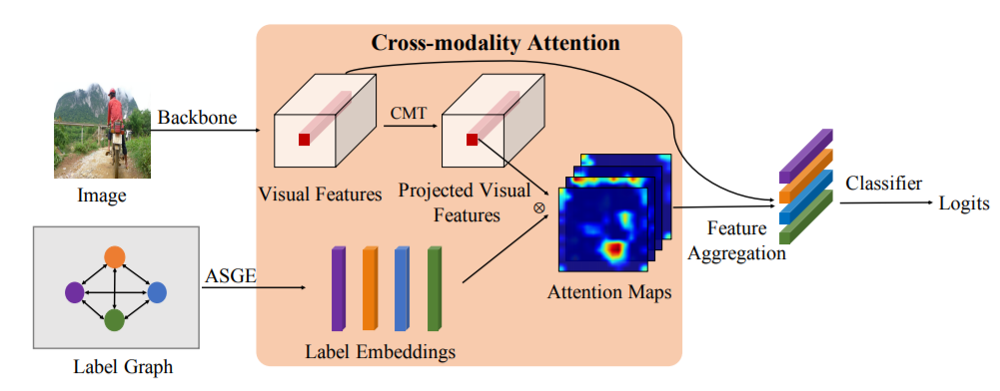
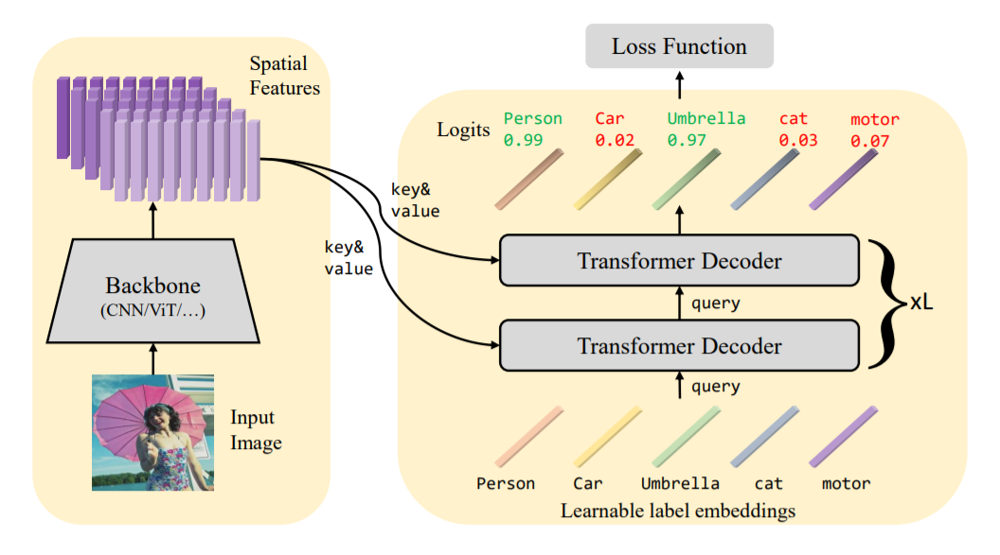
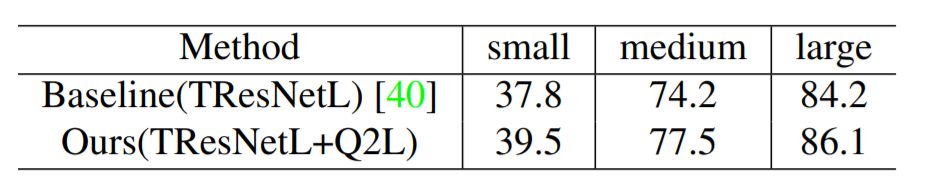

来自清华-博世机器学习研究中心，将Transformer解码器用于多标签分类，将label embedding作为query，计算与feature map的cross-attention。在MS-COCO、PASCAL VOC、NUS-WIDE和Visual Genome上进行了实验，取得了SOTA结果。

<!--more-->

## Overview

- arxiv: https://arxiv.org/pdf/2107.10834.pdf
- code: https://github.com/SlongLiu/query2labels

## Background

多标签分类主要有两个问题

- 如何解决标签不平衡问题
- 如何提取有效的local特征

前者是因为one-vs-all策略采用多个独立的二分类器，后者则是因为全局的池化特征稀释了其他标签，使得难以识别细小物体。

目前的研究方向主要有三类

- 针对正负例的不平衡问题，改进loss函数，包括focal loss、distribution-balanced loss和今年阿里提出的[asymmetric loss](https://paperswithcode.com/paper/asymmetric-loss-for-multi-label)。
- 建模label correlations，比如使用label co-occurrence和GCN。
- 定位感兴趣的区域，比如使用spatial transformer。

[[AAAI 2019]《Cross-modality attention with semantic graph embedding for multi-label classification》](https://paperswithcode.com/paper/cross-modality-attention-with-semantic-graph)这篇文章，在裁剪负值后，计算label embedding和feature map的cosine相似度作为attention map。但是这种分法可能会导致attention过于平滑，从而作用有限，难以提取有效的desired feature。

Cross-modality attention

基于上述，本文利用Transformer内置的cross-attention作为特征选择器，提取有效的desired feature。受[DETR](https://paperswithcode.com/paper/end-to-end-object-detection-with-transformers)启发，采用可学习的label embedding作为query，也避免了采用label corrleation等方法带来的噪声。

## Method

本文是一个two-stage的方法，第一步采用backbone（如ViT）提取图片的时序特征，第二步将特征和label embedding送入transformer中训练。

Query2Label的总体框架

给定图片$$x\in\mathbb{R}^{H_0\times W_0 \times 3}$$，提取特征$$\mathcal{F}_0 \in \mathbb{R}^{H \times W \times d_0}$$，后接全连接层并reshape得到特征$$\mathcal{F} \in \mathbb{R}^{HW \times d}$$。

构造label embedding$$\mathcal{Q}_0 \in \mathbb{R}^{K\times d}$$，其中$$K$$为类别数，Transformer的每一层解码层都在更新参数。
$$
\begin{aligned}
&{\rm{self-attn}}:
	&&\mathcal{Q}_i^{(1)} = {\rm{MultiHead}}(\tilde{\mathcal{Q}}_{i-1}, \tilde{\mathcal{Q}}_{i-1}, \mathcal{Q}_{i-1})\\
&{\rm{cross-attn}}:
	&&\mathcal{Q}_i^{(2)} = {\rm{MultiHead}}(\tilde{\mathcal{Q}}_{i-1}, \tilde{\mathcal{F}}, \mathcal{F})\\
&{\rm{FFN}}:
	&&\mathcal{Q}_i = {\rm{FFN}}(\mathcal{Q}_{i}^{(2)})
\end{aligned}
$$

在self-attention中，query、key和value都来自label embedding；而在cross-attention中，key和value变成了时序特征。

在经过L层Transformer后，得到最后一层的query向量$$\mathcal{Q}_L \in \mathbb{R}^{K\times d}$$，使用全连接层+sigmoid进行分类。
$$
p_k = \mathrm{Sigmoid}(W_k^T\mathcal{Q}_{L,k}+b_k)
$$
本文采用了一种简化的非对称损失以解决类别不平衡问题
$$
\begin{align}
\mathcal{L} = \frac 1 K
\sum_{k=1}^K
	\begin{cases}
		(1-p_k)^{\gamma+}\log(p_k),& y_k=1 \\
		(p_k)^{\gamma-}\log(1-p_k), & y_k = 0
	\end{cases}
\end{align}
$$
在实验中选取$$\gamma+=0$$和$$\gamma-=1$$。

## Experiment

使用了一层Transformer encoder和两层Transformer decoder，encoder只是为了更好地学习特征表示，但即使不用encoder只用一层decoder也可以表现很好。

采用Adam优化器，weight decay为1e-2，学习率设为1e-4，训练80epochs。

在四个数据集上刷新SOTA，并做了消融实验。

消融实验

