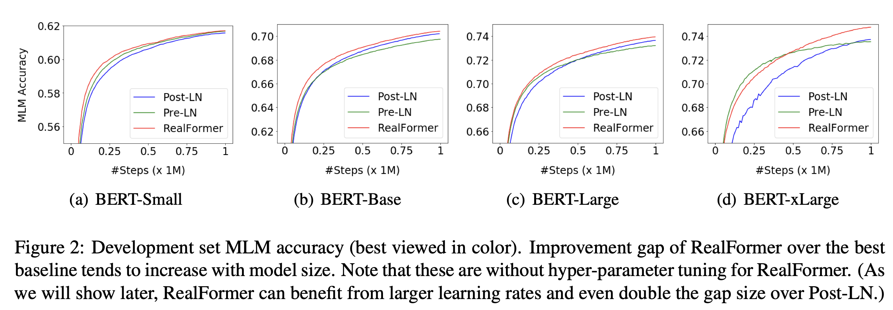

ACL Findings 2021，在Transformer中引入残差Attention。

<!--more-->

## Overview

- paper: <https://aclanthology.org/2021.findings-acl.81.pdf>
- code: <https://paperswithcode.com/paper/informer-transformer-likes-informed-attention>

## Background

Transformer按Layer Normalization的位置可以分为Post-LN和Pre-LN，BERT、XLNET、RoBERTa和ALBERT等都属于前者，GPT-2和Megatron属于后者。本文兼顾二者，引入残差注意力模块提升了Transformer的性能。

## Method

原始注意力
$$
\text{Attention}(Q',K',V') = \text{Softmax}(\frac{Q'K'^T}{\sqrt{d_k}})V'
$$
残差注意力
$$
\text{ResidualAttention}(Q',K',V', Prev') = \text{Softmax}(\frac{Q'K'^T}{\sqrt{d_k}}+Prev')V'
$$

## Experiment

在预训练和下游任务上都取得了更好的结果。

