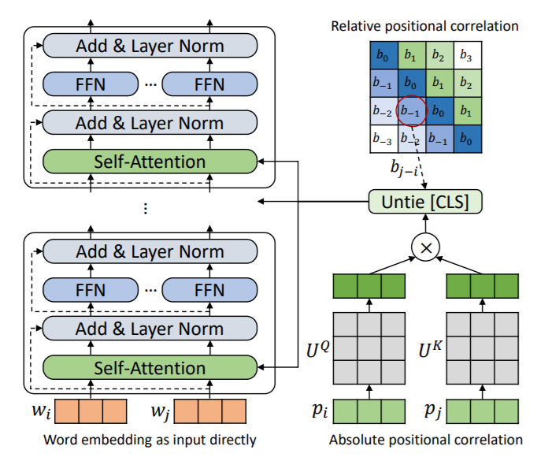
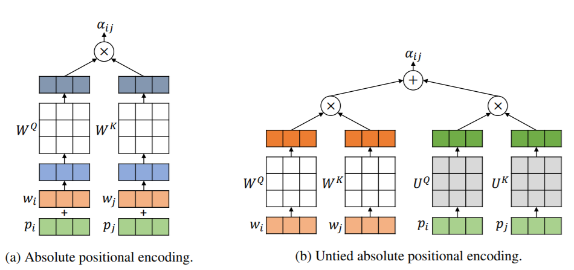
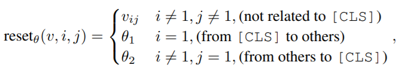
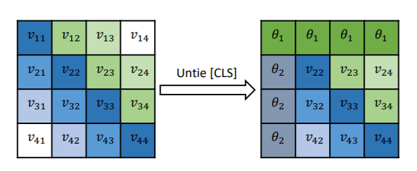
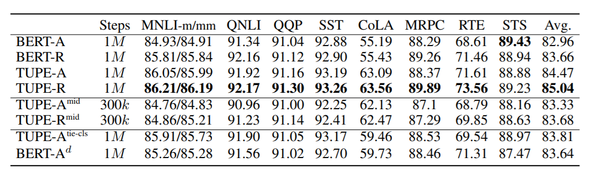
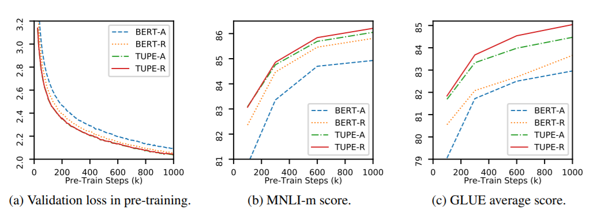

重新思考预训练语言模型中的位置编码（ICLR2021）

<!--more-->

## Overview

- arxiv: https://arxiv.org/pdf/2006.15595v4.pdf
- code: https://github.com/guolinke/TUPE

## Background

Transformer自提出以来，在语言表示学习领域大行其道。在Transformer中，位置编码是模型的关键部分，原始的Transformer使用绝对位置编码，将位置编码与词向量以相加的方式处理。后来还有其他研究者提出相对位置编码，在self-attention模块中加入一些精心设计的偏移项，以编码两个位置之间的距离信息。

本文主要针对两个问题进行研究

- 绝对位置编码与词向量采用相加的方式是否合理，两者是明显异质（heterogenous）的，相加运算可能带来一些冗余的关联信息。
- BERT中采用[CLS]这样一个特殊的token来编码句子的语义信息，但是它的位置却和其他token采用一样的位置编码，这种方式是否合理且有效？

为了解决这两个问题，本文提出了采用结构位置编码的Transformer（TUPE）。

- 将position embedding和word embedding分开计算
- 使用一个不同的函数计算[CLS]的语义

## Methodology

### 解耦word和position的计算

如上图，改进之处在于分别计算attention后再相加，而不是先相加再计算attention。

绝对位置编码：
$$
\alpha^{Abs}_{ij} = \frac1{\sqrt d}((w_i+p_i)W^{Q})((w_i+p_i)W^{K})^T
$$
改进之后，对word和position计算不同的投影矩阵
$$
\alpha_{ij} = \frac1{\sqrt{2d}}(x_i^lW^{Q})(x_j^lW^{K})^T + \frac1{\sqrt{2d}}(p_iU^{Q})(p_jU^{K})^T
$$
针对相对位置，只需要添加一个距离项
$$
\alpha_{ij} = \frac1{\sqrt{2d}}(x_i^lW^{Q})(x_j^lW^{K})^T + \frac1{\sqrt{2d}}(p_iU^{Q})(p_jU^{K})^T + b_{j-i}
$$

### 计算[CLS]

BERT中[CLS]作为输入语句的第一个字符，以捕获整个语句的全局信息。将这样一个特殊token和其他字符相提并论可能并不是一种好的选择，有一些可视化工作表明attention可能会出现只专注局部字符的现象（local concentration）。

为此，本文作了如下修改

其中，$$\theta_1$$和$$\theta_2$$是可学习的参数，计算方式的变化如下图。

## Experiment

TUPE针对绝对和相对位置编码都做了实验，与BERT进行了比较，采用了GLUE数据集。

> -A表示绝对位置编码，-R表示相对位置编码。

总体来看，在GLUE上取得了更好的成绩，不过计算量相比之下多了30%（因为多算了一次attention）。