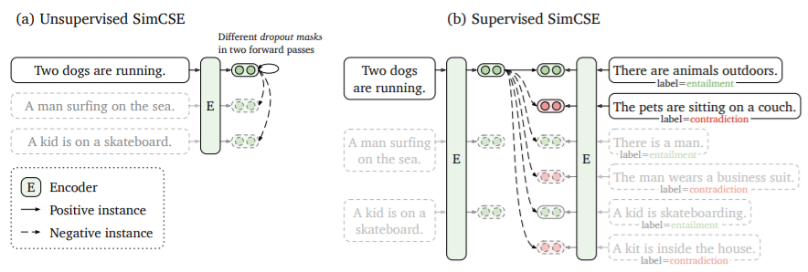
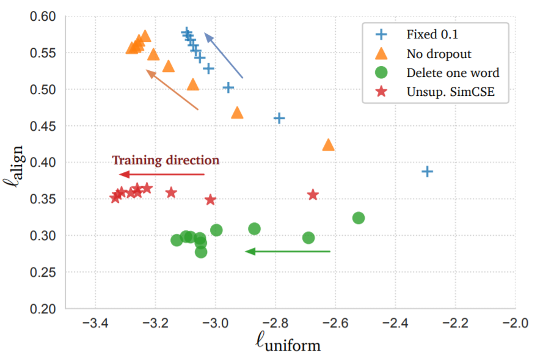
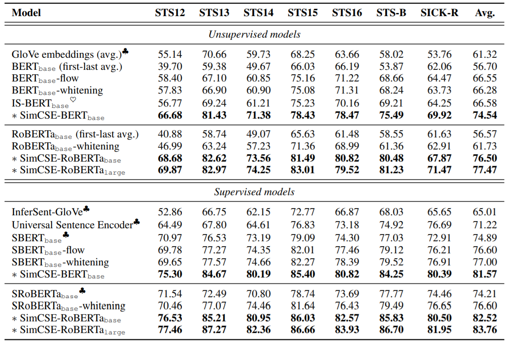
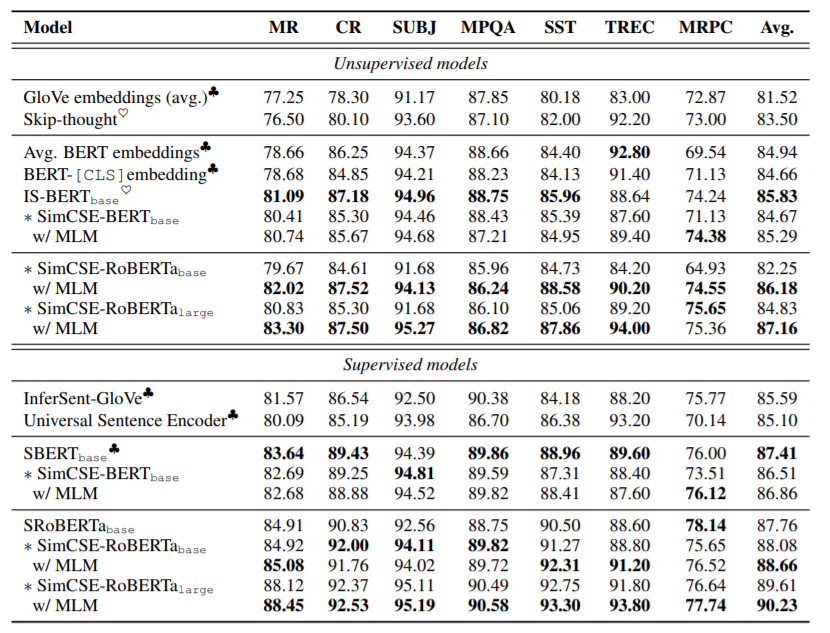

来自陈丹琦（<https://github.com/danqi>）组的文章，利用Dropout作为数据增强，进行对比学习得到句子向量表示，在无监督和有监督的语义表示上刷新SOTA。

<!--more-->

## Overview

- Arxiv: https://arxiv.org/pdf/2104.08821v1.pdf
- Code: https://github.com/princeton-nlp/SimCSE

## Background: Contrastive Learning

对比学习希望通过拉近语义相关的样本，拉远不相关的样本学习有效的向量表示。

对于样本对集合$D=\{(x_i,x_i^+)\}_{i=1}^m$，假设$({\bf h_i},{\bf h_i^+})$为样本的向量表示，则训练的目标为：
$$
l_i = \log \frac {e^{ {\rm sim} ({\bf h_i},{\bf h_i^+})}/\tau} {\sum_{j=1}^N e^{ {\rm sim}( {\bf h_i},{\bf h_j})/\tau}}
$$
其中，$\tau$是一个温度超参数，${\rm sim}({\bf h_i},{\bf h_i^+})$为余弦相似度$\rm\bf\frac{h_1^Th_2}{\|h_1\|·\|h2\|}$，本文选择的backbone是BERT或RoBERTa。

其实上述的训练目标就是交叉熵：
$$
{\rm let}\ z_{i,j} = {\rm sim} ({\bf h_i},{\bf h_j}) \\
{\rm then}\ loss_i = -\sum_{j=1}^N y_{j}\log z_{i, j}
$$

### Positive instances

对比学习的关键问题是如何构造样本对$(x_i,x_i^+)$，在CV中可以用裁剪、旋转等方法对图像进行数据增强，NLP中也有删词、替换、重排等方法。但对于NLP的离散结构来说，这些增强手段作用有限。本文采用了dropout作为数据增强手段，取得了更好的结果。

本文采用了两个度量align和uniform用于衡量表示的质量。

align描述了样本对之间的距离
$$
l_{\rm align} \triangleq \mathop{\mathbb{E}}_{(x,x^+)\sim p_{pos}}\|f(x)-f(x^+)\|^2
$$
uniform描述了样本是否分布均匀
$$
l_{\rm uniform} \triangleq \log\mathop{\mathbb{E}}_{(x,y)\sim p_{data}}e^{-2\|f(x)-f(y)\|^2}
$$

从实验结果上看，采用dropout的SimCSE效果更好。

## Experiment

在语义相似度任务上大幅度刷新SOTA，无监督就可以超越之前的有监督方法。

在迁移任务上表现一般，说明sentence embedding并不一定有益于下游训练。

