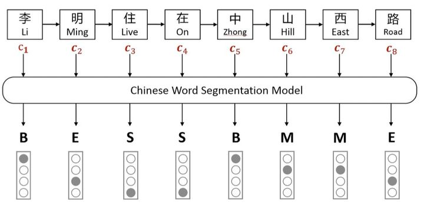
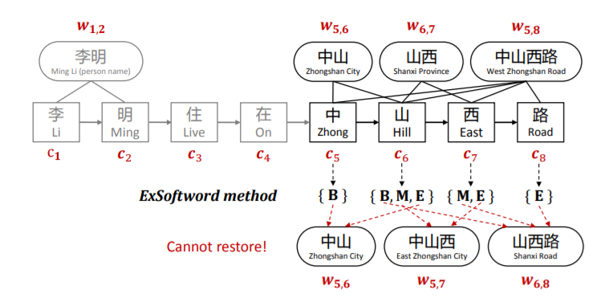
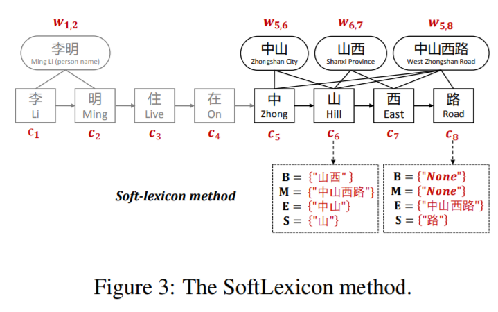
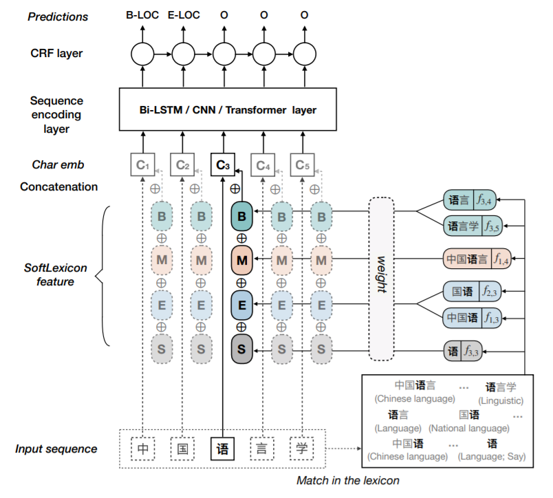

介绍如何在中文NER模型中更好地结合词典信息（ACL 2020）

<!--more-->

## Overview

- arxiv: https://arxiv.org/pdf/1908.05969v2.pdf

- code: https://github.com/v-mipeng/LexiconAugmentedNER

## Background

ref：https://zhuanlan.zhihu.com/p/142615620

近几年，在中文NER模型中融合词典信息的工作有许多，这主要得益于Lattice-LSTM的工作。但是Lattice-LSTM有几个缺点：

- 计算性能低下，采用RNN结构，不能batch并行化。
- 存在信息损失，每个字符只能获取以它为结尾的词汇信息。
- 可迁移性差，只适用于LSTM。

本篇论文提出了一种简单的方法，在embedding层利用词典信息，避免了复杂的模型结构，易于迁移。

## Approach

本文比较了三种不同的融合方式

### Softword




Softword先对句子分词，然后对每个字符嵌入BMESO的embedding。这种方法存在分词造成的误差传播，也无法引入词汇对应的信息。

### ExSoftword



ExSoftword在Softword的基础上，将所有匹配的词汇对字符进行编码，按照BMESO编码构建5维向量。比如山表示为[1, 1, 1, 0, 0]
$$
x_j^c \leftarrow [x_j^c; e^{seg}(segs(c_j))]
$$
ExSoftword虽然引入了标注信息，但仍然没有引入词汇的embedding信息。并且这种方法无法恢复词汇匹配结果，从而导致信息损失。

### SoftLexicon



为了解决上述问题，SoftLexicon对每个字符依次获取BMES对应所有的词汇集合，然后再编码表示。



之后将词汇的embedding与词向量拼接作为输入
$$
e^s(B,M,E,S) = [v^s(B)\oplus v^s(M)\oplus v^s(E)\oplus v^s(S)]
$$
$$
x^c \leftarrow [x^c;e^s(B,M,E,S)]
$$
对于词汇集合编码，采取词频加权进行计算
$$
v^s(S) = \frac1{|S|}\sum_{w\in S}z(w)e^w(w)
$$

## Detail

模型主要基于Lattice-LSTM，所以后续的模型结构依旧是BiLSTM-CRF，但因为只在embedding层修改，所以可以迁移到其他模型（CNN、BERT等）。

与Lattice-LSTM类似，采用了预训练的char+bichar embedding，还有一个word embedding文件（词典）。代码中中的预处理也主要分为三类：word、biword和gaz。

首先根据预训练embedding建立alphabet，存储字符到id的映射以及对应的embedding向量。

```python
def data_initialization(data, gaz_file, train_file, dev_file, test_file):
    data.build_alphabet(train_file)
    data.build_alphabet(dev_file)
    data.build_alphabet(test_file)
    data.build_gaz_file(gaz_file)
    data.build_gaz_alphabet(train_file,count=True)
    data.build_gaz_alphabet(dev_file,count=True)
    data.build_gaz_alphabet(test_file,count=True)
    data.fix_alphabet()
    return data
data = data_initialization(data, gaz_file, train_file, dev_file, test_file)
```

代码中也提供了相应的接口查看数据信息

```python
data.show_data_summary()
'''
显示部分信息
DATA SUMMARY START:
     Tag          scheme: BMES
     MAX SENTENCE LENGTH: 250
     Use          bigram: False
     Word  alphabet size: 1895
     Biword alphabet size: 21408
     Char  alphabet size: 1895
     Gaz   alphabet size: 12583
     Label alphabet size: 29
     Word embedding size: 50
     Biword embedding size: 50
     Char embedding size: 30
     Gaz embedding size: 50
'''
# print(data.gaz_alphabet.get_index('国籍'))
```


随后预处理训练集和测试集，根据现有的词典产生对应格式的数据。

具体来说，对于给定的一句话，依次遍历每个字符，如果遇到B，则开始匹配词典

```python
words = []
biwords = []
chars = []
labels = []
word, label = lines[idx]

if len(label) > 2:
    # label != O
    if idx < len(lines) - 1 and len(lines[idx + 1][1]) > 2:
        biword = word + lines[idx + 1][0]
        else:
            biword = word + "-null-"
            words.append(word)
            biwords.append(biword)
            labels.append(label)
else:
    # label == O
    if (len(words) > 0):
        w_length = len(words)
        gazs = [ [[] for i in range(4)] for _ in range(w_length)]
        # gazs: [c1,c2,...,cn]  ci:[B,M,E,S]  B/M/E/S :[w_id1,w_id2,...]  None:0
        gazs_count = [ [[] for i in range(4)] for _ in range(w_length)]

        gaz_char_Id = [ [[] for i in range(4)] for _ in range(w_length)]
        ## gaz_char_Id: [c1,c2,...,cn]  ci:[B,M,E,S]  B/M/E/S :[[w1c1,w1c2,...],[],...]
```

词典在内存中以Trie树的形式存在，所以对于实体中的每个字符都判断是否有到达叶子节点的路径，从而匹配词典中的词汇。

以下面这句话为例，高勇的标签不为O，词典会匹配到“高勇”和“高”两个词，那么结果就是长度为2的向量。其中的元素又是一个四维向量[B, M, E, S]，分为存储单词对应的Id，这样就可以存储词汇的信息。

```python
text = ['高', '勇', '：', '男', '，', '中', '国', '国', '籍', '，', '无', '境', '外', '居', '留', '权', '，']
labels = ['B-NAME', 'E-NAME', 'O', 'O', 'O', 'B-CONT', 'M-CONT', 'M-CONT', 'E-CONT', 'O', 'O', 'O', 'O', 'O', 'O', 'O', 'O']
print("".join(text))
# input: 高勇：男，中国国籍，无境外居留权，

# gazs: [[[2], [0], [0], [3]], [[0], [0], [2], [4]]]
# gaz_char_Id: [[[[2, 3]], [0], [0], [0]], [[0], [0], [[2, 3]], [0]]]
result = [[[''.join([word_alphabet.get_instance(idx) if word_alphabet.get_instance(idx) else '' for idx in ___ ]) for ___ in __ ]for __ in _] for _ in gaz_char_Id]
# result: [[['高勇'], [], [], ['高']], [[], [], ['高勇'], []]]
```

在得到了词汇信息后，还要引入mask，以标出哪些是有效信息

```python
# gazchar_masks: [[[[0, 0]], [[0, 1]], [[0, 1]], [[0, 1]]], [[[0, 1]], [[0, 1]], [[0, 0]], [[0, 1]]]]
```

最后，读取词典获取对应的embedding送入模型

```python
model = SeqModel(data)
print(model)
'''
build batched crf...
GazLSTM(
  (gaz_embedding): Embedding(12583, 50)
  (word_embedding): Embedding(1895, 50)
  (NERmodel): NERmodel(
    (lstm): LSTM(250, 300, batch_first=True, bidirectional=True)
    (drop): Dropout(p=0.5)
  )
  (drop): Dropout(p=0.5)
  (hidden2tag): Linear(in_features=600, out_features=31, bias=True)
  (crf): CRF()
)
'''
```

