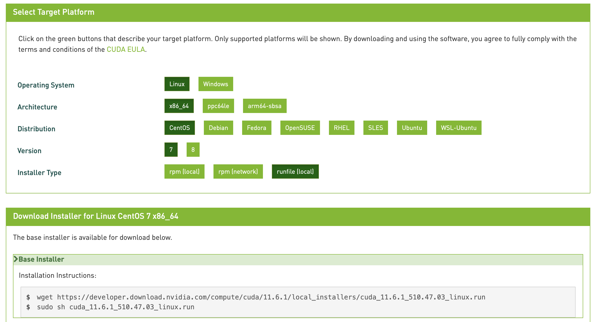

记录一下用TensorRT部署一个基于Swin-Transformer的Pytorch模型的步骤，以作备忘。

<!--more-->

## 概览

[TensorRT](https://developer.nvidia.com/tensorrt)是英伟达推出的模型加速工具，只负责模型的推理（inference）过程。具体的优化部分可以查阅官网资料，比如用FP16或INT8推理、层与张量的融合、内核调优等。


<center>TensorRT的特点</center>

TensorRT可以将模型实现数倍的加速，官网声称一行代码可以实现对PyTorch加速6倍以上。

使用TensorRT部署PyTorch模型目前有两种方案，一是先转为ONNX再转为TensorRT，而是采用[Torch-TensorRT](https://developer.nvidia.com/blog/accelerating-inference-up-to-6x-faster-in-pytorch-with-torch-tensorrt/)直接优化。


前者相比之下生态更成熟（但还是有很多坑），而且ONNX也可以直接推理，因此采取先转ONNX再转TensorRT的方式。

## 环境准备

平台为Linux，环境要求大致如下，尽量版本越新越好，新版本的兼容性往往更好，报错更少。

- CUDA 10.2 & CUDNN 8
- torch 1.11.0
- onnx 1.9.0
- onnxruntime 1.10.0
- TensorRT 8.2.3

> 友情提醒：安装教程一定要参考官网教程！！！网络上的回答很容易不正确或过时！！！

### 安装CUDA和CUDNN

参考[官方CUDA手册](https://docs.nvidia.com/cuda/cuda-installation-guide-linux/index.html)，去[下载页面](https://developer.nvidia.com/cuda-downloads)选择合适的CUDA版本下载即可，可以选择run包，下载后直接运行就可以安装。



如果之前安装过显卡驱动的（用`nvidia-smi`可以查看），在安装时可以取消驱动那一部分，只安装CUDA即可。

一般安装路径为`/usr/local/cuda`，这是一个软链接，指向某一个实际版本的CUDA（10.2或10.1等等），如果没有需要自己创建。

> 机器上存在多个CUDA版本时，也可以通过修改这个软链接来更换CUDA版本。

安装后，还需要修改环境变量，往往会写在`~/.bashrc`或`/etc/profile`中，因人而异。

```shell
export PATH=/usr/local/cuda/bin:${PATH}
export LD_LIBRARY_PATH=/usr/local/cuda/lib64:${LD_LIBRARY_PATH}
```

修改之后`source ~/.bashrc`生效，使用`nvcc -V`查看CUDA版本号，正常显示即安装成功。

至于CUDNN，依旧参考[官方安装手册](https://docs.nvidia.com/deeplearning/cudnn/install-guide/#installlinux)。去[下载页面](https://developer.nvidia.com/cudnn)（需要登陆）下载对应版本的CUDNN即可，推荐越新越好（March 18th, 2022刚更新了v8.3.3），注意与CUDA版本匹配。


下载tar压缩包后，解压复制即可安装成功。

```shell
tar -xvf cudnn-linux-x86_64-8.x.x.x_cudaX.Y-archive.tar.xz
sudo cp cudnn-*-archive/include/cudnn*.h /usr/local/cuda/include 
sudo cp -P cudnn-*-archive/lib/libcudnn* /usr/local/cuda/lib64 
sudo chmod a+r /usr/local/cuda/include/cudnn*.h /usr/local/cuda/lib64/libcudnn*
```

### 安装PyTorch和ONNX

直接`pip install`即可，TensorRT目前好像只支持到`onnx==1.9.0`。

```shell
pip3 install onnx==1.9.0
pip3 install onnxruntime
pip3 install torch torchvision torchaudio
```

为了简化模型，还可以安装[onnx-simplifier](https://github.com/daquexian/onnx-simplifier)。

```shell
pip3 install onnx-simplifier
```

### 安装TensorRT

参考[官方安装手册](https://docs.nvidia.com/deeplearning/tensorrt/install-guide/index.html)，去[下载页面](https://developer.nvidia.com/tensorrt)（需要登陆）下载tar包。


解压后有若干子目录

```shell
ls TensorRT-${version}
bin  data  doc  graphsurgeon  include  lib  onnx_graphsurgeon  python  samples  targets  TensorRT-Release-Notes.pdf  uff
```

进入对应目录分别安装即可

```shell
cd TensorRT-${version}/python

python3 -m pip install tensorrt-*-cp3x-none-linux_x86_64.whl

cd TensorRT-${version}/uff

python3 -m pip install uff-0.6.9-py2.py3-none-any.whl

cd TensorRT-${version}/graphsurgeon

python3 -m pip install graphsurgeon-0.4.5-py2.py3-none-any.whl

cd TensorRT-${version}/onnx_graphsurgeon
	
python3 -m pip install onnx_graphsurgeon-0.3.12-py2.py3-none-any.whl
```

注意修改环境变量

```shell
export LD_LIBRARY_PATH=$LD_LIBRARY_PATH:<TensorRT-${version}/lib>
```

为了使用python版的接口，还需要安装`pycuda`

```shell
python3 -m pip install 'pycuda<2021.1'
```

## 导出ONNX模型

将Torch模型导出onnx主要使用的是`torch.onnx.export`接口，在cuda上导出时会报一些奇怪的错，改成cpu后就可以成功导出了。

```python
input_data = torch.randn(batch_size, *input_shape)
model = self.model.to('cpu')
model.eval()
torch.onnx.export(model,
                  input_data,
                  onnx_file_path,
                  opset_version=12,
                  input_names=input_name,
                  output_names=output_name,
                  verbose=True)
print(f'save onnx model at {onnx_file_path}')
```

得到ONNX模型后，可以尝试对其简化。

```python
def save_model(self, dst_path, need_simplify=True):
    model = self.onnx_model
    if need_simplify:
        model, check = simplify(model)
        assert check, "Simplified ONNX model could not be validated"
    onnx.save_model(model, dst_path)
```

## 使用TensorRT

TODO

## Reference

- [Torch-TensorRT Repo](https://github.com/NVIDIA/Torch-TensorRT)
- [Torch-TensorRT Docs](https://nvidia.github.io/Torch-TensorRT/index.html)
- [torch.roll转ONNX](https://github.com/pytorch/pytorch/issues/56355)
