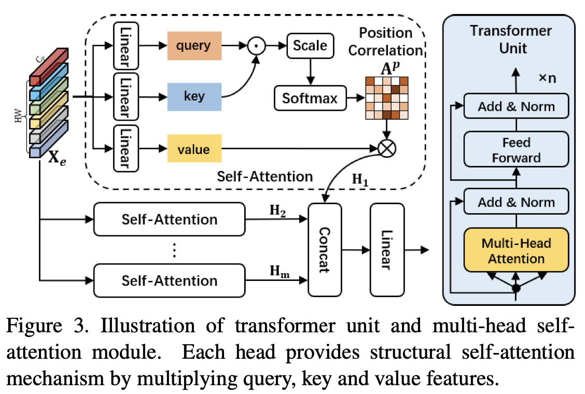

ICCV 2021，提出了一种新的基于Transformer的双关系图学习框架，从结构关系和语义关系两个角度探索相关性。

<!--more-->

## Overview

- paper: <https://openaccess.thecvf.com//content/ICCV2021/papers/Zhao_Transformer-Based_Dual_Relation_Graph_for_Multi-Label_Image_Recognition_ICCV_2021_paper.pdf>
- code: 

## Background

标签相关性对于多标签识别至关重要，现有工作主要关注于标签的co-occurrence，采用RNN或GCN等方式。但对于低频标签表现不佳，为此有人提出基于高阶语义的图像特征构建动态图的方式，但是也存在不足之处：

1. 在标签关系中没有显式建模物体的空间交互
2. 高阶语义特征不稳定，不能反映具体的类别
3. 没有考虑到大范围的场景信息和多样的目标尺寸

本文联合建模了图像中多标签的结构和语义关系，如下图所示

滑板（skateboard）和滑雪板（snowboard）的外观很相似，但是根据图中的雪景很容易认出这是一个滑雪板。

## Method

本文提出了一个协同学习框架，包含结构关系和语义关系。

结构关系图旨在捕获场景信息，构建不同尺寸之间的空间关系；语义关系图是为了构建动态的co-occurrent依赖。

给定输入图像$\mathcal{I}$，$\Phi_S(\mathcal{I})=\{\mathbf{X}_1,\cdots,\mathbf{X}_s\}$为backbone提取的多尺度特征。使用Transformer捕获场景信息，并结合跨尺度注意力构建position-wise的关系。
$$
\mathbf{T} =  \mathop{\mathrm{concat}}\limits_{i=1}^{s} (\mathcal{G}^{trans}_i(\Psi_i(\mathbf{X}_i;\{\mathbf{X}\}_{k=1}^{s}))) \in \mathbb{R}^{N_T \times C_T}
$$
其中$N_T$和$C_T$表示结构关系节点$\mathbf{T}$的数目和维度。

为了构建语义关系图，使用显式的语义感知限制和结构指导建模class-wise dependencies
$$
\mathbf{G} = \mathcal{G}^{sem}((\mathcal{C}(\mathbf{\mathbf{X}}), \mathbf{T});\mathcal{A}(\mathbf{T},\mathcal{C}(\mathbf{\mathbf{X}}))) \in \mathbb{R}^{N_{cls}\times (C_G+C_T)},
$$
其中$\mathcal{G}^{sem}$表示语义图神经网络，$\mathcal{C}(·)$表示语义感知限制，$\mathcal{A}(·)$表示$\mathcal{G}^{sem}$的联合关系相关性矩阵，$N_{cls}$和$C_G$表示语义向量的类别数和维度。

给定两个关系图，使用协同学习的方式得到最终的预测结果。
$$
\mathbf{F} = \psi_t(\mathrm{GMP}(\mathbf{T}))\biguplus \psi_g(\mathbf{G}) \in \mathbb{R}^{N_{cls}},
$$
其中$\mathrm{GMP}(·)$表示global max-pooling，$\psi_{\{t,g\}}$表示类别分类器，$\biguplus$表示加权和。

### Structural Relation Graph

图像中使用Transformer主要有两种方式：

1. 将Transformer嵌入CNN的backbone
2. 将Transformer用于图像patch的序列特征

作者认为后者计算代价大，数据有限的情况下网络难以优化，因此采用了第一种方式。

本文采用了channel-wise的相对位置编码$\mathcal{E}(·)$
$$
\mathbf{X}_e = \mathcal{R}(\phi(\mathbf{X})) + \mathcal{E}(\mathcal{R}(\phi(\mathbf{X}))) \in \mathbb{R}^{HW\times C_T}
$$
其中$\mathcal{R}(·)$表示reshape操作，随后作者计算位置相关矩阵$\mathbf{A}^p$（注意力权重）。
$$
\begin{align}
\mathbf{A}^p &= \mathrm{softmax}\left(\frac{\mathbf{X}_e\mathbf{W}_Q(\mathbf{X}_e\mathbf{W}_K)^\top}{\sqrt{C_T}}\right) \\
\mathbf{H} &= \mathbf{A}^p\mathbf{X}_e\mathbf{W}_V
\end{align}
$$
为了抑制不同尺寸带来的噪声，加强小目标的结构信息，作者提出了一种cross-attention融合策略。
$$
\mathbf{T}_i = \mathcal{G}_i^{trans}(\mathcal{D}(\prod_i^s\mathcal{U}(\mathbf{X}_i)) + \mathbf{X}_i)
$$
其中$\mathcal{U}(\cdot)$和$\mathcal{D}(\cdot)$分别表示上采样和下采样。

Transformer的多头注意力机制可以捕获丰富的结构关系信息，跨尺度的注意力进一步增强了表示能力。

### Semantic Relation Graph

作者认为图网络等方法没有考虑到每个样本的特点，因此在传统label graph的基础上，引入了语义相关的高阶特征。

最终损失函数
$$
\mathcal{L} = \mathcal{L}_{fuse} + \mathcal{L}_{regular}+ \mathcal{L}_{position}+ \mathcal{L}_{class}.
$$

## Experiment

选用MS-COCO和VOC 2007数据集

## Conclusion

模型结构比较复杂，而且没有release代码，但motivation还是很有说服力。

