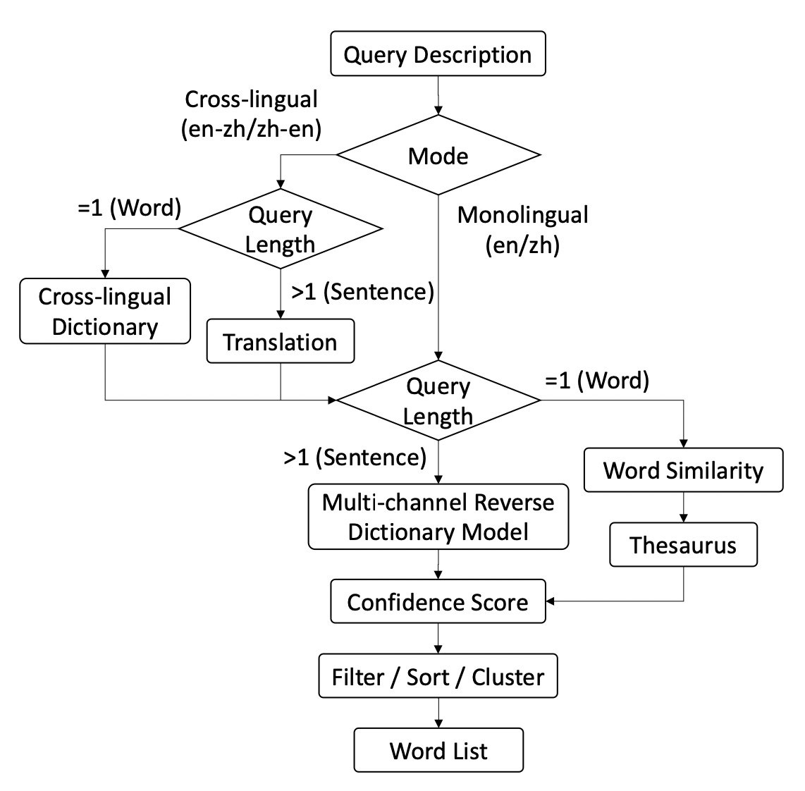

EMNLP2020，展示了一个开源在线的反向词典系统，称为WantWords（万词王）。可以根据单词的描述，按语义相似度排序列出单词。

<!--more-->

## Overview

- paper: <https://aclanthology.org/2020.emnlp-demos.23.pdf>
- code: <https://github.com/thunlp/WantWords>
- website: <https://wantwords.thunlp.org/home/>

目前支持汉-汉、汉-英、英-英和英-汉四种模式。

## Background

反向词典返回与描述语义相似的单词，在现实中可以有效解决“舌尖问题”，也就是话到嘴边却不知如何表达。

反向词典也可以帮助语言学习者，帮助他们学习并使用新的单词。

当前主要由两个在线的反向词典OneLook（<https://onelook.com/thesaurus/>）和ReverseDictionary（<https://reversedictionary.org/>），但他们的效果远不及完美，而且是闭源的，只适用于英语。

现有的反向词典主要由两种构建方式

- 基于文本匹配，返回词典描述与输入描述最相似的词，但会面对输入描述可能与词典描述不一致的问题。
- 基于语言模型，返回嵌入表示与输入描述表示最相近的词，取决于词向量的质量。而且根据Zipf定律，大多数词都是低频词，表示质量较差。

基于上述，Zhang等人在AAAI 2020中提出了一种多通道的反向词典模型（Multi-channel reverse dictionary model，<https://arxiv.org/pdf/1912.08441v2.pdf>），包括一个编码器（BiLSTM+Attention）和四个特征预测器，分别用于预测词性（part-of-speech）、词素（morpheme）、词类（word category）和义素（sememe）。

## Method

### Workflow

总体的工作流如下图所示

WantWords工作流

WantWords有两种工作模式：单语言和跨语言模式。

对于单语言模式，如果描述长度大于1，就直接送入多通道逆向词典模型，在词典中计算候选词的置信度。如果描述就是一个词，就基于embedding的cosine相似度返回候选词。

在跨语言模式中，如果描述长度大于1，就先翻译到目标语言，然后和单语言模式一样处理。如果描述就是一个词，根据跨语言词典，寻求单词的目标语言描述，然后同样送入模型处理。

### Multi-channel Reverse Dictionary Model

本文采用了MRDM的改进版本，将原文中的编码器部分由BiLSTM替换为BERT，模型的结构如下图所示。

对于给定的输入描述，MRDM为词典中的每个候选词计算置信度得分，一共包括五个部分：

- 单词分数。将输入描述用BERT编码得到句向量，通过一个全连接层映射为词向量，将词向量与候选词点积作为分数。
- 词性分数。通过一个全连接层预测目标词的词性，将所有词性标签的分数之和作为候选词的词性分数。
- 类别分数。和词性分数的计算方式相似。
- 词素分数。将BERT最后一层的隐层输出送入全连接得到local score，之后采用Max-Pooling得到每个词素的score，求和作为最终分数。
- 义素分数。与词素分数的计算方式相似。

本文使用了Hill等人（<https://aclanthology.org/Q16-1002.pdf>）提出的英文词典，包含从五个词典中提取的100000个单词和900000个单词-定义对。

对于中文词典，基于Zhang创建的数据集构建了一个大规模的词典定义数据集，包含137174个单词和270549个单词-定义对，其中定义是从几个权威词典中（包含现代汉语词典、新华词典和汉语成语词典）提取的。

此外，为了获得语言学信息，还使用了其他的一些工具。

对于英语，使用了Morfessor将词划分为词素，WordNet获得词性和类别信息，OpenHowNet获得义素信息。

对于中文，将汉字作为词素，使用现代汉语词典中的词性标签，使用HIT-IR 同义词词林和OpenHowNet分别获得类别信息和义素信息。

### One-word Query

单语言模式中，对于只有一个单词的描述，直接计算单词的embedding相似度作为置信度。此外，如果候选词还是同义词，将置信度变为两倍。本文使用了WordNet和HIT-IR 同义词词林分别作为英文和中文词典。

### The Cross-lingual Mode

在跨语言模式中，对于长于一个词的描述首先使用百度翻译API翻译。

## Experiment

### Dataset

本文在单语言和跨语言的任务上都评估了模型性能。

在单语言任务上，对于英语选用了两个测试集，包括定义集和描述集。定义集有500对单词-定义对，测试集中有200对单词-描述对。对于中文选用了三个数据集，包括定义集、描述集和问题集。定义集包括2000对单词-定义对，描述集包括200对单词-描述对，问题集包括272条真实中文考试的描述-答案对。

在跨语言任务上，基于单语言描述集构建了两个测试集，将描述人工翻译到另一语言从而构建数据集。

### Evaluation Metrics

本文选用了4个评价指标，分别是

- 目标词在结果中的中位数排名（越低越好）
- 目标词出现top1/10/100的准确率（acc@1/10/100）

### Evaluation Results

单语言任务结果

跨语言任务结果

与其他系统的预测结果对比

