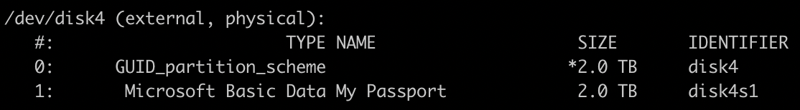

在macOS上挂载NTFS硬盘，支持读写。

<!--more-->

## 问题

硬盘：西数 My Passport 1T

电脑：mbp2021 14-inch

通过拓展坞连到mbp上只能读不能写，网上大概有三种方案：

- 下载NTFS For Mac软件（大多付费）

- 格式化硬盘为ExFAT格式

- 对于希捷硬盘，可以下载[Paragon驱动](https://www.seagate.com/cn/zh/support/software/paragon/)。

## 操作步骤

展示命令行挂载硬盘的方法，用作备忘。

在桌面预先建立一个文件夹（如Passport）

```shell
mkdir ~/Desktop/Passport
```

查看当前磁盘是否被挂载

```shell
diskutil list
```

带有external的即为移动硬盘



如果已经挂载需要先卸载

```shel
sudo umount /dev/disk4s1
```

否则以NTFS格式挂载到桌面建立的文件夹

```she
sudo mount_ntfs -o rw,nobrowse /dev/disk4s1 ~/Desktop/Passport
```

由此就可以读写了，使用完记得卸载，或许可以写个脚本自动执行这些操作。
