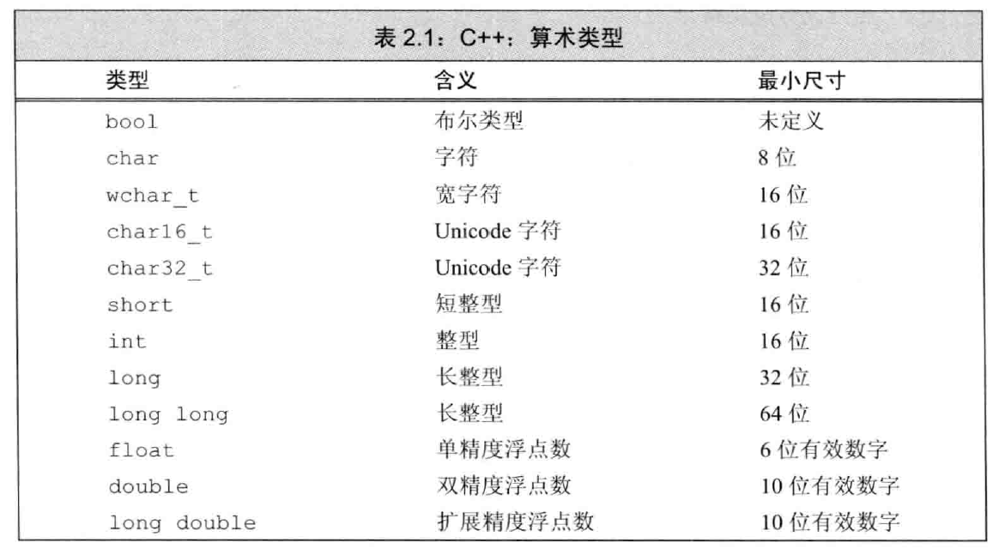
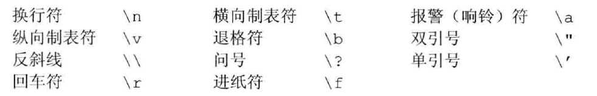
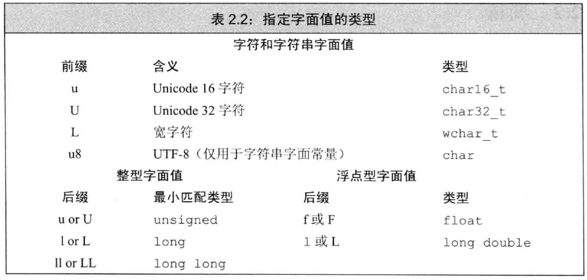

介绍C++的基本内置类型和复合类型，包括引用和指针的声明，以及const限定符的使用方法。

<!--more-->

## 基本内置类型

下表列出了各内置类型的最小尺寸。



> 2^31 - 1= 2147483647是个常见的数字。

### 带符号类型和无符号类型

无符号类型只能表示大于等于0的值，带符号类型可以表示正负数和0。

8bit的unsigned char可以表示0~255之间的值，signed char则为-128~127。

> 执行浮点数运算时选用double

### 类型转换

- 当把非bool的算术值赋给bool时，初始值为0结果为false，否则为true。
- 把bool值赋给非bool时，初始值为false则结果为0，true则结果为1。
- 赋给无符号类型一个超出表示范围的值，结果是取模后的余数。
  - 赋-1给unsigned char，结果是255。
  - **切勿混用带符号类型和无符号类型！**
  - 因为无符号数非负，所以下面这段代码为死循环。

```C++
for (unsigned i = 10; i >= 0; i--)
    std::cout << i << std::endl;
```

### 字面值常量

C++规定的转义序列如下



C++还可以对常量添加前缀和后缀，改变默认类型。

- 比如L'a'定义了宽字符型字面值，类型是wchar_t。



## 变量

### 变量定义

以下四条语句都可以定义一个int变量并初始化为0。

在C++11，可以用花括号来初始化变量，称为列表初始化。

```C++
int cnt = 0;
int cnt = {0};
int cnt(0);
int cnt{0};
```

> 初始化：创建变量时，赋予其一个初始值。
>
> 赋值：把对象的当前值擦除，用一个新值代替。

定义在函数体内部的内置类型变量将不被初始化，此时值是未定义的。

### 变量定义&声明

- 变量声明：规定了变量的类型和名字
- 变量定义：还申请存储空间，也可能会为变量赋一个初始值。
- 如果想声明一个变量而非定义，要添加关键字extern。
- 变量的定义只出现在一个文件中，其他使用该变量的文件对其声明，但不能重复定义。

```C++
extern int i; // 声明变量
int j;		  // 声明并定义
extern double pi = 3.14; // 定义
```

### 标识符

- 标识符以字母或数字开头，大小写敏感。
- 变量名一般小写，类名一般以大写字母开头。
- 标识符由多个单词组成，应有区分，如student_loan或studentLoan。

### 作用域

- 如果函数要用到全局变量，则不宜再定义一个同名的局部变量。

```c++
int cnt = 10;
int main() {
	int cnt = 20;
	// 用::cnt显式访问全局变量
	// result: 10 20
	std::cout << cnt << " " << ::cnt << std::endl;
}
```

## 复合类型

### 引用

- 引用为对象起另外一个名字
- 无法令引用重新绑定到另外一个对象，所以引用必须初始化。
- 引用只能绑定在对象上，引用自身不是对象。

```C++
int val = 1024;
int &refVal = val;
int refVal;		// 报错：引用必须初始化
```

### 指针

- 指针存放某个对象的地址，使用取地址符&获取地址。
- 使用解引用符*访问指针指向的对象。

```c++
int val = 1024;
int *p = &val;
cout << p << *p; // result: 008FF9F8 1024
```

空指针不指向任何对象

```c++
int *p1 = nullptr;
int *p2 = 0; // 指针不能指向字面值常量，0表示空指针。
int *p3 = NULL; // include <cstdlib>
```

void*是一种特殊的指针，可以指向任意非常量，不能执行解引用操作。

```C++
double pi = 3.14, *pd = & pi;
void *pv = &pi;
pv = pd;
```

### 理解复合类型的声明

定义指针和引用时，最好将*和&与变量名连在一起，以免引起误导。

指针可以指向指针

```C++
int val = 1024;
int *pi = &val;
int **ppi = &pi;
```

引用不是对象，所以不存在指向引用的指针。

但指针是对象，所以引用可以绑定指针。

```c++
int i = 10;
int *p = &i;
int *&r = p;	// r是一个对指针p的引用

r = &i;
*r = 0;
```

## const限定符

### const的引用

使用const定义变量时，变量的值不能被改变，const对象必须初始化。

> 一般const对象仅在文件内有效，多个文件中出现同名的const变量，等同于在不同文件中分别定义了独立的变量。
>
> 如果想共享const变量，需要用extern修饰。

可以把引用绑定到const对象上，称为对常量的引用。

```c++
const int val = 1024;
const int &refVal = val;
refVal = 10;		// 错误：对常量的引用不能修改绑定的对象
int &refVal2 = val; // 错误：非常量引用不能绑定常量对象
```

允许为一个常量引用绑定非常量的对象。

```c++
int i = 42;
const int &r1 = i;
const int &r2 = 42;
const int &r3 = i * 2;
int &r4 = r1 * 2;	// 错误：r1是常量引用，r4是非常量引用。
```

常量引用绑定非常量对象时，不能通过常量引用改变值，但可以通过其他途径改变绑定对象的值。

### const与指针

指向常量指针不能改变所指对象的值。

```c++
const double pi = 3.14;
const double *p = &pi;
*p = 10;		// error
```

const指针不能改变指针本身的值，而非指向的那个值。

```c++
double pi = 3.14, i = 10;
double *const p = &pi;
p = &i;			// error
```

### 顶层const

**顶层const表示指针本身是常量，底层const表示指针指向的对象是一个常量。**

```c++
int i = 0;
const ci = 10;
int *const p1 = &i;		// top-level
const int *p2 = &ci;	// low-level
const int *const p3 = p2; // low-level & top-level
const int &r = ci;		// low-level
```

### constexpr和常量表达式

常量表达式是指值不会改变并且在编译过程中就能得到计算结果的表达式。

## 处理类型

### 类型别名

有两种方法可以定义类型别名

```c++
typedef double wages;
using wages = double;
```

### auto & decltype

auto让编译器去分析表达式所属的类型，auto定义的变量必须有初始值。

decltype可以返回操作数的数据类型。

```c++
decltype(f()) sum = x;
int i = 42, *p = &i;
decltype(*p) c; // 错误：c是int&，必须初始化。
```

## 自定义数据结构

### 预处理器

```c++
#ifndef SALES_DATA_H
#define SALES_DATA_H
#endif
```

