介绍分组密码，包括Feistel Cipher、DES和IDEA等。

<!--more-->

## 分组密码

分组密码（Block Cipher），是指将明文分成许多块，利用加密算法对每一块进行加密，形式如下。

分组密码希望使用对每一块使用尽可能大的替换模块，但并不现实。

当分组长度为64bit时，即需要$2^{64}$个实体的替换表，因此使用乘积密码的思想，用一些小的模块替代。

## 替换-置换密码

Shannon在那篇著名的文章中，介绍了替换-置换（S-P）网络的概念。

- 替换 Substitution
- 置换 Permutation

其实和古典密码的思想类似，替换运算用另一个二进制字代替原来的字。

替换函数就构成密钥，可以看成一个大的查表运算，替换函数也被称为S-box。

置换运算则打乱一个二进制字的次序，重新排列的方法构成密钥，称为P-box。

S-P网络就是将这两种运算组合在一起，称为混合变换。

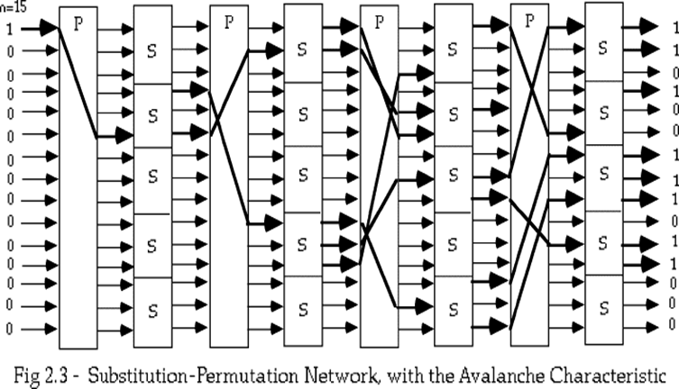

## Feistel Cipher

Feitel密码将输入块分为左右两部分L(i-1)和R(i-1)，在密码变换的第i轮只使用R(i-1)。

变换过程可以表示为
$$
\begin{align}
L(i) &= R(i-1) \\
R(i) &= L(i-1) \oplus g(K(i), R(i-1))
\end{align}
$$
S盒提供输入bits混合作用（confusion）。

- 使密钥和密文之间关系复杂化
- 极小化统计特性，使统计分析攻击不能奏效。

P盒提供扩散作用（diffusion）

- 将明文和密钥的影响尽可能散步到较多个输出的密文中（将明文冗余度分散到密文中）。

### 雪崩效应

- 输入改变1bit，导致近半的bit发生变化。
- 对于一个函数$f$来说，较好的雪崩特性是指
  - 对于$2^m$个明文向量，分为$2^{m-1}$个向量对$(x_i, x_i')$，每对向量只有一个bit不同。
  - 定义$v_i = f(x) \oplus f(x_i)$，则近半的$v_i$为1。

### 完备性效应

- 每个输出比特是所有输入比特的复杂函数的输出。
- 对于一个函数$f$来说，较好的完备性是指
  - 对密文输出向量的每一个比特j，至少存在一个明文对$(x_i, x_i')$。
  - 此明文对只在第i比特不同，且$f(x_i)$与$f(x_i')$的第j比特不同。

### Feistel Cipher设计

雪崩特性保证了小的输入变化会导致大的输出变化，完备性保证了每个输出比特依赖于所有的输入比特。

设计密码时需要以下参数

- 分组大小
- 密钥大小
- 轮数
- 子密钥生成
- 轮函数

设计一个快速/安全的算法是困难的。

## Lucifer

第一个可用的替换-置换密码。

分组长度128bit，密钥长度128bit，每一轮的子密钥是密钥的左半部分。

密钥每次向左旋转56bit，密钥的每部分都参与运算。
$$
\begin{align}
L_i &= R_{i-1} \\
R_i &= L_{i-1} \oplus P(K_{i-1}\oplus S(K_{i-1})) \\
K_i &= ROL(K_{i-1})
\end{align}
$$
Lucifer共有16轮数据计算，使用8对4bitS盒实现替换，用几个8-bit置换组成64bit的简单置换。

## S-DES

S-DES即Simplified DES，供教学使用，有着和DES相似的特性和结构，但参数小。

S-DES主要有以下几个函数

- 初始置换IP（initial permutation）
- 复合函数$f_k$$
  - 由密钥K确定，具有转换和替换的运算。
- 转换函数SW

加密算法可以表示为
$$
cipher = IP^{-1}(f_{k2}(SW(f_{k1}(IP(plain)))))
$$
其中
$$
K_1 = P_8(移位(P_{10}(K))) \\
K_2 = P_8(移位(移位(P_{10}(K))）)
$$
密钥生成可以用下图表示，LS代表循环左移

初始置换
$$
IP = \begin{pmatrix} 1 & 2 & 3 & 4 & 5 & 6 & 7 & 8 \\ 2 & 6 & 3 & 1 & 4 & 8 & 5 & 7 \end{pmatrix}
$$
$$
IP^{-1} = \begin{pmatrix} 1 & 2 & 3 & 4 & 5 & 6 & 7 & 8 \\ 4 & 1 & 3 & 5 & 7 & 2 & 8 & 6 \end{pmatrix}
$$

S-DES的加密过程如下

对于S-DES，$f_k$是加密方案中最重要的部分
$$
f_k(L, R) = (L\oplus F(R, SK), R)
$$
其中对于映射F，输入为4bit，第一步进行扩张/置换（E/P）运算
$$
(n_1, n_2, n_3, n_4) \xrightarrow{E/P} \begin{pmatrix} n_4 & n_1 & n_2 & n_3 \\ n_2 & n_3 & n_4 & n_1 \end{pmatrix}
$$
之后将密钥与E/P的结果作异或
$$
\begin{pmatrix} n_4+k_{11} & n_1+k_{12} & n_2+k_{13} & n_3+k_{14} \\ n_2+k_{15} & n_3+j_{16} & n_4+k_{17} & n_1+k_{18} \end{pmatrix} = \begin{pmatrix} P_{0,0} & P_{0,1} & P_{0,2} & P_{0,3} \\ P_{1,0} & P_{1,1} & P_{1,2} & P_{1,3} \end{pmatrix}
$$
将第一行和第二行分别输入两个S盒，得到两个2bit的输出。

S盒接收4bit输入，将第1和第4比特组成的数作为行，第2和第3比特组成的数作为列。

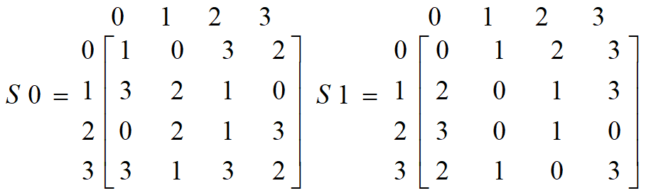

### 安全分析

对10bit密钥的强行攻击是可行的，可以利用已知明文攻击。

密钥空间：$2^{10}=1024$$

已知明文$(p_1, p_2,\dots,p_8)$和密文$(c_1, c_2,\dots,c_8)$，密钥$(k_1, k_2,\dots,k_{10})$作为未知数。

S-DES可以表示为8个含10个变量的非线性方程，非线性是S盒作用的结果。

## DES

分组长度64bit，密文64bit。密钥为64bit，只有56bit参与运算，8bit作为奇偶校验位。

算法有以下三个阶段

- 对明文X，通过初始置换IP得到$X_0 = IP(X) = L_0R_0$$
- 函数F进行16次迭代
  - $L_i = R_{i-1}, R_i = L_{i-1} \oplus F(R_{i-1}, K_i)\quad 1\leq i\leq 16$$
  - $K_i$是长为48位的子密钥。
- 对比特串使用逆置换得到密文$Y=IP^{-1}(R_{16}L_{16})$$

每一轮的结构可以用下图表示

相比于S-DES，DES的F函数更加复杂。

- F的输入为32bit的消息和48bit的密钥，输出为32bit。
- 第一步利用扩展函数，将消息扩展为48bit。
- 随后计算消息与密钥的异或，将48bit写成8个6bit数。
- 用8个S盒接收6bit数的输入，输出8个4bit数。每个S盒是4×16的矩阵，b1b6确定行号，b3b4b5b6确定列号。
- 最后经过一个置换函数得到结果。

子密钥的生成如下图所示

- PC-1和PC-2都是固定置换，$LS_i$表示循环左移。
- 注意$K_i$为48bit。

### DES的改进

双重DES
$$
C = E_{K_2}[E_{K_1}[P]] \\
P = D_{K_1}[D_{K_2}[C]]
$$
三重DES
$$
C = E_{K_1}[D_{K_2}[E_{K_1}[P]]] \\
P = D_{K_1}[E_{K_2}[D_{K_1}[C]]]
$$
三种DES的密钥长度为$2^{112}$，而标准DES的密钥长度为$2^{56}$。

## IDEA

分组长度64bit，密钥长度128bit，进行8轮迭代操作。

IDEA中，定义了三种运算。

- 逐位异或
- 整数模$2^{16}$加$\boxplus$$
- 整数模$2^{16}+1$乘$\boxdot$（IDEA的S盒）

IDEA的扩散来自于MA结构，它接收两个16bit的明文消息和两个子密钥作为输入，产生两个16bit的输出。

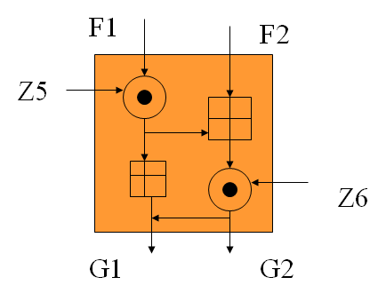

IDEA一共产生52个16bit的子密钥，每一轮使用6个子密钥，另外还需要4个额外子密钥。

前8个子密钥直接从密钥中取出，之后的密钥由25bit的循环左移产生。

- IDEA是PGP的一部分。
- IDEA能抗差分分析和相关分析。
- IDEA似乎没有DES意义下的弱密钥。

## AES-Rijndael

- 分组长度128bit，密钥长度为128、192或256bit，相应的迭代轮数为10、12和14。

  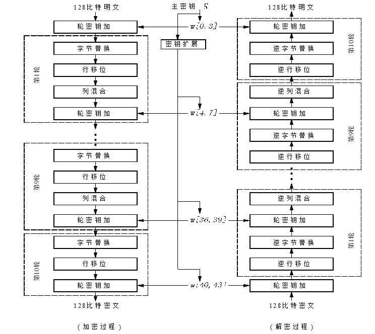

- AES的轮函数由四个变换构成，最后一轮省略了列混合。

  - 字节替换

    - 替换表是一个16×16的矩阵（S盒）。
    - 输入8bit，高4位作为行，低4位作为列，输出8bit。

  - 行移位

    - 字节的循环移位运算。

    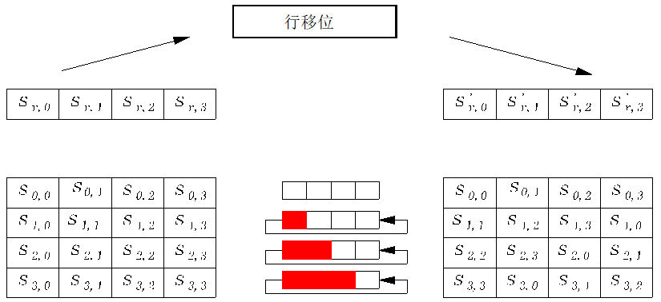

  - 列混合

    - 在$GF(2^8)$上乘以固定多项式$a(x)$并模除$(x^4+1)$$
    - $S'(x)=a(x)\otimes S(x),\ a(x)=3x^3+x^2+x+2$$

  - 轮密钥加

    - 与每轮的子密钥进行异或操作，子密钥长度等于分组长度。

    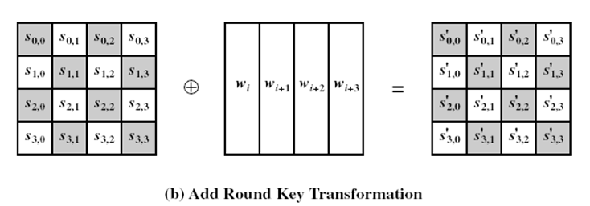

  四种变换可以用下图表示

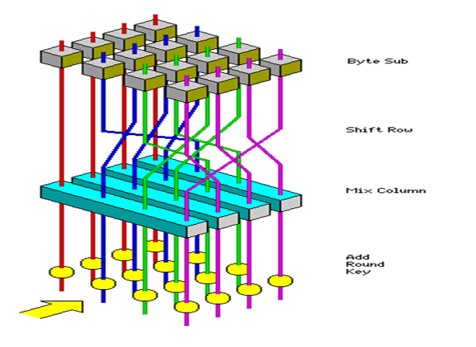

AES的子密钥长度为128bit，也即16个字节，子密钥的生成过程如下。

- 首先将16个字节分为4组，每组4个字节。
- 循环移位后，经过S盒实现替换处理。
- 第一个字节与轮常数异或。
- 将得到的字节与原先的字节按位异或，即为下一轮的密钥。

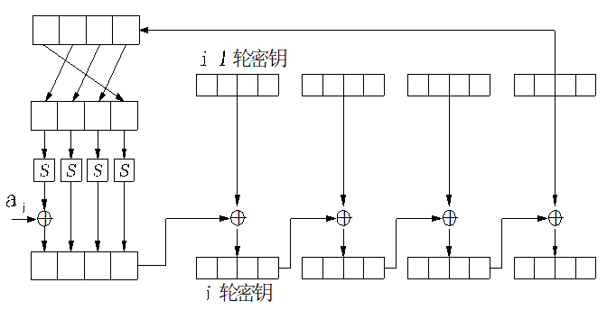

## 分组密码的工作模式

DES定义了4种工作模式。

- Block Mode
  - ECB
  - CBC
- Stream Mode
  - CFB
  - OFB

### ECB - Electronic Codebook Book

将消息分为独立的加密模块，分组长度为64bit，每块单独使用DES。

适合少量的数据加密，但是对于相同的明文来说，产生的密文也相同（不安全）。

如果需要安全传递DES密钥，ECB是最合适的模式。
$$
C_i = E_K(P_i) \\
P_i = D_K(C_i)
$$

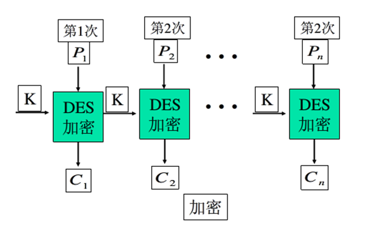

### CBC - Cipher Block Chaining

密码分组链接模式构造一个初始向量，将密文与明文联结。

为了提高安全性，应该保护初始向量，可使用ECB加密模式发送。

CBC对于加密长于64bit的消息非常合适，除了能够获得保密性，还可以实现认证（因为初始向量的保密性）。

值得一提的是，如果攻击者能修改IV，则会发生错误传播。
$$
C_i = E_K(C_{i-1}\oplus X_i) \\
X_i = C_{i-1} \oplus D_K(C_i)
$$
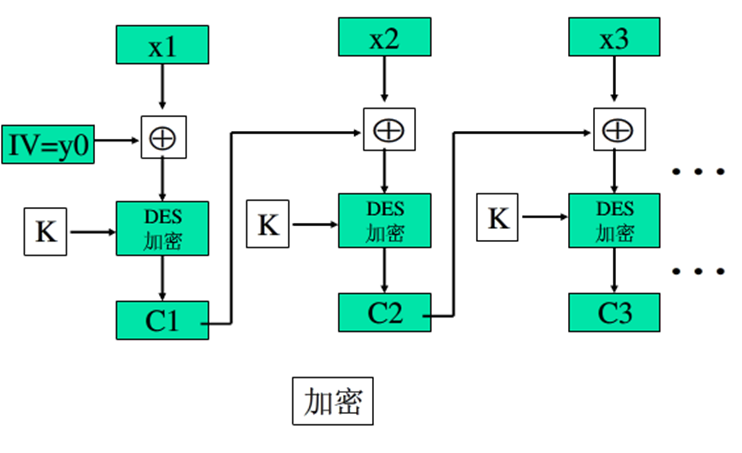

### CFB - Cipher FeedBack

DES是分组长为64bit的分组密码，利用CFB模式或OFB模式可以将其转换为流密码。

对于密码反馈模式，加密算法的输入是64bit移位寄存器，初值为一个初始向量。

和CBC模式一样，CFB也可以实现保密与认证，也会发生错误传播。
$$
C_i = P_i \oplus DES_K(C_{i-1}) \\
C_{-1} = IV
$$
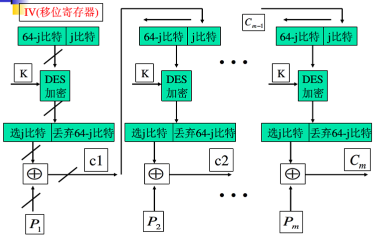

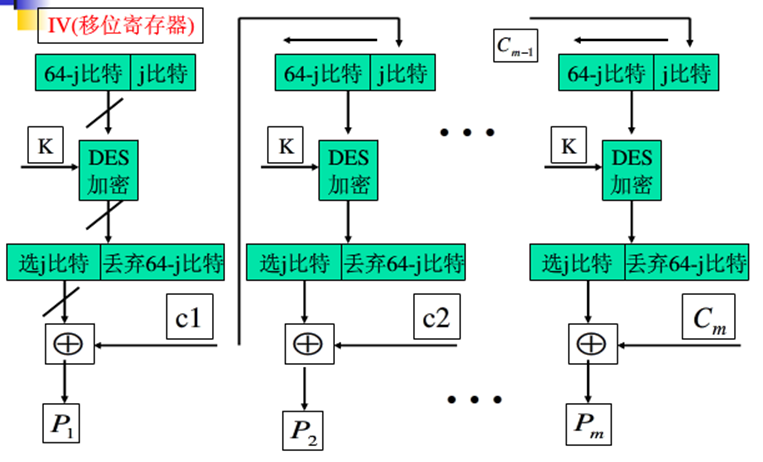

### OFB - Output FeedBack

输出反馈方式的结构类似于CFB，不过OFB将加密算法的输出反馈到移位寄存器，而CFB将密文单元反馈到移位寄存器。

OFB的优点是避免了错误传播，如果第一段密文中出错，解密结果中只有第一段明文受影响。

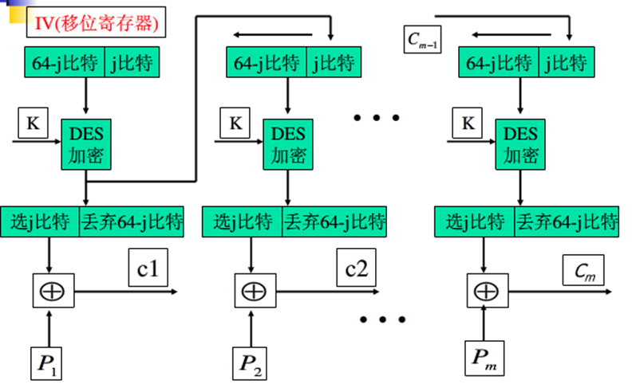

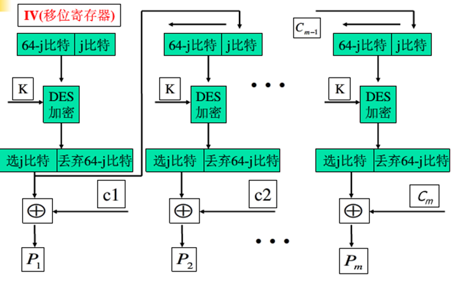

### CTR - Counter

计算器模式可以并行加密，并且实现了加密数据块的随机访问。

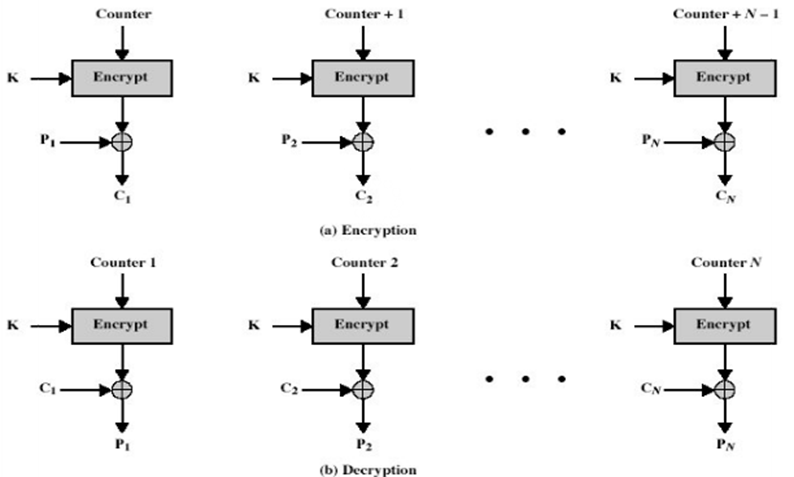

## 密码分析攻击

- 唯密文攻击
- 已知明文攻击
- 选择明文攻击
- 自适应选择明文攻击
- 选择密文攻击
- 自适应选择密文攻击

DES可能会受到差分分析攻击（分析明文对的差值对密文对的影响）。