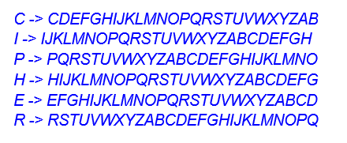
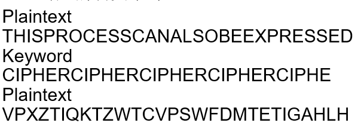
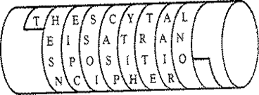
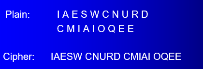
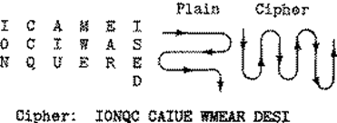
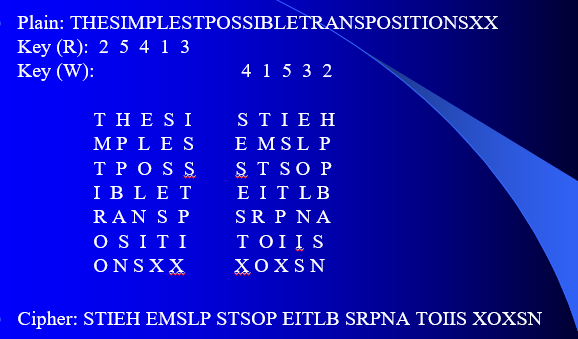
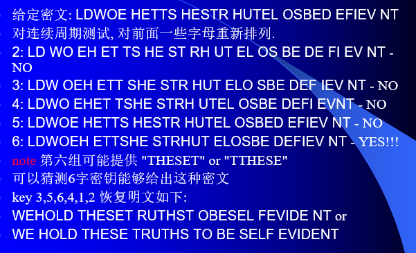

介绍古典代换密码和古典置换密码。

<!--more-->

## 古典密码

古典密码只要有两种加密方式，替换和置换（substitution and transposition）。

替换是用新的字符代替原字符，置换是不改变原文字母集，打乱字符顺序。

## 古典代换密码

### Caesar Cipher-恺撒密码

恺撒密码的替换方法是，每个字母用其后的第三个字母替换。
$$
\alpha\leftarrow\alpha+3
$$
恺撒密码可以表示为

- Plain: ABCDEFGHIJKLMNOPQRSTUVWXYZ
- Cipher: DEFGHIJKLMNOPQRSTUVWXYZABC

如密文L FDPH L VDZ L FRQTXHUHG，对应的明文即为移位三位，I CAME I SAW CONQUERED。

当然，恺撒密码也可以将移位的长度改成1-25的任一个，换言之，共有25种可能的密码算法（移位0不可用）。

### 混合单表替换密码

单字母替换密码用一个字母代替另外一个字母，相当于构造了字母表到字母表的双射，密钥长度是26个字母。

### Vigenère Cipher

发明了多字母替换密码，一个字母可以被多个字母替换，通过密钥选择对每个字母使用哪个字母表。

密钥的第i个字母表示使用第i个字母表。

如下例，密钥为CIPHER，分别定义了六张字母表（六个双射）。

对于明文，用密钥选择字母用哪个字母表，这里的效果相当于明文与密钥相加减一。

### Ciphers Machines

- Jefferson Cylinder
- Wheatstone disc
- the German Enigma
- the Swedish Hagelin
- the Janpanese Purple

## 古典置换密码

置换密码的核心思想是，按一定规则写出明文，按另一规则读出密文。

密钥就是用于读密文和写明文的方法。

### Scytale密码

消息沿着圆柱横写，密钥是纸条和圆柱的宽度。

### Rail Fence Cipher-轨道栅栏密码

在不同行写下消息字母，按行读取消息。

### 几何图形密码

以一种形式写，用另一种形式读。

### 行变换密码

按行写出字母，以密钥给出的顺序按行读出密文。

对上图的解释：

- 给定明文，分组长度为5，按25413的顺序对字母重新编排，如THESI变成STIEH。
- 给定密文，分组长度为5，按41532的顺序读取信息，如STIEH变成THESI。

其实相当于定义了置换
$$
\sigma = \begin{pmatrix} 1 & 2 & 3 & 4 & 5 \\ 2 & 5 & 4 & 1 & 3 \end{pmatrix}
$$
对应的逆置换即为
$$
\sigma^{-1} = \begin{pmatrix} 2 & 5 & 4 & 1 & 3 \\ 1 & 2 & 3 & 4 & 5 \end{pmatrix} = \begin{pmatrix} 1 & 2 & 3 & 4 & 5 \\ 4 & 1 & 5 & 3 & 2 \end{pmatrix}
$$

#### 密码分析

我们希望猜测密钥周期，再对可能的行列变换进行猜测。

